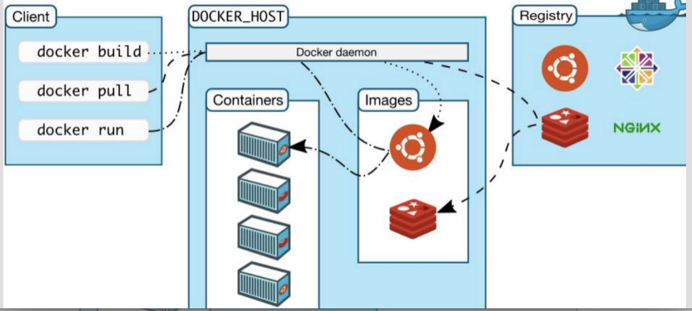

Docker 概述

###1.简介
[官网](https://www.docker.com)
[Docker GitHub](https://github.com/docker/docker)
[中文](docker-cn.com)

Docker是一个开源的应用容器引擎；是一个轻量级容器技术；

Docker 在容器的基础上，进行了进一步的封装，从文件系统、网络互联到进程隔离等等，极大的简化了容器的创建和维护。
使得 Docker 技术比虚拟机技术更为轻便、快捷。
传统虚拟机技术是虚拟出一套硬件后，在其上运行一个完整操作系统，在该系统上再运行所需应用进程；
而容器内的应用进程直接运行于宿主的内核，容器内没有自己的内核，而且也没有进行硬件虚拟。因此容器要比传统虚拟机更为轻便。

区别：
虚拟机必须要完整的虚拟出一块空间(虚拟硬件)，占用的是底层的资源，然后在虚拟的硬件之上创建操作系统。
docker直接利用宿主机的内核和资源。

最大的区别在资源利用上：
虚拟化， 创建出来的系统或者应用是占用主机的资源，而这部分资源是不能被其它系统或应用共享的。
docker中安装的系统或应用，他们的所有资源都来自底层的设备， 他们的资源是共享的。

示例：
假如：主机：16G内存
安装一个VMWare  划分内存2G，则主机内存=16-2=14G     假如虚拟机中安装一个APP，占用4G内存，则虚拟内存不够，内存溢出。
再装一个VMWare  划分内存2G，则主机内存=14-2=12G	   假如虚拟机中安装一个APP，占用1G内存，则浪费内存。
docker：不划分内存，直接使用主机的内存 16G ，docker可以有效利用宿主机的全部资源。

###2.核心概念
docker主机(Host):		安装了Docker程序的机器(Docker直接安装在操作系统之上); 
docker客户端(Client):	连接docker主机进行操作;
docker仓库(Registry):	用来保存各种打包好的软件镜像; 
docker镜像(Images):	    软件打包好的镜像;放在docker仓库中;（unionFS联合文件系统：花卷[一层层]） 只读	#java 类 一个镜像可以创建很多容器
docker容器(Container):	镜像启动后的实例称为一个容器;容器是独立运行的一个或一组应用 	#Java 类new的对象
Docker daemon：		    Docker守护进程，Docker daemon是一个运行在宿主机（DOCKER_HOST）的后台进程。我们可通过Docker客户端与之通信。

图解：
docker build 命令通过docker daemon 生成一个xx镜像。
docker run 命令通过docker daemon 运行xx镜像 可以生成一个xx容器，可以run多个。
docker pull 命令通过docker daemon  可以拉取registry中的一个mmm镜像。

重要组件：
Docker 容器通过 Docker 镜像来创建。
每个容器相互隔离（沙箱机制）[好处：容器A损坏，并不影响其它的容器，离高可用进一步]
镜像是分层的

镜像：类
容器：类的实例：对象

###3.操作
