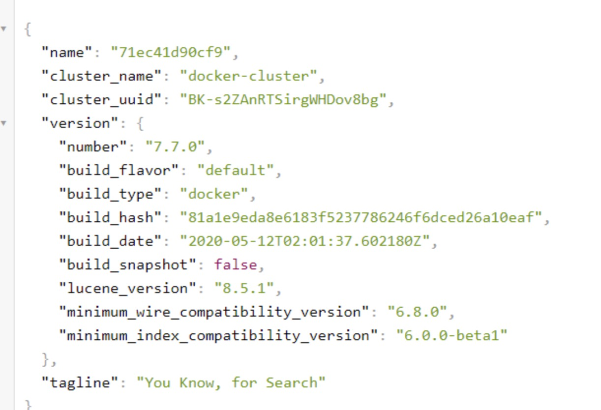
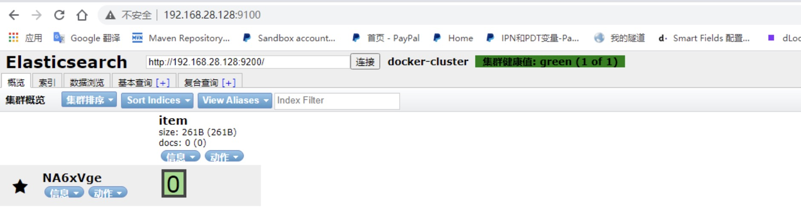
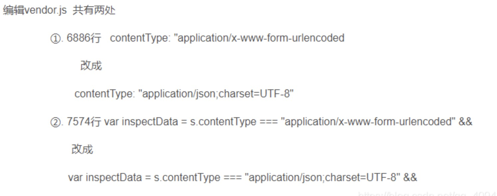
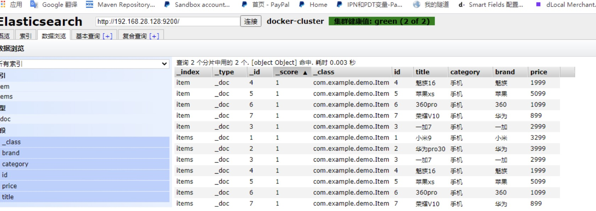
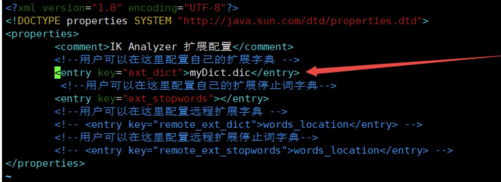

docker 安装ElasticSearch


[参考](https://blog.csdn.net/qq_40942490/article/details/111594267?spm=1001.2101.3001.6650.2&utm_medium=distribute.pc_relevant.none-task-blog-2%7Edefault%7ECTRLIST%7Edefault-2-111594267-blog-120744829.pc_relevant_multi_platform_whitelistv2_ad_hc&depth_1-utm_source=distribute.pc_relevant.none-task-blog-2%7Edefault%7ECTRLIST%7Edefault-2-111594267-blog-120744829.pc_relevant_multi_platform_whitelistv2_ad_hc&utm_relevant_index=5)

###1.设置max_map_count
```shell script
查看max_map_count的值 默认是65530
cat /proc/sys/vm/max_map_count

重新设置max_map_count的值
sysctl -w vm.max_map_count=262144
```

###2.下载镜像并运行
####2.1.安装
```shell script
#拉取镜像
docker pull elasticsearch:7.7.0

#启动镜像
docker run --name elasticsearch -p 9200:9200 -p 9300:9300 \
-e ES_JAVA_OPTS="-Xms512m -Xmx512m" \
-e "discovery.type=single-node" \
-d elasticsearch:7.7.0
```
9200是后端发送请求restAPI使用的
9300是es在分布式集群下节点间的通信端口

####2.2.参数说明
```text
--name表示镜像启动后的容器名称  
-d: 后台运行容器，并返回容器ID；
-e: 指定容器内的环境变量
    discovery.type=single-node 单点模式启动
    ES_JAVA_OPTS="-Xms512m -Xmx512m"：设置启动占用的内存范围        
-p: 指定端口映射，格式为：主机(宿主)端口:容器端口
-v: 挂载目录
```

####2.3.查看
```shell script
#查看是否启动
docker ps  
#启动日志查询
docker logs elasticsearch  
#重启
docker restart elasticsearch   
#进入容器
docker exec -it elasticsearch /bin/bash 
```

####2.4.访问
浏览器访问ip:9200 如果出现以下界面就是安装成功



###3.安装elasticsearch-head
```shell script
#拉取镜像
docker pull mobz/elasticsearch-head:5

#创建容器
docker create --name elasticsearch-head -p 9100:9100 mobz/elasticsearch-head:5

#启动容器
docker start elasticsearch-head
or
docker ps -a 查看容器id
docker start 容器id
```
浏览器打开: http://IP:9100


####3.1.跨域
[尝试连接easticsearch会发现无法连接上，由于是前后端分离开发，所以会存在跨域问题，需要在服务端做CORS的配置]
解决办法:
修改docker中elasticsearch的elasticsearch.yml文件
```shell script
docker exec -it elasticsearch /bin/bash

vi config/elasticsearch.yml

#在最下面添加2行
http.cors.enabled: true 
http.cors.allow-origin: "*"

#退出并重启服务
exit
docker restart 容器id
```


####3.2.ElasticSearch-head 操作时不修改配置，默认会报 406错误码
```shell script
#复制vendor.js到外部
docker cp 容器id:/usr/src/app/_site/vendor.js /opt/

#修改vendor.js
vim vendor.js
```
修改：
6886行：application/json;charset=UTF-8
7574行：application/json;charset=UTF-8


修改完成在复制回容器:
```shell script
docker cp /opt/vendor.js  容器id:/usr/src/app/_site
```
重启elasticsearch-head
```shell script
docker restart 容器id
```
最后就可以查询到es数据了



###4.安装ik分词器
####4.1.采用离线安装
下载分词器压缩包
[github](https://github.com/medcl/elasticsearch-analysis-ik/releases)
将IK分词器上传到/opt目录中（xftp）

将分词器安装进容器中
```shell script
#将压缩包移动到容器中
docker cp /opt/elasticsearch-analysis-ik-7.7.0.zip elasticsearch:/usr/share/elasticsearch/plugins

#进入容器
docker exec -it elasticsearch /bin/bash  

#创建目录
mkdir /usr/share/elasticsearch/plugins/ik

#将文件压缩包移动到ik中
mv /usr/share/elasticsearch/plugins/elasticsearch-analysis-ik-7.7.0.zip /usr/share/elasticsearch/plugins/ik

#进入目录
cd /usr/share/elasticsearch/plugins/ik

#解压
unzip elasticsearch-analysis-ik-7.7.0.zip

#删除压缩包
rm -rf elasticsearch-analysis-ik-7.7.0.zip
```
退出并重启容器

区别：
ik_max_word: 最细粒度拆分，如“我是中国人” 拆分为 “我，是，中国人，中国，人”，会穷尽各种可能的组合。
ik_smart: 最粗粒度拆分，如“我是中国人” 拆分为 “我，是，中国人”。


####4.2.ik自定义词组
1.进入IK配置目录
```shell script
docker exec -it elasticsearch /bin/bash
cd plugins/ik/config/
```

2.创建自定义分词文件
```shell script
touch myDict.dic
vim myDict.dic
添加词组
```

3.让IK分词器识别自定义文件
```shell script
vi IKAnalyzer.cfg.xml
```

重启ElasticSearch服务