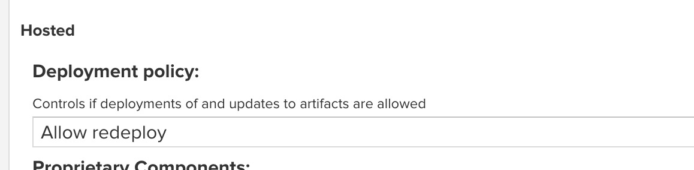

docker 安装nexus


###1.首先执行如下命令下载 Nexus3 镜像
docker pull sonatype/nexus3

###2.创建宿主机挂载目录
mkdir –p /opt/nexus/nexus-data
chmod 777 /opt/nexus/nexus-data

###3.运行 Nexus3 容器
docker run -d --name nexus3 -p 18001:8081 -v /opt/nexus/nexus-data:/nexus-data sonatype/nexus3

###4.本机防火墙开放端口
firewall-cmd --permanent --add-port=8081/tcp
firewall-cmd --reload

###5.通过 exec 命令对指定的容器执行 bash,查看 admin的密码
docker exec -it 550dd77a89e1 /bin/bash
vi /nexus-data/admin.password
exit

###6.访问搭建的nexus后台管理页面 http://ip:8081
修改密码：witroot


###7.nexus 介绍
```text
1.默认仓库说明：
maven-central：maven 中央库，默认从 https://repo1.maven.org/maven2/ 拉取 jar
maven-releases：私库发行版 jar，[初次安装请将 Deployment policy 设置为 Allow redeploy]
maven-snapshots：私库快照（调试版本）jar
maven-public：仓库分组，把上面三个仓库组合在一起对外提供服务，[在本地 maven 基础配置 settings.xml 或项目 pom.xml 中使用]

2.仓库类型说明：
group：  这是一个仓库聚合的概念，用户仓库地址选择 Group 的地址，即可访问 Group 中配置的，用于方便
        开发人员自己设定的仓库。maven-public 就是一个 Group 类型的仓库，内部设置了多个仓库，访问顺序取决
        于配置顺序，3.x 默认为 Releases、Snapshots、Central，当然你也可以自己设置。
hosted： 私有仓库，内部项目的发布仓库，专门用来存储我们自己生成的 jar 文件
snapshots：本地项目的快照仓库
releases： 本地项目发布的正式版本
proxy：    代理类型，从远程中央仓库中寻找数据的仓库（可以点击对应的仓库的 Configuration 页签下
           Remote Storage 属性的值即被代理的远程仓库的路径），如可配置阿里云 maven 仓库
central：中央仓库
```

###8.nexus 配置
####8.1. maven-releases 将 Deployment policy 设置为 Allow redeploy


####8.2. 创建新的代理仓库 aliyun-proxy
步骤：
1.点击 Create repository
2.选择 maven2(proxy)
3.填写 在Remote storage中添加阿里云地址：https://maven.aliyun.com/repository/public
4.配置 在maven-public中添加新建的仓库，并设置访问顺序


###9.nexus 使用
复制 maven-public 地址

####9.1.下载jar
配置方式：
1.通过pom.xml为单个项目配置
```xml
<repositories>
    <repository>
        <id>maven-nexus</id>
        <name>maven-nexus</name>
        <url>http://192.168.149.128:8081/repository/maven-public/</url>
        <releases>
            <enabled>true</enabled>
        </releases>
        <snapshots>
            <enabled>true</enabled>
        </snapshots>
    </repository>
</repositories>

<!-- 也可以配置阿里云 maven 仓库 -->
<repositories>
   <repository>
      <id>maven-aliyun</id>
      <url>https://maven.aliyun.com/repository/public/</url>
      <releases>
         <enabled>true</enabled>
      </releases>
      <snapshots>
         <enabled>true</enabled>
         <updatePolicy>always</updatePolicy>
         <checksumPolicy>fail</checksumPolicy>
      </snapshots>
   </repository>
</repositories>
```

2.通过maven 的setting.xml配置全局
```xml
<mirrors>  
    <mirror>  
        <id>nexus</id>  
        <name>internal nexus repository</name>  
        <url>http://192.168.149.128:8081/repository/maven-public/</url>  
        <mirrorOf>*</mirrorOf>  
    </mirror>        
</mirrors>
```

####9.2.下载插件
pom.xml
```xml
<pluginRepositories>
    <pluginRepository>
        <id>maven-nexus</id>
        <name>maven-nexus</name>
        <url>http://192.168.149.128:8081/repository/maven-public/</url>
        <releases>
            <enabled>true</enabled>
        </releases>
        <snapshots>
            <enabled>true</enabled>
        </snapshots>
    </pluginRepository>
</pluginRepositories>
```

####9.3.发布依赖
首先修改 setting.xml 文件，指定 releases 和 snapshots server 的用户名和密码
```xml
<servers>
    <server>
        <id>releases</id>
        <username>admin</username>
        <password>123</password>
    </server>
    <server>
        <id>snapshots</id>
        <username>admin</username>
        <password>123</password>
    </server>
</servers>
```
接着在项目的 pom.xml 文件中加入 distributionManagement 节点
注意：repository 里的 id 需要和上一步里的 server id 名称保持一致
```xml
<distributionManagement>
    <repository>
        <id>releases</id>
        <name>Releases</name>
        <url>http://192.168.149.128:8081/repository/maven-releases/</url>
    </repository>
    <snapshotRepository>
        <id>snapshots</id>
        <name>Snapshot</name>
        <url>http://192.168.149.128:8081/repository/maven-snapshots/</url>
    </snapshotRepository>
</distributionManagement>
```
执行mvn deploy命令


####网页上传jar
1.创建一个hosted类型的repository: JNPF-hosted

在maven-public中添加Group排序
2.切换：Browser server contents [小方块]
3.选择Browse：点击JNPF-hosted -> Upload component
4.file选择jar，填写Group ID ...
5.勾选：Generate a POM file with these coordinates


###10.前端设置npm代理
[参考](https://blog.csdn.net/HuangsTing/article/details/125146287)

####10.1.创建仓库

创建仓库，一共有3种类型

####10.2.创建npm(hosted)私有仓库

Name可以自定义填写，hosted下面的选项要切换成allow redeploy，这样才能运行重复上传一个包，不然会报400：bad request。
点击 Create repository 即可。

####10.3.创建npm(proxy)仓库


Name可以自定义填写，Proxy为公共镜像源地址，建议为淘宝镜像：https://registry.npmmirror.com。点击create repository即可.

####10.4.创建npm(group)仓库
组仓库的设定是为了将私有库和代理库同时管理起来，在开发的时候就不需要不断的切换镜像源，只需要使用组仓库就可以了。

Name可以自定义填写，在Group处将之前设定的私有仓库(hosted)和代理仓库(proxy)从Available区移入Member区。
点击create repository即可。


以上为已经完成的仓库区

####10.5.配置权限
将npm Bearer Token Realm从Available区域移入Active区域，点击save保存。

该步骤非常重要，否则在adduser和publish会一直报错401：
Unable to authenticate, need: BASIC realm=“Sonatype Nexus Repository Manager”。

####10.6.注册使用
```shell script
npm adduser --registry=http://192.168.4.3:8081/repository/npm-hosted/
```