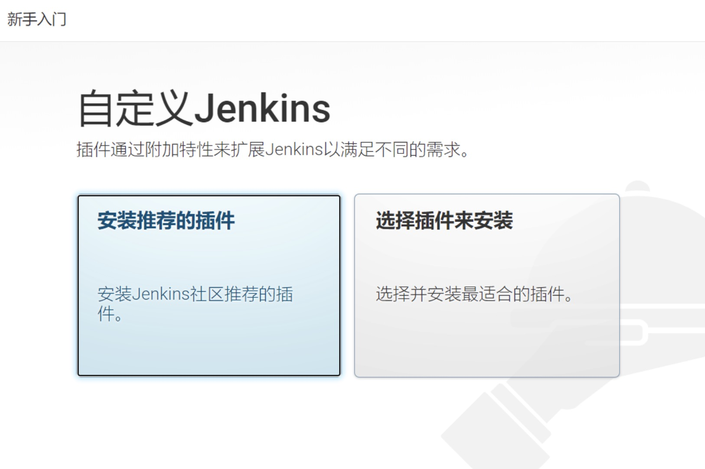
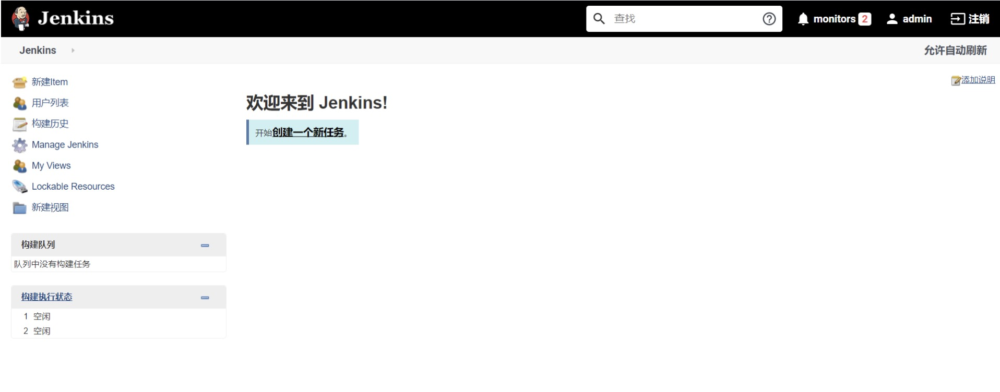

docker 安装jenkins


[参考](https://blog.csdn.net/weixin_43889841/article/details/108027759?utm_medium=distribute.pc_relevant.none-task-blog-2~default~baidujs_baidulandingword~default-0.pc_relevant_default&spm=1001.2101.3001.4242.1&utm_relevant_index=3)

先安装jdk maven nodejs...

```shell script
#创建挂载目录
mkdir -p /opt/jenkins/jenkins_home
chmod 777 /opt/jenkins/jenkins_home

#搜索镜像 lts:长期稳定版
docker search jenkins
#拉取镜像
docker pull jenkins/jenkins:lts
#创建容器
docker run --name=jenkins -d -p 8882:8080 -p 50000:50000 --privileged=true \
-u root \
-v /opt/jenkins-data/jenkins_home:/var/jenkins_home \
-v /var/run/docker.sock:/var/run/docker.sock  \
-v $(which docker):/usr/bin/docker \
-v /etc/localtime:/etc/localtime \
-v /usr/lib/jdk/jdk1.8.0_221:/var/jenkins_home/jdk8 \
-v /opt/maven:/var/jenkins_home/maven \
-v /opt/repository:/var/jenkins_home/repository \
-v /opt/nodeJs/node:/var/nodeJs \
jenkins/jenkins:lts
```

[注意：必须挂载 jdk和maven和仓库]
[注意：maven中setting配置的仓库地址必须是 容器内的仓库地址]

参数
```text
-d 后台运行镜像
-p 10240:8080 意义： 将镜像的8080端口映射到服务器的10240端口。
-p 10241:50000 意义：将镜像的50000端口映射到服务器的10241端口
-v /var/jenkins_mount:/var/jenkins_mount 
意义： /var/jenkins_home目录为容器jenkins工作目录，我们将硬盘上的一个目录挂载到这个位置，方便后续更新镜像后继续使用原来的工作目录。
      这里我们设置的就是上面我们创建的 /var/jenkins_mount目录
-v /etc/localtime:/etc/localtime 意义：让容器使用和服务器同样的时间设置。
-v /root/apache-maven-3.6.3:/usr/local/maven 意义：挂载本地maven，前面是服务器上的，后面是挂载到容器上的目录
–name myjenkins 意义：给容器起一个别名
-v $(which docker):/usr/bin/docker  使jenkins能够使用docker命令
```
[-v 本地路径:容器路径]

解锁Jenkins
http://101.34.130.39:8882/ 首次登录需要解锁Jenkins，输入密码后，选择安装推荐的插件即可



获取密码两种方式：
1.进入容器内部docker exec -it jenkins bash
  执行命令：cat /var/jenkins_home/secrets/initialAdminPassword
2.使用容器卷：/home/jenkins-data:/var/jenkins_home/secrets/initialAdminPassword，得到密码并粘贴过去

[重启Jenkins]
直接在访问地址后面加上restart
http://101.34.130.39:8885/restart


####设置Jenkins
1.安装推荐插件
2.设置默认账户
3.安装插件
安装两个插件，一个是publish over ssh，一个是Maven Integration
4.配置Jdk和Maven
点击全局配置[Global Tool Configuration]后，配置maven为刚才挂载的maven路径，也就是docker中的路径：/var/jenkins_home/maven
Jdk: 同样
[注意：环境变量取docker中的]


####配置环境变量
进入容器：docket exec -it 容器ID /bin/bash
设置容器应用的环境变量: vi /etc/profile
[安装vi](../4.常见问题.md)
在文件最后面添加如下内容:
```shell script
# java环境变量
export JAVA_HOME=/var/jenkins_home/jdk8
export JRE_HOME=$JAVA_HOME/jre
export PATH=$JAVA_HOME/bin:$PATH
export CLASSPATH=./:JAVA_HOME/lib:$JRE_HOME/lib
export NODEJS=/var/nodeJs

# maven环境变量
export M2_HOME=/var/jenkins_home/maven
export PATH=$PATH:$JAVA_HOME/bin:$M2_HOME/bin:$NODEJS/bin

```
[注意：目录为docker中的目录]

更新profile:
source /etc/profile
验证是否设置成功: mvn -v
推出容器：exit

[注意：容器重启，配置会失效]
解决：容器加载时会先从/root/.bashrc 中加载环境变量，在/root/.bashrc中添加：source /etc/profile


####踩坑
1.maven中的仓库地址必须是docker中的仓库地址，否则下载不了jar
2.WARNING: HK2 service reification failed for [org.glassfish.jersey.message.internal.DataSourceProvider] 
解决：修改pom.xml
```xml
 <build>
        <plugins>
            <plugin>
                <groupId>org.springframework.boot</groupId>
                <artifactId>spring-boot-maven-plugin</artifactId>
            </plugin>
            <plugin>
                <groupId>com.spotify</groupId>
                <artifactId>dockerfile-maven-plugin</artifactId>
                <version>1.3.6</version>
                <configuration>
                    <repository>${project.artifactId}</repository>
                    <buildArgs>
                        <JAR_FILE>target/${project.build.finalName}.jar</JAR_FILE>
                    </buildArgs>
                </configuration>
    
                <!-- 解决 HK2 DataSource-->
                <dependencies>
                    <dependency>
                        <groupId>javax.activation</groupId>
                        <artifactId>activation</artifactId>
                        <version>1.1.1</version>
                    </dependency>
                </dependencies>
            </plugin>
        </plugins>
    </build>
```
3.docker (java.io.IOException) caught when processing request to {}->unix://localhost:80: Permission denied
解决：为主机添加权限： chmod 777 /var/run/docker.sock


4.org.apache.maven.plugin.MojoExecutionException: Could not build image
解决：jenkins无法找到docker命令，在运行jenkins时，一定要挂载docker命令：
-v $(which docker):/usr/bin/docker 

5.jenkins时间与服务器不一致
解决：
首先查看服务器时间：date
查看时区：timedatectl | grep "Time zone"
```shell script
# 如果不是Asia/Shanghai，进行以下修改
rm -rf /etc/localtime
ln -s /usr/share/zoneinfo/Asia/Shanghai /etc/localtime
```
打开 jenkins web 端执行脚本命令 点击【系统管理】---->【脚本命令行】Script Console
执行以下命令
```shell script
System.setProperty('org.apache.commons.jelly.tags.fmt.timeZone', 'Asia/Shanghai')
#点击Run
```
至此，时间 jenkins 与服务器时间已同步完成。


####5.ssh发布不了，连接不到服务器
解决：使用：remote SSH 命令
1.安装 SSH Pipeline Steps 插件
2.在凭据中添加remote server凭据，添加远程服务的连接信息 dev-remote-server
用户名/密码 等
3.编写流水线脚本
```shell script
//设置远程服务信息
def remote = [:]
remote.name = "dev-server"
remote.host = "192.168.199.162"
remote.allowAnyHosts = true

pipeline{
    agent any
    stages{
        stage("部署"){
            //通过withCredentials调用Jenkins凭据中已保存的凭据,credentialsId需要填写,其他保持默认即可
            withCredentials([usernamePassword(credentialsId: 'dev-remote-server', passwordVariable: 'password', usernameVariable: 'userName')]) {
                remote.user = "${userName}"
                remote.password = "${password}"

                //在remoteserver上执行ifconfig命令
                sshCommand remote: rserver, command: "sh -x /opt/jenkins_shell/deployCloud.sh ${harbor_url} ${harbor_project_name} ${project_name} ${tag} ${port}"
            }
        }
    }
}
```