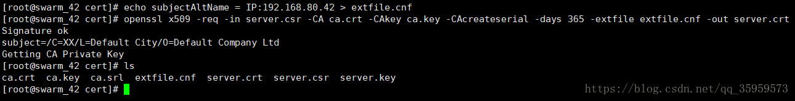

Docker安装Harbor

[参考](https://blog.csdn.net/qq_35959573/article/details/80664353)

###一、Harbor 介绍
Docker容器应用的开发和运行离不开可靠的镜像管理，虽然Docker官方也提供了公共的镜像仓库，但是从安全和效率等方面考虑，
部署我们私有环境内的Registry也是非常必要的。Harbor是由VMware公司开源的企业级的Docker Registry管理项目，
它包括权限管理(RBAC)、LDAP、日志审核、管理界面、自我注册、镜像复制和中文支持等功能。

###二、环境、软件准备
环境、软件准备
Docker：version  20.10.8-ce
Docker-compose： version 1.29.1
Harbor： version 1.9.2

未找到wget：yum -y install wget

###三、Harbor 服务搭建
1.下载Harbor安装文件
从 github harbor 官网 release 页面下载指定版本的安装包。
```shell script
#在线安装包
    $ wget https://github.com/vmware/harbor/releases/download/v1.1.2/harbor-online-installer-v1.1.2.tgz
    $ tar xvf harbor-online-installer-v1.1.2.tgz
#离线安装包
    $ wget https://storage.googleapis.com/harbor-releases/release-1.9.0/harbor-offline-installer-v1.9.2.tgz
    $ tar xvf harbor-offline-installer-v1.9.2.tgz

#添加执行权限
chmod +x harbor-offline-installer-v1.9.2.tgz

#解压
tar -xzf harbor-offline-installer-v1.9.2.tgz

mkdir /opt/harbor
mv harbor/* /opt/harbor
cd /opt/harbor

#修改Harbor的配置
vi harbor.yml
修改hostname和port
hostname: 101.34.130.39
port: 8886

#安装Harbor
./prepare
./install.sh

#启动Harbor
docker-compose up -d 启动
docker-compose stop 停止
docker-compose restart 重新启动
docker-compose down 删除容器

#访问Harbor
http://101.34.130.39:8889
#默认账户密码：admin/Harbor12345

#后台访问：
docker login -u admin -p Harbor12345 101.34.130.39:8886
#异常：
Error response from daemon: Get "https://101.34.130.39:8886/v2/": http: server gave HTTP response to HTTPS client
#解决：把Harbor地址加入到Docker信任列表
vi /etc/docker/daemon.json

{"registry-mirrors": ["https://zydiol88.mirror.aliyuncs.com"], "insecure-registries": ["101.34.130.39:8886"] }

#需要重启Docker
systemctl daemon-reload
#停止harbor
docker-compose down
systemctl restart docker 
#查看
systemctl status docker.service

#重启harbor
docker-compose up -d
```


####更改harbor的仓库地址
默认的地址:/data
```shell script
#1.关闭：
docker-compose down -v

#创建新的目录
mkdir -p /opt/harbor-data

#2.修改harbor.yml
data_volume: /opt/harbor-data

#3.修改docker-compose.yml
所有/data -> /opt/harbor-data

#4.重启
./prepare
./install.sh
```


[问题]
1. harbor-db 启动时报initdb: directory "/var/lib/postgresql/data" exists but is not empty
通过docker-compose  启动harbor服务时，harbor-db 容器一直处于 Restarting 状态
docker logs -f harbor-db ,报错日志提示如下
directory "/var/lib/postgresql/data" exists but is not empty
查看挂载目录信息  vim docker-compose.yml
从yaml文件中看到是将宿主机上的 /data/database挂载到容器中的 /var/lib/postgresql/data 目录
将 /data/database 目录删除
再将容器删除docker-compose down ，docker-compose  up -d ，将容器重启
出现如上的原因是我之前在机器上安装过harbor，第一次安装的时候/data/database 下创建了数据，再次安装时需要将之前的脏数据清空

2. harbor-db启动报initdb: could not change permissions of directory "/var/lib/postgresql/data": Operation not permitted
方法一：查看database权限，并修改
方法二：修改yml文件挂载路径（harbor.yml）
       data_volume
       

###测试
把镜像上传到Harbor
1.给镜像打上标签
docker tag eureka:v1 101.34.130.39/library/eureka-xia
docker tag 镜像名称   harbor地址/项目/新镜像

2.推送镜像
docker push 101.34.130.39/library/eureka-xia

报错：
The push refers to repository [101.34.130.39/library/eureka-xia] Get https://101.34.130.39/v2/: http: server gave HTTP response to HTTPS client
原因：这时会出现以上报错，是因为Docker没有把Harbor加入信任列表中
解决：把Harbor地址加入到Docker信任列表
vi /etc/docker/daemon.json
```text
{"registry-mirrors": ["https://zydiol88.mirror.aliyuncs.com"], "insecure-registries": ["101.34.130.39"] }
```
需要重启Docker

再次执行推送命令，会提示权限不足
denied: requested access to the resource is denied
需要先登录Harbor，再推送镜像
docker login -u 用户名 -p 密码 101.34.130.39


###四、部署 SSL 认证
1.概念理解
```text
签名证书与自签名证书 
签名证书：由权威颁发机构颁发给服务器或者个人用于证明自己身份的东西 
自签名证书：由服务器自己颁发给自己，用于证明自己身份的东西，非权威颁发机构发布

openssl 
openssl 是一个强大的安全套接字层密码库，囊括主要的密码算法、常用的密钥和证书封装管理功能及SSL协议，并提供丰富的应用程序供测试或其它目的使用

KEY与CSR的区别 
Key通常用来存放一个公钥或者私钥,并非X.509证书,编码同样的,可能是PEM,也可能是DER。证书自身拥有一个密钥对（即一个公钥和一个私钥），
由公钥（Public Key）与私钥（Private Key）是通过一种算法得到，公钥是密钥对中公开的部分，私钥则是非公开的部分。
一般公钥和密钥的关系为：
    1，公钥和私钥成对出现、
    2，公开的密钥叫公钥，只有自己知道的叫私钥、
    3，用公钥加密的数据只有对应的私钥可以解密、
    4，用私钥加密的数据只有对应的公钥可以解密、
    5，如果可以用公钥解密，则必然是对应的私钥加的密、
    6，如果可以用私钥解密，则必然是对应的公钥加的密

CSR文件必须在申请和购买SSL证书之前创建。也就是证书申请者在申请数字证书时由CSP(加密服务提供者)在生成私钥的同时也生成证书请求文件，
证书申请 者只要把CSR文件提交给证书颁发机构后，证书颁发机构使用其根证书私钥签名就生成了证书公钥文件，也就是颁发给用户的证书
```

2.创建根证书
```shell script
# 创建证书存放目录 
mkdir -p /data/cert && cd /data/cert

# 创建自己的CA证书（不使用第三方权威机构的CA来认证，自己充当CA的角色） 
openssl genrsa -out ca.key 2048 # 生成根证书私钥（无加密）

# 生成自签名证书（使用已有私钥ca.key自行签发根证书） 
openssl req -x509 -new -nodes -key ca.key -days 10000 -out ca.crt -subj "/CN=Harbor-ca" 

#req　　产生证书签发申请命令 
#-x509　签发X.509格式证书命令。X.509是最通用的一种签名证书格式。 
#-new　 生成证书请求 
#-key　 指定私钥文件 
#-nodes 表示私钥不加密 
#-out 　 输出 
#-subj　指定用户信息 
#-days　有效期
```

3.创建服务器端证书
```shell script
# 生成服务器端私钥和CSR签名请求 
openssl req -newkey rsa:4096 -nodes -sha256 -keyout server.key -out server.csr
# 一路回车
```


```shell script
# 签发服务器证书 
echo subjectAltName = IP:192.168.80.42 > extfile.cnf 
openssl x509 -req -in server.csr -CA ca.crt -CAkey ca.key -CAcreateserial -days 365 -extfile extfile.cnf -out server.crt 

#x509　　签发X.509格式证书命令。 
#-req　　 表示证书输入请求。 
#-days　 表示有效天数 
#-extensions 表示按OpenSSL配置文件v3_req项添加扩展。 
#-CA 　　表示CA证书,这里为ca.crt 
#-CAkey　　表示CA证书密钥,这里为ca.key 
#-CAcreateserial 表示创建CA证书序列号 
#-extfile　　指定文件
```


4.修改 Harbor 的配置文件 hardor.cfg
```text
# 修改成 https
ui_url_protocol = https

# 认证文件的路径
ssl_cert = /data/cert/server.crt
ssl_cert_key = /data/cert/server.key
```

5.设置 docker 证书
```text
# 如果如下目录不存在，请创建，如果有域名请按此格式依次创建
mkdir -p /etc/docker/certs.d/192.168.80.42
# mkdir -p /etc/docker/certs.d/[IP2]
# mkdir -p /etc/docker/certs.d/[example1.com] 
# 如果端口为443，则不需要指定。如果为自定义端口，请指定端口
# /etc/docker/certs.d/yourdomain.com:port
```

```shell script
# 将 ca 根证书依次复制到上述创建的目录中 
cp ca.crt /etc/docker/certs.d/192.168.80.42 
cp server.crt /etc/docker/certs.d/192.168.80.42
```

6.重启 docker 和 启动 Harbor
```shell script
# 重启 docker 
systemctl restart docker 

# 启动Harbor 
./install.sh
```
启动完成后，我们访问刚设置的 hostname 即可 https://192.168.80.42/，默认是80端口

7.后台登录
```shell script
# 登录仓库
docker login -u admin -p Harbor12345 192.168.80.42

# 登出仓库
docker logout 192.168.80.42
```
注：其他服务器如果需要访问 Harbor 仓库，把 /etc/docker/certs.d/192.168.80.42 文件夹复制到该主机的相同位置即可