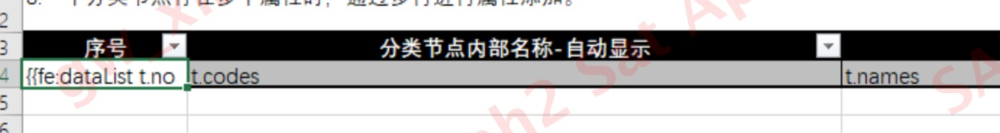

模板导出


###1.编辑模板文件
import.xlsx
语法：fe的写法 
fe标志 冒号 list数据 单个元素数据（默认t，可以不写） 第一个元素
{{fe: maplist t t.id }}


###2.项目中设置模板文件
resources/template.export

###3.定义导出实体
普通的类，字段与模板中的一致

###4.实现
```java
//controller
public class Test{
    @PostMapping("/export")
    public void export(@RequestBody ClassificationExportDto dto, 
                       HttpServletResponse response) {
        try (ServletOutputStream out = response.getOutputStream()){
            response.reset();
            String fileName = "分类列表.xlsx";
            String fileNameURL = URLEncoder.encode(fileName, "UTF-8");
            response.setCharacterEncoding("UTF-8");
            response.setHeader("content-Type", "application/x-download");
            //解决中文乱码
            response.setHeader("Content-disposition", "attachment;filename="+fileNameURL+";"+"filename*=utf-8''"+fileNameURL);

            //导出
            XSSFWorkbook workbook = (XSSFWorkbook) service.export(dto);
            workbook.write(out);
        } catch (IOException e) {
            log.error(">>>>export异常 e:{}", e.getMessage());
        }
    }
}

//service
public class Service{
    @Override
    public Workbook export(ClassificationExportDto dto) {
        List<ClassificationExportQueryVo> importList = classificationNodeRepository.queryExportInfo(dto);

        //通过类加载器获取模板文件
        ClassPathResource res = new ClassPathResource("template/export/import.xlsx", this.getClass());
        String templateUrl = res.getPath();
        //获取模板中的参数，true:展示所有的sheet页
        TemplateExportParams params = new TemplateExportParams(templateUrl, true);
        //参数所在行
        params.setHeadingRows(3);
        Map<String, Object> map = new HashMap<>();
        //key与模板中定义的一致
        map.put("dataList", importList);
        return ExcelExportUtil.exportExcel(params, map);
    }
}
```