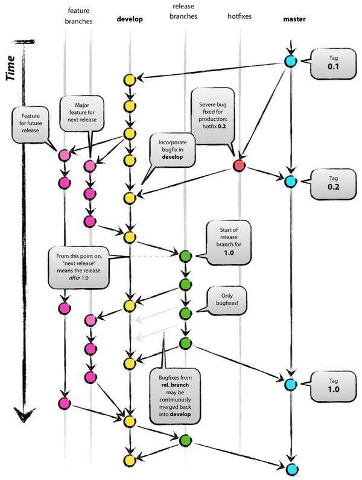

分支管理策略

###1.分支管理
本管理方案采用 Gitflow 工作流方式，它的主要特点是，长期存在两个分支：
- 主分支（master）
- 开发分支（develop）

然后，存在三种辅助分支，都是短期的，并且一半情况下只应该存在本地，不要提交到远程库。
- 功能分支（feature branch）
- 补丁分支（hotfix branch）
- 预发分支（release branch）

###2.分支命名
master 分支
- master 为主分支，也是用于部署生产环境的分支，确保master分支稳定性。
- master 分支一般由develop以及hotfix分支合并，任何时间都不能直接修改代码。

develop 分支
- develop 为开发分支，始终保持最新完成以及bug修复后的代码。
- 一般开发的新功能时，feature分支都是基于develop分支下创建的。

feature 分支
- 开发新功能时，以develop为基础创建feature分支。
- 命名规则: feature-xxx

release分支
- release 为预上线分支，发布提测阶段，会以release分支代码为基准提测

当有一组feature开发完成，首先会合并到develop分支，进入提测时，会创建release分支。
如果测试过程中若存在bug需要修复，则直接由开发者在release分支修复并提交。
当测试完成之后，合并release分支到master和develop分支，此时master为最新代码，用作上线。

hotfix 分支
- 线上出现紧急问题时，需要及时修复，以master分支为基线，创建hotfix分支，修复完成后，合并到master和develop分支
- 命名规则: hotfix-xxx

###3.分支合并示意图
