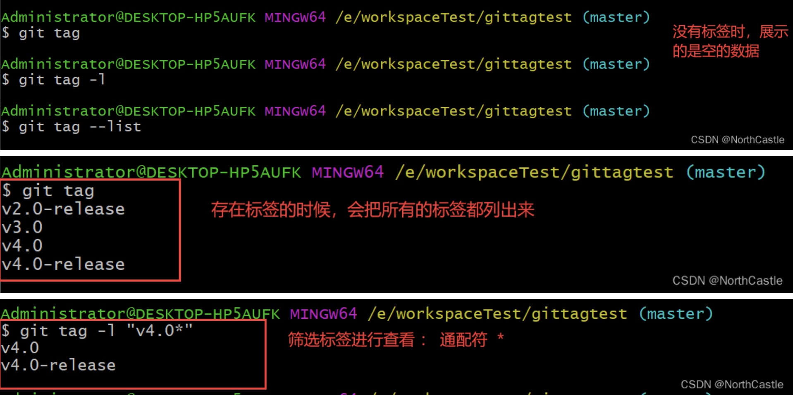
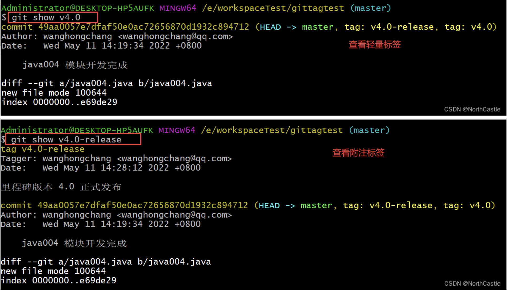
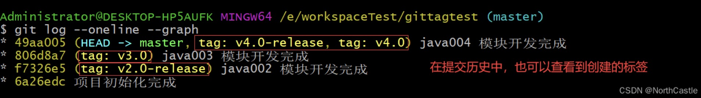
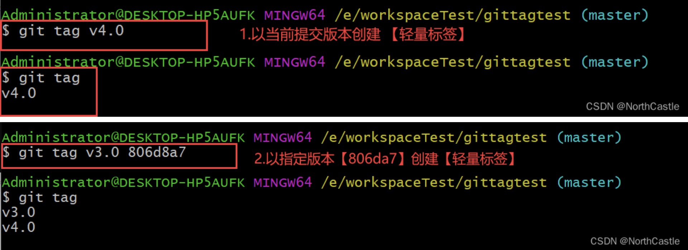
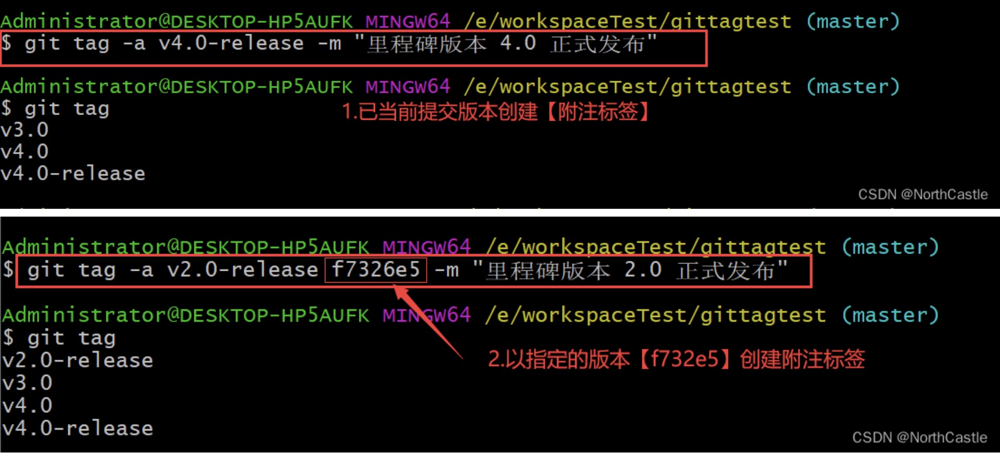
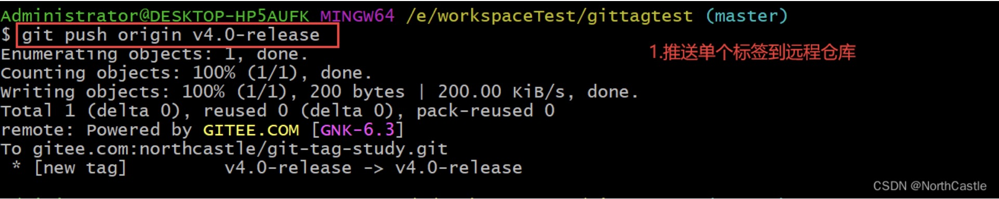
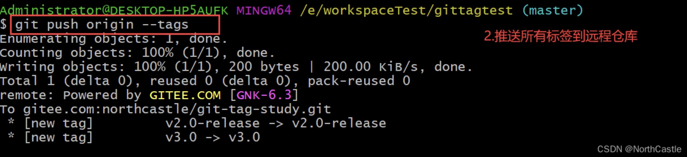
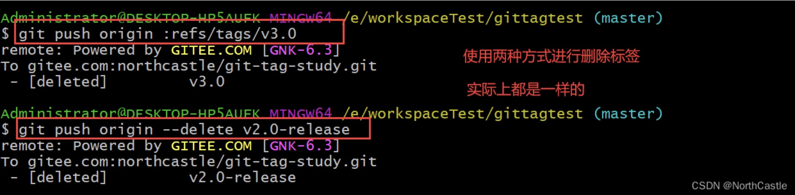
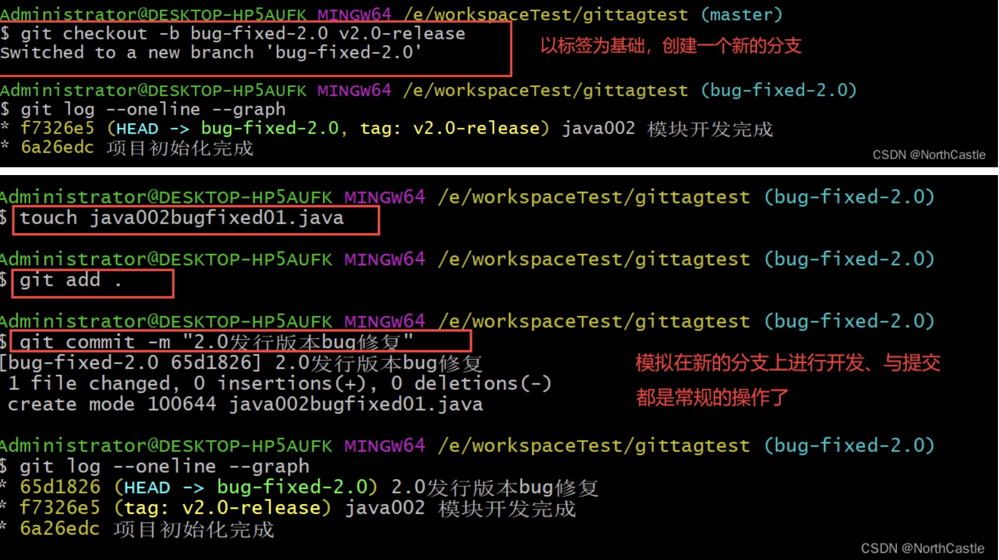

Git tag


###一、什么是tag
tag是git版本库的一个标记，指向某个commit的指针。
tag主要用于发布版本的管理，一个版本发布之后，我们可以为git打上 v.1.0.1 v.1.0.2 ...这样的标签。

tag感觉跟branch有点相似，但是本质上和分工上是不同的：
tag 对应某次commit, 是一个点，是不可移动的。
branch 对应一系列commit，是很多点连成的一根线，有一个HEAD指针，是可以依靠 HEAD 指针移动的。

所以，两者的区别决定了使用方式，改动代码用 branch ,不改动只查看用 tag。
tag 和 branch 的相互配合使用，有时候起到非常方便的效果，
例如：已经发布了 v1.0 v2.0 v3.0 三个版本，这个时候，我突然想不改现有代码的前提下，在 v2.0 的基础上加个新功能，作为 v4.0 发布。
就可以检出 v2.0 的代码作为一个 branch ，然后作为开发分支。

简单的理解，tag 就是 对某次 commit 的一个标识，相当于起了一个别名。
例如，在项目发布某个版本的时候，针对最后一次commit 起一个 v1.0.100 这样的标签来标识里程碑的意义。


###二、tag的类型
有两种类型的标签 ： 轻量标签（lightweight）、附注标签(annotated)
- 轻量标签： 只是某个commit 的引用，可以理解为是一个commit的别名；
- 附注标签： 是存储在git仓库中的一个完整对象，包含打标签者的名字、电子邮件地址、日期时间 以及其他的标签信息。
           它是可以被校验的，可以使用 GNU Privacy Guard (GPG) 签名并验证。

[参考](https://blog.csdn.net/qq_39505245/article/details/124705850?spm=1001.2101.3001.6661.1&utm_medium=distribute.pc_relevant_t0.none-task-blog-2%7Edefault%7ECTRLIST%7ERate-1-124705850-blog-98654951.pc_relevant_multi_platform_whitelistv5&depth_1-utm_source=distribute.pc_relevant_t0.none-task-blog-2%7Edefault%7ECTRLIST%7ERate-1-124705850-blog-98654951.pc_relevant_multi_platform_whitelistv5&utm_relevant_index=1)


###三、操作
####3.1.查看标签
####3.1.1.查看标签列表:
```shell script
$ git tag
or 
$ git tag -l [标签名称筛选字符串*] 或者 git tag --list [标签名称筛选字符串*]
```
说明:
git tag : 直接列出所有的标签
git tag -l xxxx : 可以根据 xxxx 进行标签的筛选



####3.1.2.查看标签的提交信息:
```shell script
$ git show 标签名
```
说明:
git show 标签名 ： 查看标签的信息，（轻量标签 和 附注标签 的信息是不一样的）



####3.1.3.在提交历史中查看标签:



####3.2.创建标签
####3.2.1.创建轻量标签
```shell script
$ git tag 标签名   
or 
$ git tag 标签名 提交版本
```
说明 ：
git tag 标签名 ： 直接给当前的提交版本创建一个【轻量标签】
git tag 标签名 提交版本号 ：给指定的提交版本创建一个 【轻量标签】



####3.2.2.创建附注标签
```shell script
$ git tag -a 标签名称 -m 附注信息   
or
$ git tag -a 标签名称 提交版本号 -m 附注信息
```
说明：
-a : 理解为 annotated 的首字符，表示 附注标签
-m : 指定附注信息
git tag -a 标签名称 -m 附注信息 ：直接给当前的提交版本创建一个 【附注标签】
git tag -a 标签名称 提交版本号 -m 附注信息 ：给指定的提交版本创建一个【附注标签】




####3.3.删除本地标签
```shell script
$ git tag -d 标签名称   
```
说明 ：
git tag -d 标签名称 : 删除指定名称的标签


####3.4.推送到远程仓库
默认情况下，git push 命令并不会把标签推送到远程仓库中。
因此，我们必须 手动地将 本地的标签 推送到远程仓库中。

```shell script
$ git push xx.git 标签名称 
or
$ git push xx.git --tags
```
说明 ：
git push xx.git 标签名称 : 将指定的标签上传到远程仓库
git push xx.git --tags : 将所有不在远程仓库中的标签上传到远程仓库





####3.5.删除远程仓库的标签
删除远程仓库上地标签同样也需要手动执行。

```shell script
$ git push xx.git  :regs/tags/标签名称
or
$ git push xx.git --delete 标签名称
```
说明 ：
上面两个命令都是删除远程仓库中的 指定标签




####3.6.检出标签
检出标签的理解 ： 我想在这个标签的基础上进行其他的开发或操作。
检出标签的操作实质 ： 就是以标签指定的版本为基础版本，新建一个分支，继续其他的操作。
因此 ，就是 新建分支的操作了。

```shell script
$ git checkout -b 分支名称 标签名称
```



但是需要特别说明的是: 
如果我们想要修改 tag检出代码分支，那么虽然分支中的代码改变了，但是 tag标记的 commit还是同一个，
标记的代码是不会变的，这个要格外的注意。

git checkout [tagname] 切换标签