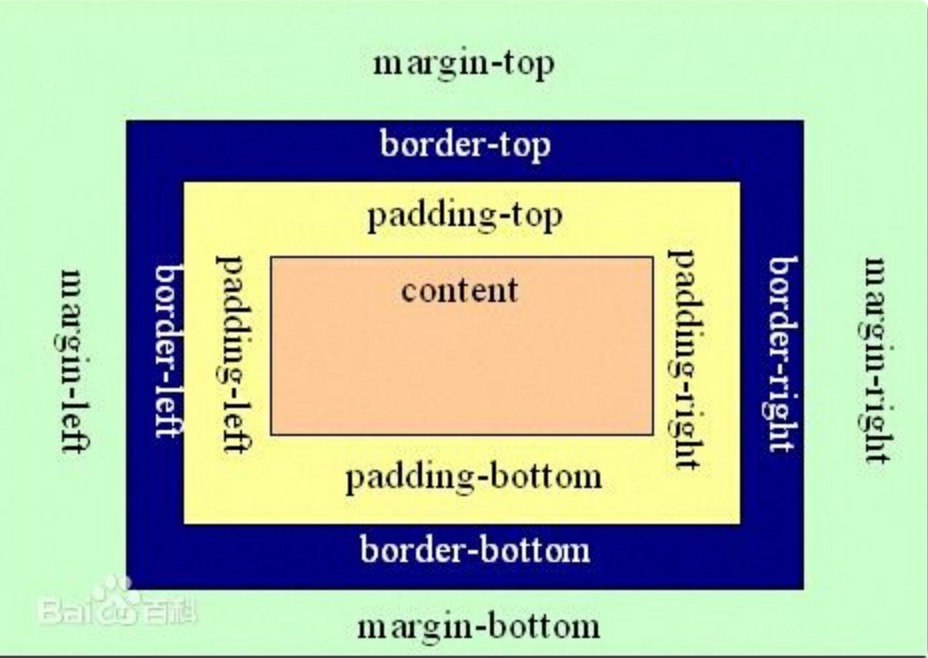

HTML


#### HTML
Hyper Text Markup Language 超文本标记语言
结构：
    根标签：<html>..</html>
    头标签：<head>
            <meta charset="utf-8"> 	    //编码
			<title>..</title> 			//网页标题显示
		   </head>
    体标签: <body>..</body> 				//存放网站页面主体


#### HTML的标签
1.字体标签 
    <font>..</font>
    格式： <标签 属性名=”属性值”>..</标签> 
    属性:
        color: 字体颜色
			1.英文单词设置:black,red,green,blue...
			2.使用16进制数设置:#FFFFFF (红绿蓝)		//红：#FF0000
			3.使用rgb(红、绿、蓝)					//rgb(0,0,255)/rgb(0%,0%,100%)
        size: 字体的大小，值：1-7：7最大，1最小
        face: 字体

2.排版标签
    <h1>..</h1> 标题标签，1-6: 1号最大，6号最小
    <p>..</p> 段落标签

3.图片标签
    
    格式：
    属性:
        src : 图片的来源,路径
        width : 图片的宽度 单位：px像素
        height : 图片的高度 单位：px像素
        alt : 图片找不到时显示的内容
-
    路径：相对路径
        ./ : 	同级路径	或省略
        ../: 	上级路径

4.列表标签
    有序列表: 有序号
        <ol type="值" start="值"> //start:从多少开始 
        <li>..</li>
        </ol>
    无序列表：无序号
        <ul type="值"> 
        <li>..</li>
        </ul>

5.超链接标签
    <a 属性="属性值">..</a>
    属性:
		href :链接的路径
		target :显示的方式
			_self :在自身页面打开
			_blank :新打开一个窗口
			_parent :在框架中的父窗口中显示

6.表格标签
    <table> 					// 表格
        <tr> 					// 行
            <td>..</td> 		// 单元格
        </tr>
    </table>
-
    table tr td属性: [<tr>没有width属性]
        width :表格宽度 单位：px像素/%百分比
        height :表格高度 单位：px像素/%百分比
        border :边框 单位：px像素
        align :对齐方式 left左 center居中 right右 
        bgcolor :背景色
        background:背景图片
        cellspacing:行间距

		<td>的属性:
			colspan=”列数”-->跨列：合并行
			rowspan=”行数”-->跨行：合并列

	其他标签
		<hr /> 				水平线
		<br /> 				换行
		<b>..</b> 			字体加粗
		<i>..</i> 			斜体字体
		<u>..</u> 			字体下划线
		<center>..</center> 字体居中
		<!--..--> 			注释
		<pre>..</pre>		原生标签：文本原来的样式
		&nbsp				空格

7.表单标签
    <form>..</form> 
    属性:
		action属性:	提交的路径.默认提交到当前页面
		method属性:	提交的方式.常用的有2种：GET和POST.默认是GET.
注：
    GET方式和POST方式的区别：
		GET :数据会显示到地址栏中.GET方式提交是有大小的限制(1K/4K). 不安全
		POST :数据不会显示到地址栏中.POST方式提交的是没有大小限制


#### 表单标签
[所有表单标签必须有name属性，才能提交到后台]

7.1.文本框标签
    <input type=”text” name="自定义值"/> 		
    属性:
	name :表单元素的名称		
	value :文本框的值
	size :文本框的长度
	maxlength:文本框输入的最大长度
	readonly:只读文本框
	placeholder:默认显示值 


7.2.密码框标签
    <input type=”password” name="自定义值"/>
    属性:
	name :表单元素的名称
	value :密码框的默认值
	size :密码框的长度
	maxlength:密码框输入的最大长度


7.3.单选按钮标签
    <input type=”radio” name="自定义值" value="自定义值"/> 			//成组使用，name值相同
    属性: 
	name :表单元素的名称 
	value :单选按钮的默认值
	checked :单选按钮默认被选中 checked="checked"


7.4.复选按钮标签
    <input type=”checkbox” name="自定义值" value="自定义值"/> 		//成组使用，name值相同
    属性:
	name :表单元素的名称
	value :单选按钮的默认值
	checked :单选按钮默认被选中  checked="checked"


7.5.下拉列表标签
    <select name="自定义值"> 
        <option value="自定义值">显示值</option> 					//option:代表每个元素 
    </select> 
-    
    option属性:
        selected:默认被选中 selected="selected" 
    select属性：
        multiple:列表元素全部显示 multiple="multiple"


7.6.其他按钮标签
    <input type=”button” name="自定义值" value="自定义值"/> 		//普通按钮.没有任何功能的按钮,需自定义功能
    <input type=”submit” name="自定义值" value="自定义值”/>		//提交按钮
	<input type=”reset” name="自定义值" value="自定义值"/> 		//重置按钮
	<input type=”file” name="自定义值"/> 						//文件上传的表单项
	<input type=”hidden” name="自定义值"/> 						//隐藏字段
	<input type=”image” name="自定义值"/> 						//图片按钮
	<textarea name="自定义值" rows="值" cols="值"/> 				//文本域 几行 几列 	//默认值：在外面写


扩展标签：(H5)
	<input type=”email”> :邮箱标签
	<input type=”date”> :日期标签
	<input type=”number”> :数字标签，只能输入数字
	<input type=”color”> :颜色选项标签
	


8.框架标签 		
[框架标签与body标签是冲突,有frameset就没有body]
	<frameset>
		<frame src="页面路径" name="区域值"/> 			
	</frameset>

frameset属性:
    rows: 页面横向切分 ，可以有多个值[或者用百分比]，用逗号隔开,代表切割几个部分
    cols: 页面纵向切分 ，可以有多个值[或者用百分比]，用逗号隔开,代表切割几个部分
    //<frameset rows="20%,60%,20%"> 横向切了三个部分
    //<frameset rows="15%,*"> 	//*:代表剩下的全部,  有顺序，15%-->left,  *-->right

注：切出了几个部分，就必须要有几个对应的<frame>

frame属性：
    src：  引入页面的路径
    name： 区域名 	[必须要设置]

在超链接的target的属性上设置这个区域名，点击超链接时，则会跳转到指定区域
    <frame src="right.html" name="right"/>
    <a href="http://www.baidu.com" target="right">分类管理</a> 


#### css
DIV+CSS布局网站
1.HTML的块标签：
    <div>..</div> 		默认一个div独自占一行，div一般会与css连用
    <span>..</span> 	默认在同一行，一般用于显示信息

2.CSS 层叠样式表
    语法： 选择器{属性：属性值;属性：属性值...} 		//分号相隔，类似于数组 h1 {color:red; font-size:14px}
-
	css的引入方式： 就近原则
		1.行内样式：直接在HTML的元素上使用style属性设置CSS. 			//有局限性
			<h1 style="color:red;font-size:200px ;">标题</h1>

		2.页面内样式：在HTML的<head>标签中使用<style>标签设置CSS. 	//当前页面可以复用，有局限性
			<style type="text/css" >
				.addH1{color:blue;font-size: 40px;}
			</style>

		<h1 class="addH1">标题</h1>

		3.外部样式:创建一个.css的文件，将2中的代码写入.css文件中,不加<style>.再在HTML中引入该CSS文件. 【HTML的<head>标签中引入】
			<link href="../../css/demo1.css" rel="stylesheet" type="text/css" />


3.css的常用选择器
    1.元素选择器：直接使用标签名当作选择器使用
        div{border:1px solid blue;width:40px; height:45px;}
        <div>文字</div>
    2.ID选择器：使用标签中的唯一标识来进行选择 需定义唯一标识id, HTML所有标签都有id属性
        <div id="d1">文字</div>
        #d1{ border:2px solid red;}
    3.类选择器：选择是同一个类的所有标签 HTML所有标签都有class属性
        <div class="divClass">文字</div>
        .divClass{ border:2px solid yellow;}

同时选中多个选择器对应的元素 逗号分隔
```html
<style>
    #p1 , .p2 ,h2 {
        background-color: #ff56d0;
    }
</style>
```

复合选择器(交集选择器)同时满足多个选择器的元素
对于id选择器来说，不建议使用复合选择器。
```html
<style>
    span.p2{
        background-color: #b1b1b1;
    }
</style>
<span class="p2">略略略</span>
```

根据属性选择元素
语法【属性名】选取含有指定属性的元素
【属性名=“属性值”】选取含有指定属性值的元素
【属性名^=“属性值”】选取属性值以指定内容开头的元素
【属性名$=“属性值”】选取属性值以指定内容结尾的元素
【属性名*=“属性值”】选取属性值以包含指定内容的元素
```html
<style type="text/css">
     [href="500294514.jpg"]{
         font-size: 70px;
         color: #c49aff;
     }
</style>
```

选择器动作
```html
<style type="text/css">
    p:hover{
        font-size: 100px;
        color: #ff3321;
    }
</style>
```

后代元素选择器（语法：祖先 后代{}）
例如改变下面的div标签中的span元素
```html
<style type="text/css">
    div span{
        background-color: #b1b1b1;
    }
</style>

<div>
    <span>我是一个标签</span>
</div>

<style type="text/css">
    #id1 p span{
        background-color: #b1b1b1;
    }
</style>

<div id="id1">
    <span>我是一个标签</span>
    <p><span>我是p中的span标签</span></p>
</div>
```

设置圆角边框(border-radius后面的数字是圆心里左右边框的距离，和圆心离上下边的距离)
```html
<style type="text/css">
    .class3{
        width: 50px;
        height: 50px;
        border: 1px solid slateblue;
        background-color: #ff46d4;
        border-radius: 10px / 10px;
    }

</style>
```


4.css的浮动 	
通过float浮动控制一行显示多少个div
    1.float属性的取值:
		left:		元素向左浮动
		right:	    元素向右浮动
		none:	    默认值。元素不浮动
		inherit:	规定应该从父元素继承float属性的值
    2.清除浮动效果：   使用clear属性进行清除:
    clear属性的取值:
		left:		在左侧不允许浮动元素
		right:	    在右侧不允许浮动元素
		both:	    在左右两侧都不允许浮动元素 clear:both; //清除浮动
		none:	    默认值。允许浮动元素出现在两侧
		inherit:	规定应该从父元素继承clear属性的值


5.css样式 
    1.背景：background
		body {background-image: url(/i/eg_bg_04.gif);}
		p {background-color: gray; padding: 20px;}
    2.文本：text-xx
		p {text-indent: 5em;} 			//首行缩进，或者20%
		text-align ：center  			//文本对齐方式
		p.spread {word-spacing: 30px;} 	//字间距
		h4 {letter-spacing: 20px} 	 	//字母间距
		text-shadow 				    //设置文本阴影
		color 						    //设置文本颜色 
    3.字体：font
		font-style 		设置字体风格。 
		font-size 		设置字体的尺寸。 
    4.列表：list
	 	ul li {list-style-image : url(xxx.gif)}
		list-style-type 		设置列表项标志的类型。 

6.CSS中的框模型-->针对div
	1.内边距：padding   div边框距离内部对象的距离
	2.边框：border 
	3.外边距：margin    div边框外面距离其他对象的距离

7.CSS中的定位-->针对div
	1.position属性设置定位： 定位原点在页面 左上角(0,0)
		relative:相对定位 相对于原点
		absolute:绝对定位
	2.使用另外两个属性:left,top


8.超链接的伪类 用于向超链接添加特殊的效果。有顺序
	:link {color: #FF0000}      未访问的链接 
	:visited {color: #00FF00}   已访问的链接 
	:hover {color: #FF00FF}     鼠标移动到链接上 
	:active {color: #0000FF}    选定的链接 

"代码案例"
```html
#red : visited {color: #FF0000} 
<a id="red" href="css_syntax.asp">CSS Syntax</a>
```
提示：在 CSS 定义中，a:hover 必须被置于 a:link 和 a:visited 之后，才是有效的。
提示：在 CSS 定义中，a:active 必须被置于 a:hover 之后，才是有效的。
提示：伪类名称对大小写不敏感。


CSS 属性组：
https://www.w3school.com.cn/cssref/index.asp

边距样式
