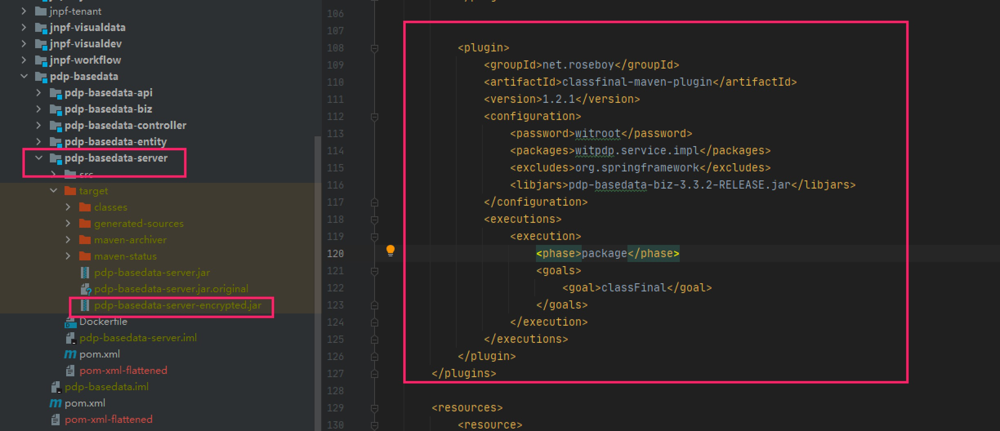

jar包加密部署

[参考](https://gitee.com/roseboy/classfinal)

使用开源工具：classfinal
[jar包](./lib/classfinal-fatjar-1.2.1.jar)

介绍
ClassFinal是一款java class文件安全加密工具，支持直接加密jar包或war包，无需修改任何项目代码，兼容spring-framework；
可避免源码泄漏或字节码被反编译。

功能特性
无需修改原项目代码，只要把编译好的jar/war包用本工具加密即可。
运行加密项目时，无需求修改tomcat，spring等源代码。
支持普通jar包、springboot jar包以及普通java web项目编译的war包。
支持spring framework、swagger等需要在启动过程中扫描注解或生成字节码的框架。
支持maven插件，添加插件后在打包过程中自动加密。
支持加密WEB-INF/lib或BOOT-INF/lib下的依赖jar包。
支持绑定机器，项目加密后只能在特定机器运行。
支持加密springboot的配置文件。

环境依赖
JDK 1.8 +


###1.添加依赖
```xml
<plugin>
    <!-- https://gitee.com/roseboy/classfinal -->
    <groupId>net.roseboy</groupId>
    <artifactId>classfinal-maven-plugin</artifactId>
    <version>1.2.1</version>
    <configuration>
        <!--加密打包之后pom.xml会被删除，不用担心在jar包里找到此密码-->
        <password>000000</password>
        <!--加密的包-->
        <packages>com.yourpackage,com.yourpackage2</packages>
        <!--加密的配置文件-->
        <cfgfiles>application.yml</cfgfiles>
        <!--排除的包-->
        <excludes>org.spring</excludes>
        <!--需要加密的lib下的依赖jar-->
        <libjars>a.jar,b.jar</libjars>
    </configuration>
    <executions>
        <execution>
            <!--绑定maven命令-->
            <phase>package</phase>
            <goals>
                <goal>classFinal</goal>
            </goals>
        </execution>
    </executions>
</plugin>
```

参数说明：
-file        加密的jar/war完整路径
-packages    加密的包名(可为空,多个用","分割)
-libjars     jar/war包lib下要加密jar文件名(可为空,多个用","分割)
-cfgfiles    需要加密的配置文件，一般是classes目录下的yml或properties文件(可为空,多个用","分割)
-exclude     排除的类名(可为空,多个用","分割)
-classpath   外部依赖的jar目录，例如/tomcat/lib(可为空,多个用","分割)
-pwd         加密密码，如果是#号，则使用无密码模式加密
-code        机器码，在绑定的机器生成，加密后只可在此机器上运行
-Y           无需确认，不加此参数会提示确认以上信息

运行mvn package时会在target下自动加密生成yourpaoject-encrypted.jar


###2.启动加密后的jar
加密后的项目需要设置javaagent来启动，项目在启动过程中解密class，完全内存解密，不留下任何解密后的文件。
解密功能已经自动加入到 yourpaoject-encrypted.jar中，所以启动时-javaagent与-jar相同，不需要额外的jar包。
启动jar项目执行以下命令：
```shell script
java -javaagent:yourpaoject-encrypted.jar='-pwd 0000000' -jar yourpaoject-encrypted.jar

//参数说明
// -pwd      加密项目的密码  
// -pwdname  环境变量中密码的名字
```

###3.示例

[启动脚本](./lib/pdp-server-shell.sh)
启动命令:./脚本 start all nacos地址 密码