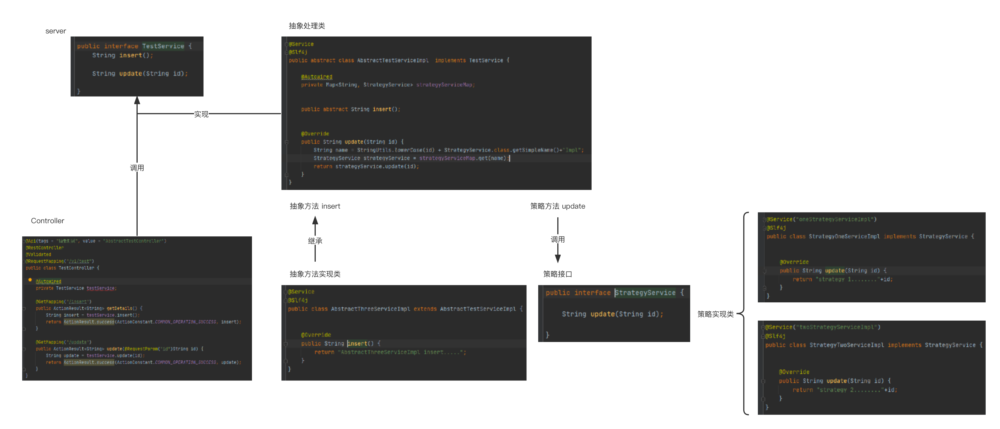
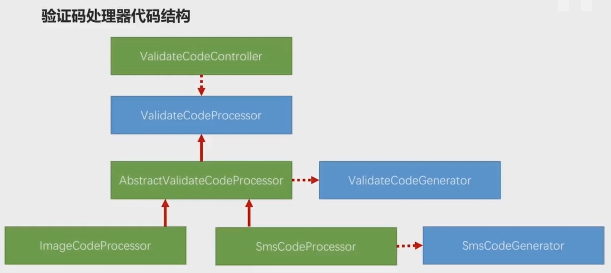

公共接口抽象


###示例



###实现
1.公共接口
[PatternProcessor](./公共接口抽象/PatternProcessor.java)

2.公共接口实现
抽象类 将公共接口中公共的接口进行实现处理[策略]，其余接口定义为抽象类[组合]，由子级实现
[AbstractPatternProcessor](./公共接口抽象/AbstractPatternProcessor.java)

3.组合子实现
继承AbstractPatternProcessor 实现抽象方法
[ComponentPatternProcessor](./公共接口抽象/ComponentPatternProcessor.java)

4.AbstractPatternProcessor中公共方法实现
[StrategyService](./公共接口抽象/StrategyService.java)
[OneStrategyServiceImpl](./公共接口抽象/OneStrategyServiceImpl.java)
[TwoStrategyServiceImpl](./公共接口抽象/TwoStrategyServiceImpl.java)

5.定义获取处理器的工厂
根据不同的类型获取到不同的处理器
[PatternHandlerFactory](./公共接口抽象/PatternHandlerFactory.java)

6.测试类
[TestController](./公共接口抽象/TestController.java)


[优化]
反过来：将策略的方法定义成抽象，将组合的方法定义成公共
好处：策略的实现类比较多，组合的只要一个实现类

或者：
公共接口->父级实现->子级继承[重写方法]
在父级实现中 可以使用 策略获取子级

抽象方式：
[controller](./公共接口抽象/abstract/TestController.java)
[接口](./公共接口抽象/abstract/TestService.java)
[路由](./公共接口抽象/abstract/AbstractHandler.java)

[公共实现—抽象](./公共接口抽象/abstract/AbstractTestServiceImpl.java)

[抽象实现1](./公共接口抽象/abstract/AbstractThreeServiceImpl.java)
[抽象实现2](./公共接口抽象/abstract/AbstractFourServiceImpl.java)

[策略实现1](./公共接口抽象/abstract/StrategyOneServiceImpl.java)
[策略实现2](./公共接口抽象/abstract/StrategyTwoServiceImpl.java)


### 根据关键字选择调用本地服务或远程服务
nacos服务发现依赖
```xml
<dependency>
    <groupId>com.alibaba.cloud</groupId>
    <artifactId>spring-cloud-starter-alibaba-nacos-discovery</artifactId>
</dependency>
```
服务启动创建RestTemplate
```java
@SpringBootApplication
public class SaasApplication {

    public static void main(String[] args) {
        SpringApplication.run(SaasApplication.class, args);
    }

    @Bean
    public RestTemplate restTemplate() {
        return new RestTemplate();
    }
}
```
自定义路由规则
```java
package witpdp.route;

import com.alibaba.cloud.nacos.NacosDiscoveryProperties;
import com.alibaba.cloud.nacos.NacosServiceManager;
import com.alibaba.nacos.api.naming.NamingService;
import com.alibaba.nacos.api.naming.pojo.Instance;
import org.springframework.beans.factory.annotation.Autowired;
import org.springframework.stereotype.Component;
import org.springframework.web.client.RestTemplate;
import witpdp.exception.PdpRuntimeException;

import java.util.Map;
import java.util.Objects;

@Component
public class RouteHandler {
    @Autowired
    private Map<String,RouteService> routeServiceMap;
    @Autowired
    private RestTemplate restTemplate;
    @Autowired
    private NacosServiceManager nacosServiceManager;
    @Autowired
    private NacosDiscoveryProperties nacosDiscoveryProperties;

    /**
    * 描述: 本地路由 
    */
    private RouteService localRoute(String key) {
        String mapKey = key.toLowerCase() + RouteService.class.getSimpleName() + "Impl";
        return routeServiceMap.get(mapKey);
    }
    /**
    * 描述: 从nacos中获取指定服务的url 
    */
    private String getAddress(String serverName) {
        try {
            NamingService namingService = nacosServiceManager.getNamingService(nacosDiscoveryProperties.getNacosProperties());
            Instance instance = namingService.selectOneHealthyInstance(serverName);
            return  "http://"+ instance.getIp()+":"+instance.getPort();
        }catch (Exception e){
            throw new PdpRuntimeException("获取nacos地址失败");
        }
    }
    /**
    * 描述: 远程路由 
    */
    private String feignRoute(String key,String methodName) {
        String address = getAddress(key);
        return address+"/client/"+methodName;
    }


    /**
    * 描述: 路由执行方法 
    */
    public String routeMethod(String key) {
        RouteService route = localRoute(key);
        if (Objects.isNull(route)){
            //获取当前方法名
            String methodName = Thread.currentThread().getStackTrace()[1].getMethodName();
            String feignUrl = feignRoute(key, methodName);
            return restTemplate.getForObject(feignUrl, String.class);
        }
        return route.routerMethod();
    }

}
```
api
```java
@RestController
@RequestMapping("/v1/test")
public class TestController {
    @Autowired
    private RouteHandler routeHandler;

    @GetMapping(value = "/router-test")
    public ActionResult<String> routerMethod(@RequestParam("key") String key) {
        String str = routeHandler.routeMethod(key);
        return ActionResult.success("操作成功",str);
    }
}
```
本地路由
```java
public interface RouteService {
    String routerMethod();
}

//两个实现
@Service(value = "oneRouteServiceImpl")
public class OneRouteServiceImpl implements RouteService {
    @Override
    public String routerMethod() {
        return "One.........";
    }
}

@Service(value = "twoRouteServiceImpl")
public class TwoRouteServiceImpl implements RouteService {
    @Override
    public String routerMethod() {
        return "Two.......";
    }
}
```
远程路由
feign
```java
import org.springframework.cloud.openfeign.FeignClient;
import org.springframework.web.bind.annotation.*;
import witpdp.constant.ServerName;
import witpdp.fallback.RouteTestFallback;


@FeignClient(name = ServerName.PDP_CORECONFIG, fallback = RouteTestFallback.class, path = "/client")
public interface RouteTestApi {
    @GetMapping("/routeMethod")
    String routeMethod();
}
```
feign实现
```java
@RestController
@RequestMapping("/client")
public class RouteTestClient implements RouteTestApi {

    @Override
    @GetMapping("/routeMethod")
    public String routeMethod() {
        return "Feign.......";
    }
}
```