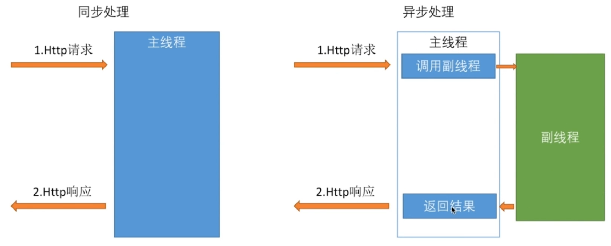
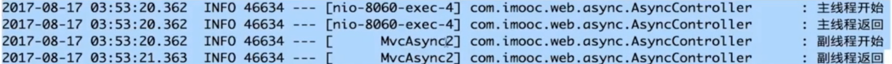
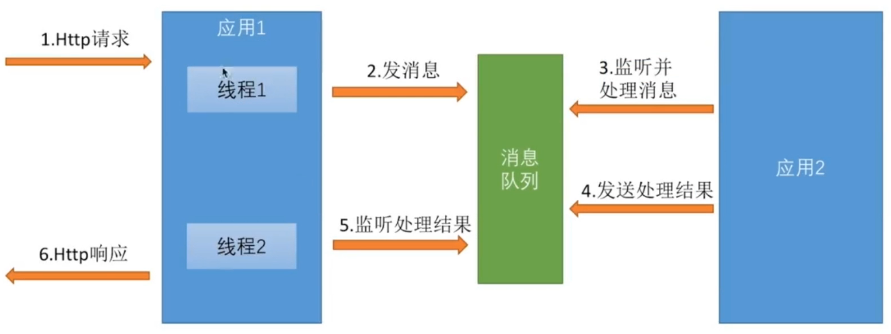
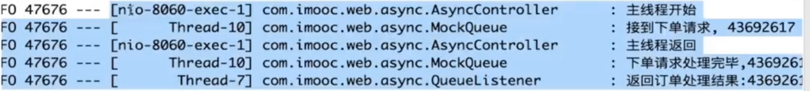

使用多线程提高REST服务性能

#####1、Runnable


主线程中开启子线程
```java
public class test{
	@RequestMapping("/order")
	public DeferredResult<String> order() throws Exception {
		logger.info("主线程开始");
    
		Callable<String> result = new Callable<String>() {
			@Override
			public String call() throws Exception {
				logger.info("副线程开始");
				Thread.sleep(1000);
				logger.info("副线程返回");
				return "success";
			}
		};
    
		logger.info("主线程结束");
	}
}
```

主线程直接返回，子线程处理耗时1秒
缺点：子线程必须是由主线程调起的，有局限性。


#####2、DeferredResult
主线程和子线程互相隔离不干扰


消息队列 [模拟]
```java
import org.slf4j.Logger;
import org.slf4j.LoggerFactory;
import org.springframework.stereotype.Component;

@Component
public class MockQueue {

	private String placeOrder;		//下单消息  [订单号]
	private String completeOrder;	//订单完成消息
	
	//set方法  接到‘下单消息’，睡眠1秒 设置‘完成消息’
	public void setPlaceOrder(String placeOrder) throws Exception {
		new Thread(() -> {
			logger.info("接到下单请求, " + placeOrder);
			try {
				Thread.sleep(1000);
			} catch (Exception e) {
				e.printStackTrace();
			}
			this.completeOrder = placeOrder;
			logger.info("下单请求处理完毕," + placeOrder);
		}).start();
	}
}
```

deferredResult处理
定义一个map字段，key:订单号 value:处理结果
```java
import java.util.HashMap;
import java.util.Map;

import org.springframework.stereotype.Component;
import org.springframework.web.context.request.async.DeferredResult;

@Component
public class DeferredResultHolder {
	
	private Map<String, DeferredResult<String>> map = new HashMap<String, DeferredResult<String>>();

	public Map<String, DeferredResult<String>> getMap() {
		return map;
	}

	public void setMap(Map<String, DeferredResult<String>> map) {
		this.map = map;
	}
}
```

主线程
```java
import org.apache.commons.lang.RandomStringUtils;
import org.slf4j.Logger;
import org.slf4j.LoggerFactory;
import org.springframework.beans.factory.annotation.Autowired;
import org.springframework.web.bind.annotation.RequestMapping;
import org.springframework.web.bind.annotation.RestController;
import org.springframework.web.context.request.async.DeferredResult;

@RestController
public class AsyncController {
	
	@Autowired
	private MockQueue mockQueue;
	@Autowired
	private DeferredResultHolder deferredResultHolder;
		
	@RequestMapping("/order")
	public DeferredResult<String> order() throws Exception {
		logger.info("主线程开始");
		
    //1.生成订单号 随机8位
		String orderNumber = RandomStringUtils.randomNumeric(8);
    //2.下单
		mockQueue.setPlaceOrder(orderNumber);
		
    //3.调用 DeferredResult 创建map，并将map的key设置为‘订单号’
		DeferredResult<String> result = new DeferredResult<>();
		deferredResultHolder.getMap().put(orderNumber, result);
		
    //4.返回结果
		return result;
	}
}
```

子线程
实现监听
```java
import org.apache.commons.lang.StringUtils;
import org.slf4j.Logger;
import org.slf4j.LoggerFactory;
import org.springframework.beans.factory.annotation.Autowired;
import org.springframework.context.ApplicationListener;
import org.springframework.context.event.ContextRefreshedEvent;
import org.springframework.stereotype.Component;

@Component
public class QueueListener implements ApplicationListener<ContextRefreshedEvent> {

	@Autowired
	private MockQueue mockQueue;
	@Autowired
	private DeferredResultHolder deferredResultHolder;
	
	@Override
	public void onApplicationEvent(ContextRefreshedEvent event) {
		new Thread(() -> {
      //循环监听
			while (true) {
        //1.当队列中‘完成’字段有值，开始处理
				if (StringUtils.isNotBlank(mockQueue.getCompleteOrder())) {
					
					String orderNumber = mockQueue.getCompleteOrder();
					logger.info("返回订单处理结果:"+orderNumber);
          
          //2.在 DeferredResultHolder 的对应订单的map中存放处理结果
					deferredResultHolder.getMap().get(orderNumber).setResult("place order success");
          
					//3.打断死循环
          mockQueue.setCompleteOrder(null); 
					
				}else{
					try {
						Thread.sleep(100);
					} catch (InterruptedException e) {
						e.printStackTrace();
					}
				}

			}
		}).start();
	}
}
```
注：有点类似ThreadLocal
数据结果使用`DeferredResultHolder`在两个线程直接进行传递。



#####3、异步配置
异步请求的拦截
```java
import com.examples.common.interceptor.TimeInterceptor;
import org.springframework.beans.factory.annotation.Autowired;
import org.springframework.context.annotation.Configuration;
import org.springframework.web.servlet.config.annotation.AsyncSupportConfigurer;
import org.springframework.web.servlet.config.annotation.InterceptorRegistry;
import org.springframework.web.servlet.config.annotation.WebMvcConfigurerAdapter;

@Configuration
public class WebConfig extends WebMvcConfigurerAdapter {
	
    //注入拦截器
	@Autowired
	private TimeInterceptor timeInterceptor;
	
  /**
	* 描述: 普通处理的拦截
	*/
	@Override
	public void addInterceptors(InterceptorRegistry registry) {
		registry.addInterceptor(timeInterceptor)
      .excludePathPatterns("/test/userAge").addPathPatterns("/test/create3");
	}

	/**
	* 描述: 异步处理的拦截
	*/
	@Override
	public void configureAsyncSupport(AsyncSupportConfigurer configurer) {
		configurer.registerCallableInterceptors();			//注册CallableProcessingInterceptor拦截器
		configurer.registerDeferredResultInterceptors();	//注册DeferredResultProcessingInterceptor拦截器
		configurer.setDefaultTimeout();						//设置异步请求的默认超时时间
        configurer.setTaskExecutor();						//设置线程池 替代spring使用的默认的线程池
	}
}
//区别于普通拦截器：异步拦截器多了可以对超时的处理
```