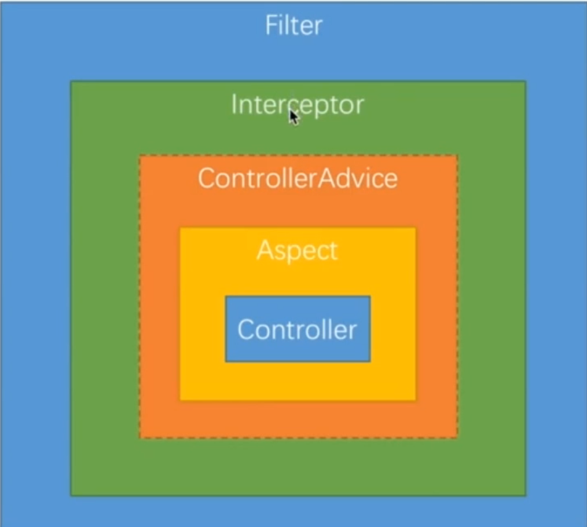
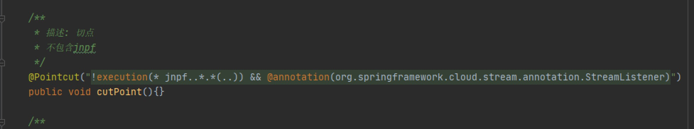

自定义注解


###1.自定义注解
```java
import java.lang.annotation.*;

/**
*@Documented - 标记这些注解是否包含在用户文档中
 *
*@Target - 标记这个注解应该是哪种 Java 成员
 * *		ElementType.METHOD 可以应用于方法级注释
 * *		ElementType.FIELD 可以应用于字段或属性
 * *		ElementType.PARAMETER 可以应用于方法的参数
 * *		ElementType.CONSTRUCTOR 可以应用于构造函数
 * *		ElementType.LOCAL_VARIABLE 可以应用于局部变量
 *
 *@Retention - 标识这个注解怎么保存，是只在代码中，还是编入class文件中，或者是在运行时可以通过反射访问
 * * 		RetentionPolicy.SOURCE - 标记的注释仅保留在源级别中，并由编译器忽略
 * *		RetentionPolicy.CLASS - 标记的注释在编译时由编译器保留，但Java虚拟机（JVM）会忽略
 * *		RetentionPolicy.RUNTIME - 标记的注释由JVM保留，因此运行时环境可以使用它
*
*/
@Target(ElementType.METHOD)
@Retention(RetentionPolicy.RUNTIME)
@Documented
public @interface OrderLogAnnotation {
		//处理的类
    Class<?> beanClass();

    //输入的参数
    String param();
}
```
[OrderLogAnnotation](./自定义注解/OrderLogAnnotation.java)

###2.注解处理
```java
import com.hellozj.mallorder.send.MQMessageHandler;
import com.hellozj.order.entity.dao.OrderLog;
import com.hellozj.order.entity.dto.OrderLogDto;
import lombok.extern.slf4j.Slf4j;
import org.aspectj.lang.ProceedingJoinPoint;
import org.aspectj.lang.annotation.Around;
import org.aspectj.lang.annotation.Aspect;
import org.aspectj.lang.annotation.Pointcut;
import org.springframework.beans.BeanUtils;
import org.springframework.stereotype.Component;

import java.util.Arrays;

@Aspect  //切面注解
@Component
@Slf4j
public class OrderLogAspect {
 	//切controller      //执行  public方法 任意返回值  指定controller包 任意类 任意方法 任意参数
  //@Pointcut(value = "execution(public * com.examples.demo.controller..*.*(..))")
  //切点 拦截注解
	@Pointcut("@annotation(com.hellozj.mallorder.annotation.OrderLogAnnotation)")
	public void orderLogCut() {
	}

  
  //环绕  
	@Around("orderLogCut()")
	public Object around(ProceedingJoinPoint point) throws Throwable {
		// 方法返回结果
		Object result = point.proceed();
    // 请求的参数
		//Object[] args = point.getArgs();
    //参数转对象
    //OrderLogDto orderLogDto = (OrderLogDto) args[0];
    //拦截的方法
    //MethodSignature signature = (MethodSignature) point.getSignature();
    //Method method = signature.getMethod();
    
		if (proceed instanceof ResultResponse) {
      			//获取对象
            Object o = ((ResultResponse) proceed).getData();
            if(o instanceof PageInfo){
                setFieldValueForCollection(((PageInfo) o).getList());
            }
            if(o instanceof Collection){
                setFieldValueForCollection((Collection)o);
            }
        }
     return  proceed;
	}

  	//处理 [注解放在对象的字段上的]
    private void setFieldValueForCollection(Collection col) throws Throwable {
        //得到对象的class
        Class<?> clazz = col.iterator().next().getClass();
        //根据class得到字段
        Field[] fields = clazz.getDeclaredFields();
        for (Field needField : fields){
            //获取每个字段的注解
            NeedSetValue needSetValue = needField.getAnnotation(NeedSetValue.class);
           
          	//注解中的类
            Object bean = SpringContextUtil.getBean(needSetValue.beanClass());
          	//注解中的类的类名
          	String name = needSetValue.beanClass().getName();
          	//注解中的参数
          	String param = needSetValue.param();
        }
    }
}
```
[OrderLogAspect](./自定义注解/OrderLogAspect.java)

###3.使用
```java
import com.hellozj.order.entity.dto.OrderLogDto;
/**
* 文件名: AsynOrderLogService.java
* 描述: 异步订单日志
*/
public interface AsynOrderLogService {
    /**
    * 方法名:  setOrderLog
    * 描述: 插入订单日志
    */
    void setOrderLog(OrderLogDto orderLog);
}
```
[AsynOrderLogService.java](./自定义注解/AsynOrderLogService.java)
```java
@Service
public class AsynOrderLogServiceImpl implements AsynOrderLogService{

    @Override
    @OrderLogAnnotation
    public void setOrderLog(OrderLogDto orderLog) {
    }
}
```
[AsynOrderLogServiceImpl](./自定义注解/AsynOrderLogServiceImpl.java)

调用：
```java
public class test{
    @Autowired
    private AsynOrderLogService asynOrderLogService;
    public void createBusOrderLog(Long BusId, Long userId) {
        try {
            asynOrderLogService.setOrderLog(new OrderLogDto(BusId,0L,"",
                    OrderOperAction.NewBUSORDER.value(),"提交商机报备信息","",
                    LoginUserRoleUtil.getLoginRoleType(),0, LoginUserRoleUtil.getLoginName(),userId,userId,new Date(),new Date()));
        } catch (Exception e) {
            log.info("服务订单 工程师创建商机订单 log failed ..... BusId:{} .. error:{}", BusId, ExceptionUtils.getStackTrace(e));
        }
    }
}
```

相比较拦截器 可以通过反射获取到方法上的参数等更详细的数据。


> 比较：
> 过滤器：获取到原始的http请求和响应的信息，获取不到处理请求的方法的信息。
> 拦截器：获取到原始的http请求和响应的信息，获取到处理请求的方法的信息，获取不到方法参数的值等信息。
> 切面：获取到处理请求的方法的元数据以及参数的值等信息，获取不到原始的http请求和响应的信息


> 执行顺序：
> 过滤器 > 拦截器(pre) > 切面 > 方法 > 切面 > [全局异常] > 拦截器(post, after)  > 过滤器




### 补充
#### 1.pointCut注解表达式
execution：一般用于指定方法的执行
@annotation：当执行的方法上拥有指定的注解时生效

within：指定某些类型的全部方法执行，也可用来指定一个包
this：Spring Aop是基于代理的，生成的bean也是一个代理对象，this就是这个代理对象，当这个对象可以转换为指定的类型时，对应的切入点就是它了，Spring Aop将生效
target：当被代理的对象可以转换为指定的类型时，对应的切入点就是它了，Spring Aop将生效
args：当执行的方法的参数是指定类型时生效
@target：当代理的目标对象上拥有指定的注解时生效
@args：当执行的方法参数类型上拥有指定的注解时生效
@within：与@target类似，看官方文档和网上的说法都是@within只需要目标对象的类或者父类上有指定的注解，则@within会生效，而@target则是必须是目标对象的类上有指定的注解。而根据笔者的测试这两者都是只要目标类或父类上有指定的注解即可
bean：当调用的方法是指定的bean的方法时生效


示例:
#### 1.1.execution
execution是使用的最多的一种Pointcut表达式，表示某个方法的执行，其标准语法如下:
```shell script
execution(modifiers-pattern?  ret-type-pattern  declaring-type-pattern?  name-pattern(param-pattern)  throws-pattern?)
```
名词解释：
modifiers-pattern 表示方法的访问类型，public等；
ret-type-pattern  表示方法的返回值类型，如String表示返回类型是String，“*”表示所有的返回类型；
declaring-type-pattern表示方法的声明类，如“com.elim..*”表示com.elim包及其子包下面的所有类型；
name-pattern  表示方法的名称，如“add*”表示所有以add开头的方法名；
param-pattern 表示方法参数的类型，name-pattern(param-pattern)其实是一起的表示的方法集对应的参数类型
    如“add()”表示不带参数的add方法，“add(*)”表示带一个任意类型的参数的add方法，“add(*,String)”则表示带两个参数，且第二个参数是String类型的add方法；
throws-pattern 表示异常类型；
其中以问号结束的部分都是可以省略的

例子:
“execution(* add())” 匹配所有的不带参数的add()方法
“execution(public * com.elim..*.add*(..))” 匹配所有com.elim包及其子包下所有类的以add开头的所有public方法
“execution(* com.elim..*.add*(..))” 匹配所有com.elim包及其子包下所有类的以add开头的所有方法
“execution(* *(..) throws Exception)” 匹配所有抛出Exception的方法


#### 1.2.@annotation
@annotation用于匹配方法上拥有指定注解的情况。

例子:
“@annotation(com.elim.spring.support.MyAnnotation)” 匹配所有的方法上拥有MyAnnotation注解的方法外部调用


#### 1.3.组合使用
