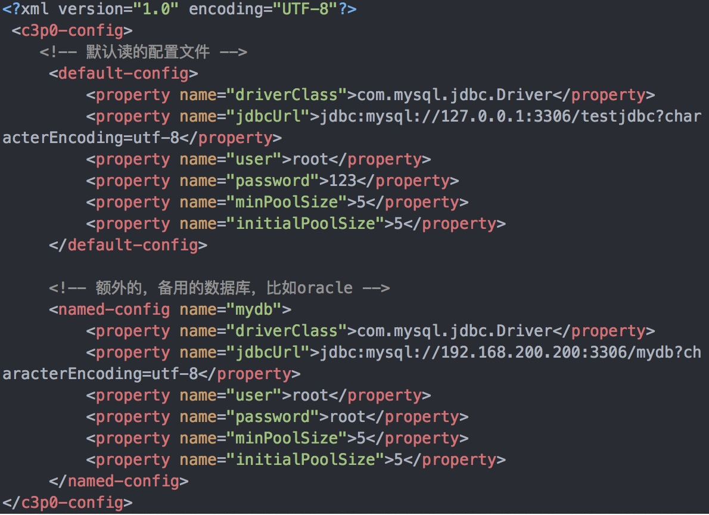
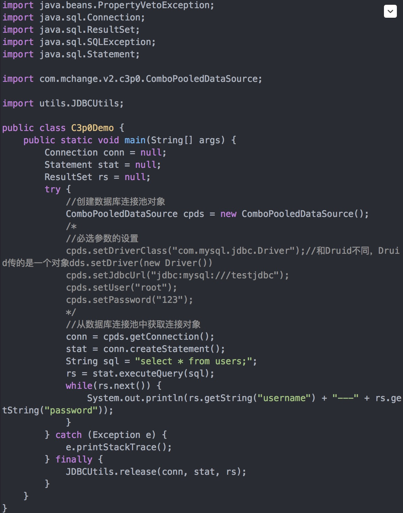

Mysql


### 数据库
数据库就是存储数据的仓库，其本质是一个文件系统，数据按照特定的格式将数据存储起来，用户可以对数据库中的数据进行增加，修改，删除及查询操作。
			
"知识点整理"
    有一个表就有一个类
	表中有一个字段，类中就有一个成员变量
	每一行数据都是new出来的一个对象
	
数据库操作
```sql
创建数据库并指定字符集
    create database 数据库名 CHARACTER SET utf8;
查看数据库
    show databases; 
删除数据库
    drop database 数据库名称;
切换数据库
    use 数据库名;
查看正在使用的数据库
    select database();

表的操作
查看数据库中的所有表
    show tables;
查看表结构
    desc 表名;	
删除表
    drop table 表名;
```
		
约束
    主键约束 primary key		不重复 不为空 可作外键 可以多列
    非空约束 not null
    唯一约束 unique			不重复 允许空 可以多列 限制不受主键约束的列
    外键约束
    自增	auto_increment

主键约束
    1.在创建表时创建主键，在字段后面加上  primary key
    2. 在创建表时创建主键，在表创建的最后来指定主键
    3.删除主键：alter table 表名 drop primary key
    4.主键自动增长：一般主键是自增长的字段，主键字段后加auto_increment(只适用MySQL)

修改表结构
```sql
添加列
    alter table 表名 add 列名 类型(长度) 约束;
修改列
    alter table 表名 modify 列名 类型(长度) 约束;
修改列名
    alter table 表名 change 旧列名 新列名 类型(长度) 约束;
删除列
    alter table 表名 drop 列名;
修改表名
    rename table 表名 to 新表名;
修改表的字符集
    salter table 表名 character set 字符集;
```

建表示例:
```sql
CREATE TABLE `y_goods` (
    `id` bigint(20) NOT NULL AUTO_INCREMENT,
    `img_url` varchar(255) COLLATE utf8mb4_unicode_ci NOT NULL,
    `price` decimal(10,2) NOT NULL,
    `content` text COLLATE utf8mb4_unicode_ci,
    `sale_count` int(11) NOT NULL DEFAULT '0',
    `creat_time` datetime DEFAULT NULL COMMENT '创建时间',
    `update_time` timestamp NOT NULL DEFAULT CURRENT_TIMESTAMP ON UPDATE CURRENT_TIMESTAMP COMMENT '更新时间', //时间自动更新
    PRIMARY KEY (`id`),
    UNIQUE KEY `uni_name_idx` (`name`),
    KEY `overall_evaluation_classify_kind_index` (`kind`)
) ENGINE=InnoDB AUTO_INCREMENT=1 DEFAULT CHARSET=utf8 COMMENT '商品表';
```


### 表操作
操作：
```sql
添加数据
    insert into 表 (列名1,列名2,列名3..) values  (值1,值2,值3..); 
    insert into 表名 (列名1,列名2,列名3) values (值1,值2,值3),(值1,值2,值3)
更新数据 
    update 表名 set 字段名=值,字段名=值 where 条件;
删除数据
    delete from 表名 [where 条件];
    delete from 表名; 和 truncate table 表名;

删除方式
    delete 一条一条删除,不清空auto_increment记录数
	truncate 直接将表删除,重新建表,auto_increment将置为零,从新开始

数据查询
    select distinct 字段 as 别名 from 表名  where 条件 GROUP BY 分组字段 HAVING 追加条件 ORDER BY 排序字段 asc/dwsc降 ;	
```

while条件的种类如下：
比较运算符	
    >  <  <=   >=   =  <>		大于、小于、大于(小于)等于、不等于
    BETWEEN  ...AND...      	显示在某一区间的值(含头含尾)
    IN(set) 	            	显示在in列表中的值，例：in(100,200)
    LIKE 通配符	   				模糊查询，Like语句中有两个通配符：
								    % 用来匹配多个字符；例first_name like ‘a%’;
									_ 用来匹配一个字符。例first_name like ‘a_’;									
    NOT LIKE 					不匹配	
    IFNULL(comm,0) 				如果字段为空则设置为0
    IS NULL 					判断为空
    is not null					判断不为空
			
逻辑运算符	
    and	                    	多个条件同时成立
    or							多个条件任一成立
    not							不成立，例：where not(salary>100);

聚合函数	
聚合函数查询是纵向查询，它是对一列的值进行计算，然后返回一个单一的值；另外聚合函数会忽略空值。
    count：	统计指定列不为NULL的记录行数 总数；
    sum：	计算指定列的数值和，null值则取0
    max：	计算指定列的最大值，如果指定列是字符串类型，那么计算结果为0；
    min：	计算指定列的最小值，如果指定列是字符串类型，那么计算结果为0
    avg：	计算指定列的平均值，如果指定列是字符串类型，那么计算结果为0；
	
注意：
    1、having与where的区别
        having是在分组后对数据进行过滤.
        where是在分组前对数据进行过滤
        having后面可以使用聚合函数
        where后面不可以使用聚合函数
    2、select 查询的时候,被分组的列,要出现在select 选择列的后面


	
### JDBC
JDBC是java提供给开发人员的一套操作数据库的接口
JDBC的开发步骤
    1.注册驱动
        告知JVM使用的是哪一个数据库的驱动
    2.获得连接
        使用JDBC中的类,完成对MySQL数据库的连接
    3.获得语句执行平台
        通过连接对象获取对SQL语句的执行者对象
    4.执行sql语句
        使用执行者对象,向数据库执行SQL语句
        获取到数据库的执行后的结果
    5.处理结果
    6.释放资源  一堆close()

案例：	
```java
public class A{
    public static void main(String[] args){
        //1.注册驱动 反射技术,将驱动类加入到内容
        Class.forName("com.mysql.jdbc.Driver");
        //2.设置参数
      	String url = "jdbc:mysql://localhost:3306/mybase";
      	String username="root";
      	String password="123";
        //3.获得连接
      	Connection con = DriverManager.getConnection(url, username, password);
        //4.获得语句执行平台
      	Statement stat = con.createStatement();
        //执行sql语句 除了select语句 返回值int,受影响的行数
      	int I = stat.executeUpdate("sql语句");
        //执行sql语句 select语句 返回值是一个结果集
      	ResultSet rs = stat.executeQuery("sql语句");		
        //5.获取每列数据,  getXX方法参数中写String列名					
      	while(rs.next()){											
            sout(rs.getInt("id")+"   "+rs.getString("name")+rs.getDouble("sprice"));
      	}
      	//6.释放资源
      	rs.close();
      	stat.close();
      	con.close();
    }
}
```

防止注入攻击
```java
public class A{
    public static void main(String[] args){
        //参数全部采用占位符  从1开始
        String sql = "SELECT * FROM users WHERE username=? AND PASSWORD=?"; 
        //sql语句预编译		
        PreparedStatement pst =  con.prepareStatement(sql); 						
        pst.setObject(1, user);	
        pst.setObject(2, pass);
        //获取结果集
        ResultSet rs = pst.executeQuery();											
    }
}
```

properties配置文件	
    文件内容：一行一组数据，格式是:key=value
        a)	key命名自定义，如果是多个单词，习惯使用点分隔。例如：jdbc.driver
        b)	value值不支持中文，如果需要使用非英文字符，将进行unicode转换。

案例：
database.properties：
```properties
driverClass=com.mysql.jdbc.Driver
url=jdbc:mysql://localhost:3296/mybase
username=root
password=123
```
						
jdbc工具类：
```java
public class JDBCUtilsConfig { 

private static Connection con ;
private static String driverClass;
private static String url;
private static String username;
private static String password;
				
    static{
	    try{
		    readConfig();
			Class.forName(driverClass);
			con = DriverManager.getConnection(url, username, password);
		}catch(Exception ex){
			throw new RuntimeException("数据库连接失败");
		}
    }
				
    private static void readConfig()throws Exception{
	    //使用类的加载器
		InputStream in = JDBCUtilsConfig.class.getClassLoader().getResourceAsStream("database.properties");
		//FileInputStream fs=new FileInputStream("src\\database2.properties");也可以
					 
		Properties pro = new Properties();//集合
		pro.load(in);
		driverClass=pro.getProperty("driverClass");
		url = pro.getProperty("url");
		username = pro.getProperty("username");
		password = pro.getProperty("password");
    }
				
	public static Connection getConnection(){
		return con;
	}
    //释放资源
				
}
```
							
测试：
```java
public class TestJDBCUtils {
    public static void main(String[] args) {
	    Connection con = JDBCUtilsConfig.getConnection();
		System.out.println(con);
    }
}
```


### DButils
JavaBean类
    JavaBean就是一个类，在开发中常用封装数据。
	1.	需要实现接口：java.io.Serializable 序列化，通常实现接口这步骤省略了，不会影响程序。
	2.	提供私有字段：private 类型 字段名;
	3.	提供getter/setter方法：
	4.	提供无参构造
	
DBUtils就是JDBC的简化开发工具包。需要项目导入commons-dbutils-1.6.jar才能够正常使用DBUtils工具。
Dbutils核心功能:
    QueryRunner 中提供对sql语句操作的API.
	    update(Connection conn, String sql, Object... params) ，用来完成表数据的增加、删除、更新操作
		query(Connection conn, String sql, ResultSetHandler<T> rsh, Object... params) ，用来完成表数据的查询操作
    ResultSetHandler接口，用于定义select操作后，怎样封装结果集.
    
API:    
1. update(Connection conn, String sql, Object... params) ，用来完成表数据的增加、删除、更新操作
使用QueryRunner类,实现对数据表的insert delete update
```java
public class A{
    public static void main(String[] args){
        //创建QueryRunner类对象
        QueryRunner qr = new QueryRunner();								
        String sql = "INSERT INTO sort (sname,sprice,sdesc)VALUES(?,?,?)";
        Object[] params = {"体育用品",289.32,"购买体育用品"};
        //调用update()执行SQL语句
        int row = qr.update(con, sql, params);
        //关闭资源								
        DbUtils.closeQuietly(con);											
    }
}
```
		
2. query(Connection conn, String sql, ResultSetHandler<T> rsh, Object... params) ，用来完成表数据的查询操作
ResultSetHandler结果集处理类:
1、ArrayHandler		将结果集中的第一条记录封装到一个Object[]数组中，数组中的每一个元素就是这条记录中的每一个字段的值
					//Object[] result = qr.query(con, sql, new ArrayHandler());
2、ArrayListHandler	将结果集中的每一条记录都封装到一个Object[]数组中，将这些数组在封装到List集合中。
					//List<Object[]> result=  qr.query(con, sql, new ArrayListHandler());
			
3、BeanHandler		将结果集中第一条记录封装到一个指定的javaBean中。
4、BeanListHandler	将结果集中每一条记录封装到指定的javaBean中，将这些javaBean在封装到List集合中
			
5、ColumnListHandler将结果集中指定的列的字段值，封装到一个List集合中
					//List<Object> list = qr.query(con, sql, new ColumnListHandler<Object>("列名"));
6、ScalarHandler	它是用于单数据。例如select count(*) from 表操作。
					//long count = qr.query(con, sql, new ScalarHandler<Long>());
			
7、MapHandler	    将结果集第一条记录封装到Map集合中,Key 列名, Value 该列数据
8、MapListHandler	将结果集每一条记录封装到Map集合中,Key 列名, Value 该列数据,Map集合存储到List集合
	
query方法返回值, 返回的是T 泛型, 具体返回值类型,跟随结果集处理方式变化:
```java
public class A{
    public static void main(String[] args){
        QueryRunner qr = new QueryRunner();
        String sql = "SELECT * FROM sort";
        
        //1、ArrayHandler处理方式, 如果查询结果为空，则Object数组的长度是0，代码体现：[]
        Object[] result = qr.query(con, sql, new ArrayHandler());
        for(Object obj : result){
            System.out.print(obj);
        }

        //2、ArrayListHandler处理方式 	如果没有查询结果，那么返回的ArrayList集合的长度为0
        List<Object[]> result=  qr.query(con, sql, new ArrayListHandler());
        //集合的遍历
        for( Object[] objs  : result){
            //遍历对象数组	
            for(Object obj : objs){	
                System.out.print(obj+"  ");
        	}
        	System.out.println();
        }

        //3、BeanHandler处理方式
        Sort s = qr.query(con, sql, new BeanHandler<Sort>(Sort.class));
        System.out.println(s);

        //4、BeanListHandler处理方式
        List<Sort> list = qr.query(con, sql, new BeanListHandler<Sort>(Sort.class));
        for(Sort s : list){
            System.out.println(s);
        }
        
        //5、ColumnListHandler处理方式
        List<Object> list = qr.query(con, sql, new ColumnListHandler<Object>("sname"));
        for(Object obj : list){
            System.out.println(obj);
        }

        //6、ScalarHandler处理方式
        long count = qr.query(con, sql, new ScalarHandler<Long>());
        System.out.println(count);

        //7、MapHandler处理方式
        Map<String,Object> map = qr.query(con, sql, new MapHandler());
        for(String key : map.keySet()){
            System.out.println(key+".."+map.get(key));
        }

        //8、MapListHandler处理方式
        List<Map<String,Object>> list = qr.query(con, sql, new MapListHandler());
        for( Map<String,Object> map : list ){
            for(String key : map.keySet()){
        	    System.out.print(key+"..."+map.get(key));
        	}
        	System.out.println();
        }
    }
}
```


### 数据库连接池
实际上就是存放连接的池子(容器)
连接池概念规范
    用池来管理Connection，这样可以重复使用Connection。
    不用自己来创建Connection，而是通过池来获取Connection对象
    使用完Connection后，调用Connection的close()方法也不会真的关闭Connection，而是把Connection“归还”给池
    连接池技术可以完成Connection对象的再次利用

Java为数据库连接池提供了公共的接口：javax.sql.DataSource
常见的连接池：DBCP、C3P0

#### DBCP连接池
tomcat内置的连接池
jar包：
    mysql-connector-java-5.1.37-bin.jar：数据库驱动
    commons-dbutils-1.6.jar：			提供QueryRunner类方便进行增删改查操作
    commons-dbcp-1.4.jar：
    commons-pool-1.5.6.jar：			提供高效的数据库连接池技术

创建连接池的步骤：
    1.创建一个BasicDataSource对象
    2.对这个BasicDataSource对象进行基本的配置
    3.写一个静态的方法，将这个对象进行返回
			
DBCP连接池工具类
```java
import javax.sql.DataSource;
import org.apache.commons.dbcp.BasicDataSource;

public class JDBCUtils{ 
    //创建出BasicDataSource类对象
    private static BasicDataSource datasource = new BasicDataSource();	
			
    //静态代码块,只加载一次 ，BasicDataSource对象中的配置	
	static{														
        datasource.setDriverClassName("com.mysql.jdbc.Driver");
        datasource.setUrl("jdbc:mysql://localhost:3306/day33_user");
        datasource.setUsername("root");
        datasource.setPassword("123");
        //对象连接池中的连接数量配置,可选的
        datasource.setInitialSize(10);	//初始化的连接数
        datasource.setMaxActive(8);		//最大连接数量
        datasource.setMaxIdle(5);		//最大空闲数
        datasource.setMinIdle(1);		//最小空闲
    }
				
    public static DataSource getDataSource(){    //返回数据源
        return datasource;
    }
}
```
测试:
```java
public class A{
    //QueryRunner类对象,写在类成员位置
    private static QueryRunner qr = new QueryRunner(JDBCUtils.getDataSource()); 
	
    public static void select(){
        String sql = "SELECT * FROM sort";
        try{
            List<Object[]> list = qr.query(sql, new ArrayListHandler());
            for(Object[] objs : list){
                for(Object obj : objs){
                    System.out.print(obj+"\t");
				}
                System.out.println();
            }
        }catch(SQLException ex){
            throw new RuntimeException("数据查询失败");
        }
    }
}
```
	
#### C3P0连接池
c3p0 是一个开源的JDBC连接池，它相对于DBCP和Druid来说有一个更方便的配置连接方式，就是自动读取配置文件。
配置文件名：c3p0-config.xml，放置与src目录下。

配置文件的demo如下：


默认的数据库连接使用的是<default-config>标签里的，其余的<named-config>可以有多个，
当需要连接其它的数据库时，不需要再重新编辑配置文件，直接选择其它的数据库即可。

在如下的测试代码中，在创建数据库连接池对象的时候可以传入参数来进行选择ComboPooledDataSource cpds = new ComboPooledDataSource();
在空参的时候是选择默认的<default-config>数据库连接，传入<named-config>的名字就可以直接连接其它数据库。
比如这里ComboPooledDataSource cpds = new ComboPooledDataSource("mydb");，那么连接的就是mydb这个数据库。

测试c3p0:	
