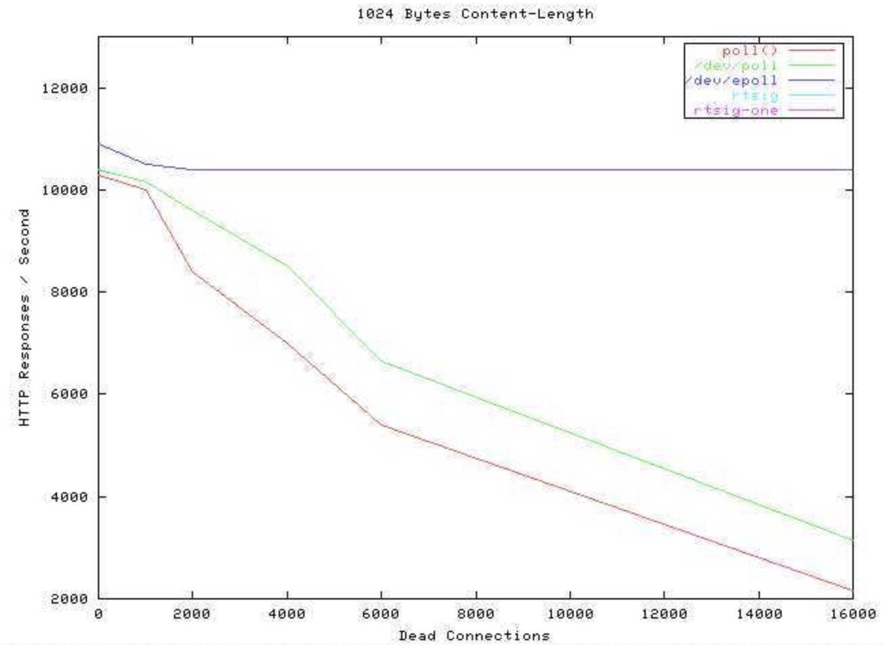

IO多路复用

先给个结论：I/O多路复用技术（就是大家经常说的事件驱动模型）

### io多路复用是啥？
噢，要讲明白io多路复用之前，我们还要知道一些概念

```text
小张找基友小鹏
小张第一次来到小鹏的宿舍楼，发现这个宿舍楼有一大堆的楼妈，为啥？因为学校竟然请了一堆楼妈来管理宿舍楼里的每一个宿舍，
结果搞得一大堆楼妈唧唧咋咋的，乌烟瘴气。重要的就是学校会给每个楼妈都发工资。小张顿时觉得，这个学校没药救了。

没错，现实中已经没有这种傻逼现象了，学校也不会傻到这种程度为每一个宿舍都请一个楼妈来管理


过了几十年，小张的儿子来找小鹏的儿子
不巧，过了一二十年，小张的儿子和小鹏的儿子也上了同一所学校，小张张要来找小鹏鹏。小张张听了父亲说，这个学校的舍管特别傻逼，会有一堆，能烦死你。
结果小张张来到了宿舍楼，发现现在只有一个楼妈了，哎哟，不错嘛，学校终于没那么傻逼了。但是，这个楼妈比较傻，小张张去问她：小鹏鹏在哪个寝室啊？
她说，我也不知道啊。我带你上去找吧？
于是乎，小张张和楼妈挨个挨个的找宿舍，最终花了半天时间找到了小鹏鹏....（小张张尿了。


又过去了差不多20年
此时，学校已经不是那个学校，张和鹏都挂得差不多了。新生代小春来找小丽，小春来到了这个宿舍，找到了楼妈。
这个楼妈就比较聪明了，每当一个学生入住新宿舍的时候，她就记录下这个人的名字，学号，电话，以及宿舍房号。
当小春找小丽的时候，楼妈掏出眼镜，查表，马上就能知道小丽在哪里了，小春几分钟就到达了小丽的宿舍....
```


### 对应到编程界
在最开始的时候，为了实现一个服务器可以支持多个客户端连接，人们想出了fork/thread等办法，
当一个连接来到的时候，就fork/thread一个进程/线程去接收并且处理请求，
然而，当时估计是大家都穷吧，没啥钱买电脑，所以这个模型一直很好用，过去几十年都没有问题。

但是时代发展了，1980年代，计算机网络开始成型，越来越多的用户进行网络连接（其实也没多少），
但是之前的fork/thread模型就不行了，太辣鸡了。（回想一下小张和小鹏与一大堆楼妈的故事）


(select函数发明)1983年，人们终于意识到了这种问题，所以发明了一种叫做「IO多路复用」的模型，
这种模型的好处就是「没必要开那么多条线程和进程了」，一个线程一个进程就搞定了。
随着计算机业务的增长，这种IO多路复用的模型看似太傻逼了点，回想一下小张张和小鹏鹏：

1.宿舍楼里有可能有上百间宿舍
2.为了寻找到其中一间宿舍，你必须得一间一间去找，浪费时间

对应的编程模型就是：
一个连接来了，就必须遍历所有已经注册的文件描述符，来找到那个需要处理信息的文件描述符，
如果已经注册了几万个文件描述符，那会因为遍历这些已经注册的文件描述符，导致cpu爆炸。


直到2002年，互联网时代爆炸，数以千万计的请求在全世界范围内发来发去，服务器大爆炸，人们通过改进「IO多路复用」模型，进一步的优化，
发明了一个叫做epoll的方法。这个方法就是小春和小丽故事里聪明的楼妈。


这就是当年的并发图，震撼人心的并发图。我们可以看到蓝色的线是epoll，性能几乎不受连接数的影响（dead connections），无敌的并发！

事件驱动不是无敌的，在事件驱动模型中，处理事件的进程一定是单线程的