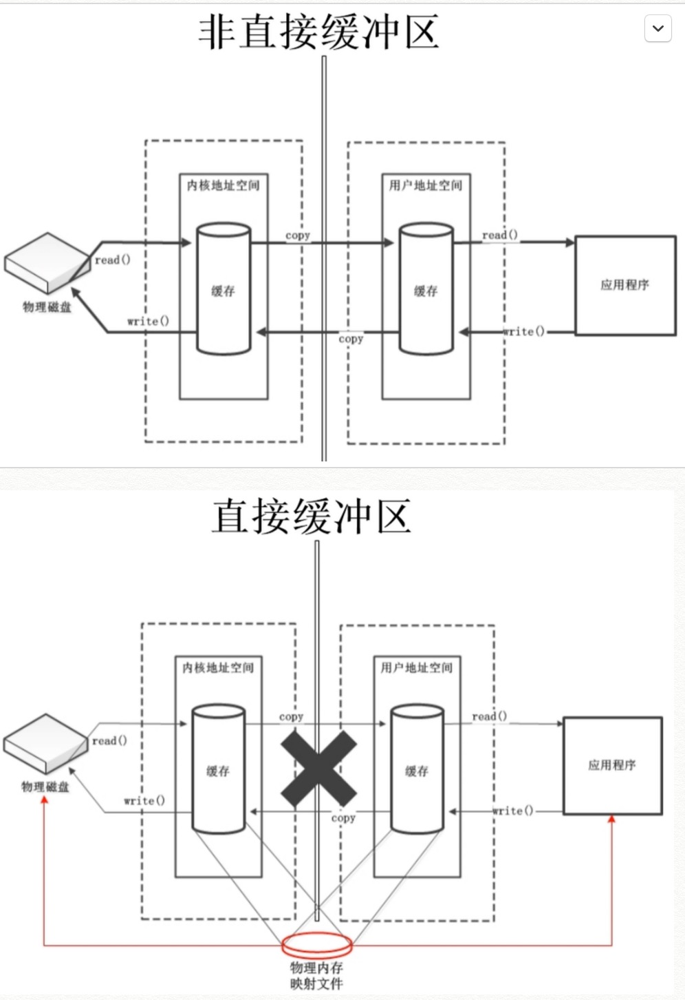

NIO

[参考](http://tutorials.jenkov.com/java-nio/index.html)

### 同步与异步（synchronous/asynchronous）
同步:是一种可靠的有序运行机制，当我们进行同步操作时，后续的任务是等待当前调用返回，才会进行下一步；
    比如：自己去做某件事（Java自己亲自做这件事，并且是在同一个时间点）

异步:则相反，其他任务不需要等待当前调用返回，通常依靠事件、回调等机制来实现任务间次序关系
    比如：java将io交给操作系统去处理，告诉缓存区大小，处理完成回调。


### 阻塞与非阻塞
阻塞:当前线程会处于阻塞状态，无法从事其他任务，只有当条件就绪才能继续，
     比如: java 进行IO操作时，一直会等到读操作或者写操作完成，当前线程才能去做其他事情。（一个线程）
     
非阻塞:则是不管IO操作是否结束，直接返回，相应操作在后台继续处理


1.BIO：  [同步并阻塞]，服务器的实现模式是一个连接一个线程，
        这样的模式很明显的一个缺陷是：由于客户端连接数与服务器线程数成正比关系，可能造成不必要的线程开销，严重的还将导致服务器内存溢出。
        当然，这种情况可以通过线程池机制改善，但并不能从本质上消除这个弊端。

2.NIO：  [同步非阻塞]，在JDK1.4以前，Java的IO模型一直是BIO，但从JDK1.4开始，JDK引入的新的IO模型NIO，它是同步非阻塞的。
        而服务器的实现模式是多个请求一个线程，即请求会注册到多路复用器Selector上，多路复用器轮询到连接有IO请求时才启动一个线程处理。

3.AIO：  [异步非阻塞]，JDK1.7发布了NIO2.0，这就是真正意义上的异步非阻塞，服务器的实现模式为多个有效请求一个线程，
        客户端的IO请求都是由OS先完成再通知服务器应用去启动线程处理（回调）。

应用场景：并发连接数不多时采用BIO，因为它编程和调试都非常简单，但如果涉及到高并发的情况，应选择NIO或AIO，更好的建议是采用成熟的网络通信框架Netty。


### 1、BIO (Blocking IO)
同步阻塞 IO 
IO流简单来说: 就是input和output流
IO流主要是: 用来处理设备之间的数据传输，Java IO对于数据的操作都是通过流实现的。

分类：
按操作数据分为：字节流（Reader、Writer）和字符流（InputStream、OutputStream）
按流向分：输入流（Reader、InputStream）和输出流（Writer、OutputStream）

[流管道是一种单向管道，不能同时读写，要么读要么写]


#### 1.1 单线程BIO
示例代码：
客户端：
```java
public class FirstClient {

    public static void main(String[] args) {
        try {
            Socket socket = new Socket("localhost", 8000);
            OutputStream outputStream = socket.getOutputStream();
            outputStream.write("hello server, i am client".getBytes());
            outputStream.flush();;
            InputStream inputStream = socket.getInputStream();
            byte[] buffer = new byte[1024];
            int length = 0;
            // 读取服务端的数据
            while ((length = inputStream.read(buffer)) > 0) {
                System.out.println(new String(buffer, 0, length));
            }
        } catch (IOException e) {
            e.printStackTrace();
        }
    }
}
```
服务端：
```java
public class FirstServer {

    public static void main(String[] args) {
        try {
            ServerSocket serverSocket = new ServerSocket(8000);
            System.out.println("服务器启动成功，监听端口8000");
            // 不断监听客户端的请求
            while (true) {
                Socket socket = serverSocket.accept();  	//存在阻塞
                InputStream inputStream = socket.getInputStream();
                byte[] buffer = new byte[1024];
                int length = 0;
                // 读取客户端的数据
                while ((length = inputStream.read(buffer)) > 0) {
                    System.out.println(new String(buffer, 0, length));
                }
                // 向客户端写数据
                OutputStream outputStream = socket.getOutputStream();
                outputStream.write("hello java".getBytes());
            }
        } catch (IOException e) {
            e.printStackTrace();
        }
    }
}
```

#### 图解分析：

存在的问题：
1、accept 是阻塞的。	
2、IO进行操作也是阻塞的，要么读操作，要么写操作（前提：单线程环境下而言）。
BIO中不可能只有一个客户端进行连接，所以阻塞必然发生。

解决：针对accept阻塞可以使用多线程，但是IO流本身的阻塞？


#### 1.2 多线程下的BIO：
代码：
多个Socket 多线程：
```java
public class SecondServer {

    public static void main (String[] args) {
        ServerSocket serverSocket = null;
        try {
            serverSocket = new ServerSocket(8000);
            System.out.println("服务器启动成功，监听端口8000");
            while (true) {
                Socket socket = serverSocket.accept();
                // 针对每个连接创建一个线程，去处理IO操作
                new Thread(new ServerHandler(socket)).start();
            }
        } catch (IOException e) {
            e.printStackTrace();
        }
    }
}

public class ServerHandler implements Runnable {
    //维护一个socket成员变量，记录传来的socket
    private Socket socket;
    public ServerHandler (Socket socket) {
        this.socket = socket;
    }

    //当前线程要执行的任务
    @Override
    public void run() {
        InputStream inputStream = null;
        try {
            inputStream = socket.getInputStream();
            byte[] buffer = new byte[1024];
            int length = 0;
            //读取客户端的数据
            while ((length = inputStream.read(buffer)) > 0) {
                System.out.println(new String(buffer, 0, length));
            }
            //向客户端写数据
            OutputStream outputStream = socket.getOutputStream();
            outputStream.write("hello java".getBytes());
        } catch (IOException e) {
            e.printStackTrace();
        }
    }
}
```

#### 图解分析：

Socket操作时开启多线程：单独的io是阻塞的（单线程），但是针对全局所有的io又是非阻塞的。（多线程）

存在的问题：
资源浪费，占用CPU，多线程抢夺CPU。线程的创建和销毁都会消耗性能。
本质上还是没有解决IO同步阻塞（单线程）

在有IO操作的时候再去开启线程？
BIO中，线程池已经可以解决这种问题


#### 1.3 伪异步IO：
代码：
BIO 多个Socket多线程，由线程池执行多个任务
```java
public class ThirdServer {

    public static void main (String[] args) {
        ServerSocket serverSocket;								//固定大小
        ExecutorService executorService = Executors.newFixedThreadPool(60);
        try {
            serverSocket = new ServerSocket(8000);
            System.out.println("服务器启动成功，监听端口8000");
            while (true) {
                Socket socket = serverSocket.accept();
                //使用线程池中的线程去执行每个对应的任务
                executorService.execute(new ServerHandler(socket));
            }
        } catch (IOException e) {
            e.printStackTrace();
        }
    }
}
```

#### 图解分析：

IO操作时使用线程池开启多线程
* 线程池，进行IO操作的时候，从线程池中分配一个线程去执行run任务；
* 线程池只提供固定线程，当需求量超过固定线程数量的时候，则进行等待；

好处：
在io时才开启线程，线程池降低系统开销

存在问题：
高并发的情况不适用（如果需要600个线程呢？总不能创建600个线程的线程池吧）还是会阻塞。


### 2、NIO (New IO/Non-Blocking IO)
同步非阻塞 IO
[BIO是面向流的. NIO是面向缓冲区的]
NIO支持面向缓冲区的，基于通道的IO操作。NIO将以更高效的方式进行文件的读写操作。

阻塞：
类似去银行ATM机取钱，排队等候，依次进行。

非阻塞：
类似去银行柜台取钱，先去取号，然后在银行大厅等待叫号。（客户端请求连接服务端的时候，服务端将连接请求记录下来，判断是否要进行IO操作）

BIO存在问题？
* a.每一个socket连接服务端都会立刻开启一个线程进行处理。（解决方案：连接，但不立刻开启线程，有IO操作再开启线程 ：selector）。
* b.每个IO操作完成后，线程就会销毁。（解决方案：不要轻易销毁：channel）

在Java1.4之前的I/O系统中，提供的都是面向流的I/O系统，系统一次一个字节地处理数据，一个输入流产生一个字节的数据，一个输出流消费一个字节的数据，面向流的I/O速度非常慢，
而在Java 1.4中推出了NIO，这是一个面向块的I/O系统，系统以块的方式处理处理，每一个操作在一步中产生或者消费一个数据库，按块处理要比按字节处理数据快的多。


#### 图解分析：

channel：通道，负责连接传输 ，多路复用技术。（一直存在，不销毁），【铁轨】
selector：监视channels，记录客户端的状态，是需要io操作还是啥，（在服务端有一个主线程，记录客户端的连接操作 ：selector）
Buffer：缓存区，负责数据存取，读写数据，【火车】

BIO：
客户端连接：socket
服务端连接：serverSocket
数据读写：IO

NIO：
客户端连接：socketChannel
服务端连接：serverSocketChannel
数据读写：Buffer
服务端选择器：selector

流管道是一种单向管道，不能同时读写，要么读要么写。
Buffer缓冲区是双向的，可读可写。


#### Buffer操作示意图：
ByteBuffer buffer = ByteBuffer.allocate(10);
put:存入5个字节
flip:切换模式

注：
get () 时position也会移动。
filp:写模式切换到读模式，调整Buffer的limit属性和position属性的位置。
rewind:初始化Buffer的position属性，可用于重复读取。
clear:清空Buffer，但是Buffer中的数据依然存在，处于“遗忘”状态。Buffer的所有的属性都初始化。
mark:标记，记录当前的position的位置。
reset:将position的位置恢复到mark标记时的位置。

Buffer底层是数组：
属性：
position:	位置，表示缓冲区中正在操作数据的位置。
limit：		界限，表示缓冲区中可以操作的数据的界限，limit后面的数据不能进行读写操作。
capacity：	容量，表示缓冲区的最大存储容量，一旦声明不能更改。

即：调整数组的属性位置来控制数组的读写区域。

区别总结：


详解：
NIO之所以是同步，是因为它的accept/read/write方法的内核I/O操作都会阻塞当前线程

三个主要组成部分：Channel（通道）、Buffer（缓冲区）、Selector（选择器）


#### Channel
Channel（通道）：用于源节点和目标节点的连接，[在NIO中负责传输Buffer。本身不能直接访问数据，只能与Buffer进行交互]。可以把它看做是IO中的流，

不同的是：
* Channel是双向的，既可以读又可以写，而流是单向的
* Channel可以进行异步的读写
* 对Channel的读写必须通过buffer对象来处理

白话：就是一个传输通道

所有数据都通过Buffer对象处理，所以，不会将字节直接写入到Channel中，相反，将数据写入到Buffer中；
同样，也不会从Channel中读取字节，而是将数据从Channel读入Buffer，再从Buffer获取这个字节。

因为Channel是双向的，所以Channel可以比流更好地反映出底层操作系统的真实情况。特别是在Unix模型中，底层操作系统通常都是双向的。

在Java NIO中的Channel主要有如下几种类型：
* FileChannel：从文件读取数据的
* DatagramChannel：读写UDP网络协议数据
* SocketChannel：读写TCP网络协议数据
* ServerSocketChannel：可以监听TCP连接

获取通道的方式：
1:java 针对支持通道的类提供了 getChannel()
本地IO：
	FileInputStream/FileOutputStream
	RandomAccessFile

网络IO：
	Socket
	ServerSocket
	DatagramSocket

2:在JDK1.7中的NIO.2 针对各个通道提供了静态防范：open()
3:在JDK1.7中的NIO.2 的Files工具类的newByteChannel()

示例：
```java
public class Test {
	//利用通道完成文件复制
	public void test() throws Exception {
		FileInputStream fis  = new FileInputStream("1.jpg");
		FileOutputStream fos = new FileOutputStream("2.jpg");
		
		//根据BIO获取NIO的通道
		FileChannel inChannel = fis.getChannel();
		FileChannel outChannel = fos.getChannel();
		
		//分配指定大小的缓冲区
		ByteBuffer buffer = ByteBuffer.allocate(1024);
		//使用通道读取缓冲区数据
		while (inChannel.read(buffer) != -1) {
			//切换Buffer的模式
			buffer.flip();
			//使用通道写出缓冲区数据
			outChannel.write(buffer);
			//清空缓冲区
			buffer.clear();
		}
		
		//关闭通道和流
		outChannel.close();
		inChannel.close();
		fos.close();
		fis.close();
	}
}
```

使用通道open()创建通道：				                    //路径			    //读写模式
FileChannel inChannel = FileChannel.open(Paths.get("D:/1.jpg"),StandardOpenOption.READ);
FileChannel outChannel = FileChannel.open(Paths.get("D:/", "2.jpg"),StandardOpenOption.READ,StandardOpenOption.WRITE);

通道之间数据传递：
inChannel.transferTo(0, inChannel.size(), outChannel);
outChannel.transferFrom(inChannel, 0, inChannel.size());


#### Buffer
Buffer是一个对象，它包含一些要写入或者读到Stream对象的。
应用程序不能直接对 Channel 进行读写操作，而必须通过 Buffer 来进行，[即 Channel 是通过 Buffer 来读写数据的。]

[在NIO中，所有的数据都是用Buffer处理的，它是NIO读写数据的中转池。]

[Buffer实质上是一个数组，通常是一个字节数组，但也可以是其他类型的数组。]
但一个缓冲区不仅仅是一个数组，重要的是它提供了对数据的结构化访问，而且还可以跟踪系统的读写进程。

Buffer方法：
    put:    存入数据到Buffer
    get:    获取Buffer中的数据
    filp:   写模式切换到读模式，调整Buffer的limit属性和position属性的位置
    rewind: 初始化Buffer的position属性，可用于重复读取
    clear:  清空Buffer，但是Buffer中的数据依然存在，处于“遗忘”状态。Buffer的所有的属性都初始化。
    mark:   标记，记录当前的position的位置。
    reset:  将position的位置恢复到mark标记时的位置。
    hasRemaining:   判断缓冲区是否还有剩余数据。
    remaining:      获取缓冲区中可以操作的数据的数量。

使用 Buffer 读写数据一般遵循以下四个步骤：
1.写入数据到 Buffer；
2.调用 flip() 方法；			//写模式切换到读模式，即：改变Buffer中position和limit属性的位置
3.从 Buffer 中读取数据；
4.调用 clear() 方法或者 compact() 方法。

当向 Buffer 写入数据时，Buffer 会记录下写了多少数据。一旦要读取数据，需要通过 flip() 方法将 Buffer 从写模式切换到读模式。
在读模式下，可以读取之前写入到 Buffer 的所有数据。
一旦读完了所有的数据，就需要清空缓冲区，让它可以再次被写入。

有两种方式能清空缓冲区：调用 clear() 或 compact() 方法。
clear() 方法会清空整个缓冲区。
compact() 方法只会清除已经读过的数据。任何未读的数据都被移到缓冲区的起始处，新写入的数据将放到缓冲区未读数据的后面。

Buffer主要有如下几种类型：
* ByteBuffer
* CharBuffer
* DoubleBuffer
* FloatBuffer
* IntBuffer
* LongBuffer
* ShortBuffer

直接缓冲区 和 非直接缓冲区的区别：
直接缓冲区：	通过allocateDirect()方法分配缓冲区，将缓冲区建立在物理内存中。可以提高效率。但是内存消耗大，垃圾管理不好控制。
非直接缓冲区：通过allocate()方法分配缓冲区，将缓冲区建立在JVM内存中。



#### Selector（选择器对象）
首先需要了解一件事情就是: [线程上下文切换开销会在高并发时变得很明显，这是同步阻塞方式的低扩展性劣势]

Selector是一个对象，它可以注册到很多个Channel上，[监听各个Channel上发生的事件]，并且能够根据事件情况决定Channel读写。
这样，[通过一个线程管理多个Channel]，就可以处理大量网络连接了。

selector优点
有了Selector，我们就可以利用一个线程来处理所有的channels。线程之间的切换对操作系统来说代价是很高的，并且每个线程也会占用一定的系统资源。
所以，对系统来说使用的线程越少越好。

1.如何创建一个Selector
Selector 就是您注册对各种 I/O 事件兴趣的地方，而且当那些事件发生时，就是这个对象告诉您所发生的事件。
Selector selector = Selector.open();

2.注册Channel到Selector
为了能让Channel和Selector配合使用，我们需要把Channel注册到Selector上。通过调用 channel.register（）方法来实现注册：
channel.configureBlocking(false);	//非阻塞
SelectionKey key =channel.register(selector,SelectionKey.OP_READ);

注意，注册的Channel 必须设置成异步模式 才可以,否则异步IO就无法工作，
这就意味着我们不能把一个FileChannel注册到Selector，因为FileChannel没有异步模式，但是网络编程中的SocketChannel是可以的。

3.关于SelectionKey
表示channel和selector之间的注册关系

当调用register(Selector sel,int ops)将通道注册到选择器时，选择器对通道的监听事件，需要通过第二个参数ops指定。

可以监听的事件类型：（可以使用SelectionKey的四个常量表示）
读：SelectionKey.OP_READ
写：SelectionKey.OP_WRITE
连接：SelectionKey.OP_CONNECT
接收：SelectionKey.OP_ACCEPT

注：若注册时不止监听一个事件，则可以使用“位或”操作符连接：
int intersetSet = SelectionKey.OP_READ | SelectionKey.OP_WRITE;


### NIO多路复用
主要步骤和元素：
* 首先，通过 Selector.open() 创建一个 Selector，作为类似调度员的角色。
* 然后，创建一个 ServerSocketChannel通道，并且向 Selector 注册，通过指定 SelectionKey.OP_ACCEPT，告诉调度员，它关注的是新的连接请求。

* 注意，为什么我们要明确配置非阻塞模式呢？ 这是因为阻塞模式下，注册操作是不允许的，会抛出 IllegalBlockingModeException 异常。

* Selector 阻塞在 select 操作，当有 Channel 发生接入请求，就会被唤醒。
* 在 具体的 方法中，通过 SocketChannel 和 Buffer 进行数据操作

IO 都是同步阻塞模式，所以需要多线程以实现多任务处理。
而 NIO 则是利用了单线程轮询事件的机制，通过高效地定位就绪的 Channel，来决定做什么，仅仅 [select 阶段是阻塞的]
可以有效避免大量客户端连接时，频繁线程切换带来的问题，应用的扩展能力有了非常大的提高。


NIO代码示例：服务端
```java
public class NIOServer {

    private int port = 8000;
    private InetSocketAddress address = null;
    // 注册客户端连接信息
    private Selector selector;

    public NIOServer(int port) {
        try {
            this.port = port;
            address = new InetSocketAddress(this.port);
            ServerSocketChannel serverSocketChannel = ServerSocketChannel.open();	//channel
            serverSocketChannel.bind(address);

            // 服务器通道设置为非阻塞的模式
            serverSocketChannel.configureBlocking(false);						//阻塞模式下，注册操作是不允许的
            selector = Selector.open();										//selector
            serverSocketChannel.register(selector, SelectionKey.OP_ACCEPT);		//channel注册到selector上
            System.out.println("服务器启动：" + this.port);
        }catch (Exception e) {
            e.printStackTrace();
        }
    }

    /**
     * Selector开始轮询
     */
    public void listen() {
        try {
            //轮询
            while(true) {
                //在Selector上的连接的数量
                int wait = this.selector.select();  	//类似accept()，是阻塞的，返回多少个通道已经就绪
                if(wait == 0)  continue;
                Set<SelectionKey> keys = this.selector.selectedKeys();	//获得就绪的Channel集合

                Iterator<SelectionKey> iterator = keys.iterator();			//遍历集合
                while(iterator.hasNext()) {
                    SelectionKey key = iterator.next();
                    //针对每一个客户端进行相应的操作
                    process(key);
                    iterator.remove();		//处理完一个Channel的时候移除。当下一次Channel就绪的时候，Selector会再次把它添加到selected key集合中
                }
            }
        }catch (Exception e) {
            e.printStackTrace();
        }
    }

    /**
     * 处理每一个客户端的请求
     */
    public void process(SelectionKey key) throws Exception {
        ByteBuffer buffer = ByteBuffer.allocate(1024);				//Buffer 缓冲区

        if(key.isAcceptable()) {														//判断Channel是可接受的，是否是连接状态
            ServerSocketChannel serverSocketChannel = (ServerSocketChannel) key.channel();	//把Channel转换成具体要处理的类型
            SocketChannel socketChannel = serverSocketChannel.accept();
            socketChannel.configureBlocking(false);										//通道设置为非阻塞的模式
            // 客户端一旦连接上来，进行读写操作
            // 往这个Selector上注册Key，OP_READ，接下来可以进行读操作
            socketChannel.register(selector, SelectionKey.OP_READ);						//channel注册到selector上
        } else if(key.isReadable()) {											//判断Channel是读操作
            SocketChannel socketChannel = (SocketChannel) key.channel();
            int len = socketChannel.read(buffer);									//通过Buffer操作数据
            if(len > 0) {
                buffer.flip();
                String content = new String(buffer.array(), 0, len);
                System.out.println(content);
                socketChannel.register(selector, SelectionKey.OP_WRITE);
            }
            buffer.clear();
        } else if(key.isWritable()) {											//判断Channel是写操作
            SocketChannel socketChannel = (SocketChannel) key.channel();
            socketChannel.write(buffer.wrap("hello nio".getBytes()));					//通过Buffer操作数据
            socketChannel.close();
        }
    }

public static void main (String[] args){
	new NIOServer(8000).listen();
}
}
```


阻塞式 示例：
```java
public class A{
	//客户端
	public void client() throws Exception {
		//1:获取通道
		SocketChannel sChannel = SocketChannel.open(new InetSocketAddress("127.0.0.1", 9898));
		FileChannel inChannel = FileChannel.open(Paths.get("1.jpg"), StandardOpenOption.READ);
		//2:指定大小的缓冲区
		ByteBuffer buffer = ByteBuffer.allocate(1024);
		
		//3:读取本地文件，并发送到服务器
		while (inChannel.read(buffer) != -1) {
			buffer.flip();
			sChannel.write(buffer);
			buffer.clear();
		}
		
		//接收服务器的返回数据
		int len = 0;
		while ((len = sChannel.read(buffer)) != -1) {
			buffer.flip();
			System.out.println(new String(buffer.array(),0,len));
			buffer.clear();
		}
		
		//4:关闭通道
		inChannel.close();
		sChannel.close();
	}
	
	//服务器
	public void server() throws Exception {
		//1:获取通道
		ServerSocketChannel serverSocketChannel = ServerSocketChannel.open();		//注：CREATE：总是创建，CREATE_NEW：无创建，有报错
		FileChannel outChannel = FileChannel.open(Paths.get("2.jpg"), StandardOpenOption.WRITE,StandardOpenOption.CREATE);
		//2:绑定连接
		serverSocketChannel.bind(new InetSocketAddress(9898));
		//3:获取客户端连接的通道
		SocketChannel socketChannel = serverSocketChannel.accept();
		//4:分配缓冲区
		ByteBuffer buffer = ByteBuffer.allocate(1024);

		//5:接收客户端的数据保存到本地
		while (socketChannel.read(buffer) != -1) {
			buffer.flip();
			outChannel.write(buffer);
			buffer.clear();
		}
		//反馈信息给客户端
		buffer.put("服务端接收数据成功".getBytes());
		buffer.flip();
		socketChannel.write(buffer);

		//6:关闭通道
		outChannel.close();
		socketChannel.close();
		serverSocketChannel.close();
	}
}
```


非阻塞式 示例：
```java
public class A{
	// 客户端
	public void client() throws Exception {
		// 1:获取通道
		SocketChannel sChannel = SocketChannel.open(new InetSocketAddress("127.0.0.1", 9898));
		// 切换非阻塞模式
		sChannel.configureBlocking(false);
		// 2:指定大小的缓冲区
		ByteBuffer buffer = ByteBuffer.allocate(1024);

		// 3:发送数据到服务器
		buffer.put(new Date().toString().getBytes());
		buffer.flip();
		sChannel.write(buffer);
		buffer.clear();

		// 4:关闭通道
		sChannel.close();
	}

	// 服务器
	public void server() throws Exception {
		// 1:获取通道
		ServerSocketChannel serverSocketChannel = ServerSocketChannel.open();
		// 切换非阻塞模式
		serverSocketChannel.configureBlocking(false);
		// 2:绑定连接
		serverSocketChannel.bind(new InetSocketAddress(9898));
		// 3:获取选择器
		Selector selector = Selector.open();
		// 4：将通道注册到选择器上，并且指定“监听接收事件”
		serverSocketChannel.register(selector, SelectionKey.OP_ACCEPT);

		// 5:轮询式获取选择器上已经“准备就绪”的事件
		while (selector.select() > 0) {
			// 5.1 获取当前选择器中所有注册的“选择键（已经就绪的监听事件）”
			Iterator<SelectionKey> lIterator = selector.selectedKeys().iterator();

			while (lIterator.hasNext()) {
				// 5.2 获取准备“就绪”的事件
				SelectionKey selectionKey = lIterator.next();

				// 5.3 判断具体是什么事件准备就绪
				if (selectionKey.isAcceptable()) {
					// 若“接收就绪”，获取客户端连接
					SocketChannel socketChannel = serverSocketChannel.accept();
					// 切换非阻塞模式
					socketChannel.configureBlocking(false);
					// 将该通道注册到选择器上
					socketChannel.register(selector, SelectionKey.OP_READ);
				} else if (selectionKey.isReadable()) {
					// 获取当前选择器上“读就绪”的通道
					SocketChannel channel = (SocketChannel) selectionKey.channel();
					// 读取数据
					ByteBuffer buffer = ByteBuffer.allocate(1024);
					int len = 0;
					while ((len = channel.read(buffer)) != -1) {
						buffer.flip();
						System.out.println(new String(buffer.array(), 0, len));
						buffer.clear();
					}
				}
				// 6:取消选择键selectionKey
				lIterator.remove();
			}
		}
	}
}
```


### 3、NIO2/AIO(异步、非阻塞)
AIO是异步IO的缩写，虽然NIO在网络操作中，提供了非阻塞的方法，但是NIO的IO行为还是同步的。
对于NIO来说，我们的业务线程是在IO操作准备好时，得到通知，接着就由这个线程自行进行IO操作，IO操作本身是同步的。
白话：先通知，再执行IO

但是对AIO来说，则更加进了一步，它不是在IO准备好时再通知线程，而是在IO操作已经完成后，再给线程发出通知。
因此AIO是不会阻塞的，此时我们的业务逻辑将变成一个回调函数，等待IO操作完成后，由系统自动触发。
白话：先执行IO，再通知回调

与NIO不同，当进行读写操作时，只须直接调用API的read或write方法即可。
这两种方法均为异步的：
对于读操作而言，当有流可读取时，操作系统会将可读的流传入read方法的缓冲区，并通知应用程序；
对于写操作而言，当操作系统将write方法传递的流写入完毕时，操作系统主动通知应用程序。 
即可以理解为，read/write方法都是异步的，完成后会主动调用回调函数。

 在JDK1.7中，这部分内容被称作NIO.2，主要在Java.nio.channels包下增加了下面四个异步通道：
* AsynchronousSocketChannel
* AsynchronousServerSocketChannel
* AsynchronousFileChannel
* AsynchronousDatagramChannel

在AIO socket编程中，服务端通道是AsynchronousServerSocketChannel，这个类提供了一个open()静态工厂，
一个bind()方法用于绑定服务端IP地址（还有端口号），另外还提供了accept()用于接收用户连接请求。
在客户端使用的通道是AsynchronousSocketChannel,这个通道处理提供open静态工厂方法外，还提供了read和write方法。
在AIO编程中，发出一个事件（accept read write等）之后要指定事件处理类（回调函数），AIO中的事件处理类是CompletionHandler<V,A>，

这个接口定义了如下两个方法，分别在异步操作成功和失败时被回调。
void completed(V result, A attachment);
void failed(Throwable exc, A attachment);