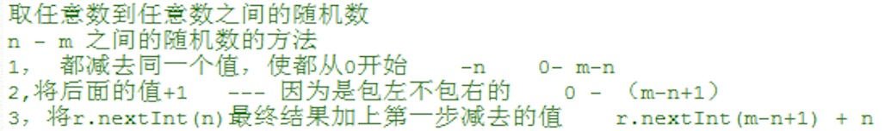

API


### 1、Random随机数类（伪随机数）
Random随机数类的使用:
import导包：所属包java.util. Random
创建实例格式：Random  random = new Random ();

调用方法:
1. nextInt(int maxValue)	产生[0,maxValue)范围的随机数,包含0不包含maxValue 
2. nextDouble()  			产生[0.0,1.0)范围的随机数 

示例：
```java
public class Test{
    public static void main(String[] args){
        Random random = new Random();

        //结果为0-99的一个数  
        random.nextInt(100);

        //结果为0-100的一个数 
        random.nextInt(100)+1;

        //结果为0.0-1.0之间的数(包括0.0不包括1.0)
        random.nextDouble();
        
        int end3 = random.nextInt(999);
        //如果不足三位前面补0
        String str = millis + String.format("%03d", end3);
        //%02d 不足两位前面补0


        //3位随机数
        ((Math.random() * 9 + 1) * 1000);
            
        //UUID计算随机数
        UUID.randomUUID().toString();
    }
}
```



其它：
UUID: UUID.randomUUID().toString().replace("-", "");
毫秒值: System.currentTimeMillis()


### 2、== 号和equals的区别
==  可以比较 基本数据类型 和 引用数据类型
    比较基本数据类型的时候，比较的是值。比较引用数据类型的时候比较的是地址值

equals  不能比较基本数据类型，因为基本数据类型是不能调用方法的。
        [只能比较引用数据类型]
		没有重写的情况，object里面的equals方法。比较的是地址值，跟==号是一样的
		重写的时候，比较的就是对象内部的属性值。

示例：
```java
public class Test{
    public static void main(String[] args){
      String str1 = "abc";					//在内存中只有一个对象。这个对象在字符串常量池中
      String str2 = new String("abc"); 		//在内存中有两个对象。一个new的对象在堆中，一个字符串本身对象，在字符串常量池中
      str1 == str2; 		//false   比较的是地址值
      str1.equals(str2); 	//true    比较的是属性值
    }
}
```
		

### 3、null "" " "的区别
以吃饭举例:
null		吃完的时候连一个碗都没有
""		    有一个碗，但是碗里面是真空状态，连空气都没有
" "		    有一个碗，里面装了一碗空气
"11"		有一个碗，碗里面装了两根豆芽菜


### 4、String类的常用方法
int length(): 返回此字符串的长度。													//str.length();
char charAt(int value):返回指定索引处的 char 值
int indexOf(char ch):  查找一个字符,在字符串中第一次出现的索引,被查找的字符不存在,返回-1 	//int indexOf(String str) 
			
int compareTo(String anotherString) 按码表顺序比较两个字符串。	
String substring(int beginIndex,int endIndex): 截取字符串的一部分 [包含头索引，不含尾索引]--->[1,5)
String substring(int beginIndex): 截取字符串的一部分【包含头索引到结尾】

boolean contains (String s): 判断一个字符串中,是否包含另一个字符串
char[] toCharArray(): 将字符串转成字符数组,功能和构造方法相反【必须用for遍历才能输出结果】
			
boolean startsWith(String prefix): 判断一个字符串是不是另一个字符串的前缀,开头
boolean endsWith(String prefix): 判断一个字符串是不是另一个字符串的后缀,结尾
			
byte[] getBytes(): 将字符串转成字节数组,此功能和String构造方法相反,byte数组查询编码表【必须用for遍历才能输出结果】
boolean equals(Object obj): 判断字符串中的字符是否完全相同,如果完全相同返回true  		//"end".equals(sc.nextLine());
boolean equalsIgnoreCase(String s): 传递字符串,判断字符串中的字符是否相同,忽略大小写

补充：
boolean isEmpty(): 判断字符串是不是空串,如果是空的就返回true
String toLowerCase(): 字符串转成小写
String toUpperCase(): 字符串转成大写
String repalce(char oldChar, char newChar): 将字符串中的老字符,替换为新字符
String repalce(String old, String newstr): 将字符串中的老字符串,替换为新字符串
       replaceAll（）替换所有
String trim(): 去掉字符串两端空格
String[] split(Object obj): 按指定对象切割字符串


### 5、StringBuffer  是字符串的一个缓冲区，是用来操作字符串的，长度可变的
特点：	
    [线程安全]
    底层采用[字符数组]实现,初始容量为16
	
将字符串转成StringBuffer: 2种方式
1. StringBuffer sb = new StringBuffer(String str) 
2. 遍历字符串，调用charAt()方法得到每个字符，再调用StringBuffer的append()添加进字符串缓冲区

StringBuffer类的方法
    1.append()： 将任意类型的数据,添加缓冲区 			    //可以往缓冲区中添加任意数据类型，但是我们一般添加的就是String
	2.reverse(): 将缓冲区中的字符反转
	3.String toString(): 将缓冲区中的所有字符,变成字符串
	4.delete(int start,int end): 根据索引删除缓冲区中字符 	//[2,5) 开始索引包含,结尾索引不包含
	5.insert(int index, 任意类型): 将任意类型数据,插入到缓冲区的指定索引上，原索引元素向后移
	6.replace(int start,int end, String str): 将指定的索引范围内的所有字符,替换成新的字符串 	//开始索引包含,结尾索引不包含
	7.int indexOf(char ch):  查找一个字符,第一次出现的索引,被查找的字符不存在,返回-1 

"补充知识点"
任意类型转String
	1.任意类型 + ""
	2.引用数据类型toString()方法
	3.String.valueOf(参数); 参数传递任意类型，返回值是String

String转StringBuffer	
	StringBuffer sb = new StringBuffer("abc");
StringBuffer转String
    sb.toString();
					
与StringBuilder区别
	StringBuffer是jdk1.0版本的,是线程安全的,效率低
	[StringBuilder是jdk1.5版本的,是线程不安全的,效率高]


### 6、正则表达式
判定 字符串 满足一定的规则。那么这个规则就叫做正则表达式。		
		
语法规则
	a: 字符
		x  代表的是字符x
		\\ 代表的是反斜线字符'\'
		\t 代表的是制表符
		\n 代表的是换行符
		\r 代表的是回车符
	b: 字符类
		[abc]    a、b 或 c（任意一个）
		[^abc]   任何字符，除了 a、b 或 c（非）
		[a-zA-Z] a到 z 或 A到 Z，任意一个 
		[0-9]    0到9任意一个
		[a-zA-Z_0-9] 字母、数字、下划线任意一个
	c: 预定义字符类
		\\1 表示和前面的相同
		\\. 任何字符。
		\\d 数字：[0-9] 
		\\w 单词字符：[a-zA-Z_0-9] 	
	e: 数量词
		X?     X，一次或一次也没有				
		X*     X，零次或多次					
		X+     X，一次或多次					
		X{n}   X，恰好 n 次 						
		X{n,}  X，至少 n 次 						
		X{n,m} X，至少 n 次，但是不超过 m 次	//a{b,c}表示a出现b-c次 包左又包右

[注：使用正则时需要加双引号]

"补充知识点"
    ()表示的是一组
    []表示中括号内的元素出现1次
    a{b}表示a出现b次 包左又包右

相关方法
	boolean matches(String 正则的规则)
	"abc".matches("[a]")  告知此字符串是否匹配给定的正则表达式	  //匹配成功返回true
-
	String[] split(String 正则的规则) 使用规则将字符串进行切割
	"abc".split("a")  
-
	String replaceAll(正则规则,String 字符串) 按照正则的规则,替换字符串
	"abc0123".repalceAll("[\\d]","#")	
-
	示例
	    正则表达式邮箱地址验证
	    "[a-zA-Z0-9_]+@[0-9a-z]+(\\.[a-z]+)+"
	    "\\w+@\\w+(\\.\\w+)+"
	
"补充知识点"
		split注意事项
		1，如果要切割的在字符串中没有  		---  把整个字符串做为一个整体
		2，如果要切割的在字符串中是连续的 	--- 全部切割掉，但是会有个空元素
		3，如果要切割的在字符串中开头		--- 开头有个空元素
		4，如果要切割的在字符串中结尾		--- 结尾没有空元素，刚好
-
		匹配正整数：”\\d+”
		匹配正小数：”\\d+\\.\\d+”  
		匹配负整数：”-\\d+”
		匹配负小数：”-\\d+\\.\\d+”
		匹配保留两位小数的正数：”\\d+\\.\\d{2}”
		匹配保留1-3位小数的正数：”\\d+\\.\\d{1,3}”


### 7、毫秒值
1000毫秒=1秒
获取当前日期的毫秒值: System.currentTimeMillis()   
时间原点: 公元1970年1月1日,午夜0:00:00 英国格林威治  毫秒值就是0


### 8、Date 日期类
Date类的构造方法
空参构造
    public Date()
带参构造
    public Date(long times)	如果在这类传了参数了，那么表示从时间原点开始往后的times毫秒
-
    Date d = new Date(); 	当前系统的时间。格式不是我们天朝人习惯的格式

相关方法			
    public long getTime()				将当前的日期对象，转为对应的毫秒值
    public void setTime(long times);	根据给定的毫秒值，生成对应的日期对象
-
	注："两种获取当前毫秒值的方法"
		long c = System.currentTimeMillis();
		new Date().getTime()	

		"毫秒值转成日期的方法"
		new Date().setTime(long times)
		Date d = new Date(long times)

	日期格式化
			SimpleDateFormat 类	[线程不安全,直接在方法中写，哪边用哪边写]
			
			1.日期转字符串
				public String format(Date date) 传递日期对象,返回字符串
				* 日期模式:
	 			* yyyy    年份
	 			* MM      月份
				* dd      月中的天数
				* HH       0-23小时
				* mm      小时中的分钟
	 			* ss      秒
	 			* yyyy年MM月dd日 HH点mm分钟ss秒  ,注:汉字可以修改，字母不可以随便写
	 			
			2.字符串转日期
				public Date parse(String str) 传递String,返回Date
				* 注意: 日期的模式, 必须和字符串中的日期格式匹配

		日期对象转换成字符串  格式化
		SimpleDateFormat sdf = new SimpleDateFormat("yyyy年MM月dd日 HH:mm:ss");
		String s = sdf.format(new Date());	
	
		字符串转换成日期对象
		SimpleDateFormat sdf = new SimpleDateFormat("yyyy年MM月dd日 HH:mm:ss");
		Date d = sdf.parse("2000年10月10日 10:10:10");


### 9、Calendar 日历类 [抽象类]
Calendar c = Calendar.getInstance();

相关方法
		getTime()  把日历对象, 转成Date日期对象
		    Date time = Calendar.getInstance().getTime();
-
		int  get(日历字段) 获取指定日历字段的值  
			Calendar c = Calendar.getInstance();
			int year = c.get(Calendar.YEAR);			// 获取年份
			int month = c.get(Calendar.MONTH) + 1;	    // 获取月份 [Calendar类的月份是0-11,类似于下标]
			int day = c.get(Calendar.DAY_OF_MONTH);	    // 获取天数
			
		set(int field,int value)  设置时间
			Calendar c = Calendar.getInstance();	
			1.c.set(Calendar.MONTH, 9);			        //设置单个字段的值		
			2.c.set(2000, 2, 1); 					    //把时间设置为2000年3月1日
		
		add(int field, int value) 调整日历字段值	[正数往后加，负数往前减]
			Calendar c = Calendar.getInstance();
			c.add(Calendar.DAY_OF_MONTH, -280);         // 让日历中的天数,减掉280天


### 10、包装类
Integer类
	静态方法: 将字符串类型数字转换成int类型：
		parseInt(String value)
		int i = Integer.parseInt("12");
-
	将int类型转成字符： 
		char num=(char)('0'+5);	
	    int i = in.intValue();	//将包装类转换成基本数据类型

自动装箱是什么转换成什么？
	基本数据类型---> 引用数据类型
自动拆箱是什么转换成什么?
	引用数据类型 ---> 基本数据类型
			


### 11、Math类
static double sqrt(double d)            //返回参数的平方根
static double pow(double a, double b)   //a的b次方
static double floor(double d)           //去尾法  返回小于等于该参数的整数

//图形化记忆 变小
System.out.println(Math.floor(5.6));    //5.0
	   
static double ceil(double d)            //进一法  返回大于等于该参数的整数

// 图形化记忆 变大
System.out.println(Math.ceil(5.4));     //6.0

static int abs(int i)                   //绝对值
System.out.println(Math.abs(-100));     //100

static double round(double d)           //获取参数的四舍五入,取整数
  
static double random()                  //返回随机数 0.0-1.0之间 不包含1.0
									


### 12、Arrays  数组工具类 
static String toString(数组)  //将数组变成字符串，省去遍历的麻烦
			
static int binarySearch(数组, 被查找的元素)  //前提：集合有序
	数组的二分搜索法
	返回元素在数组中出现的索引
	元素不存在, 返回的是  (-插入点-1)
			
static void sort(数组)        //对数组升序排列
			


### 13、BigInteger	大数据类型   
BigInteger b1 = new BigInteger("5861694569514568484562385634168451684568645684564564");
当我们要统计超过Long类型数的时候去使用他。
 
BigInteger对象的四则运算 
[ 加：b1.add(b2)，减：b1.subtract(b2)，乘：b1.multiply(b2)，除：b2.divideAndRemainder(b1);]

BigInteger b1 = new BigInteger("3");
BigInteger b2 = new BigInteger("10");
		 
BigInteger bigAdd = b1.add(b2);			//计算 b1+b2对象的和,调用方法 add
	
//相除建议用divideAndRemainder，因为服务器做数据运算时，数据是前端传递过来的  所以我们没有办法判断能否整除
BigInteger[] bigDiv = b2.divideAndRemainder(b1);	//相除    Remainder：余数
System.out.println(bigDiv[0]);//商
System.out.println(bigDiv[1]);//余数		//可以判断两个数是不是能整除？判断bigDiv[1] == 0
		 

BigDecimal    超级大型的浮点数据,提供高精度的浮点运算
因为java中小数的运算是不精确的，如果我们要进行小数的精确计算，那么此时使用BigDecimal。