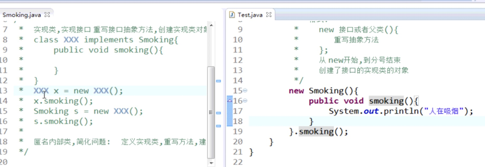
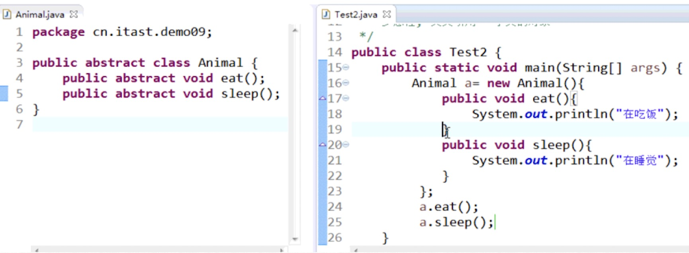
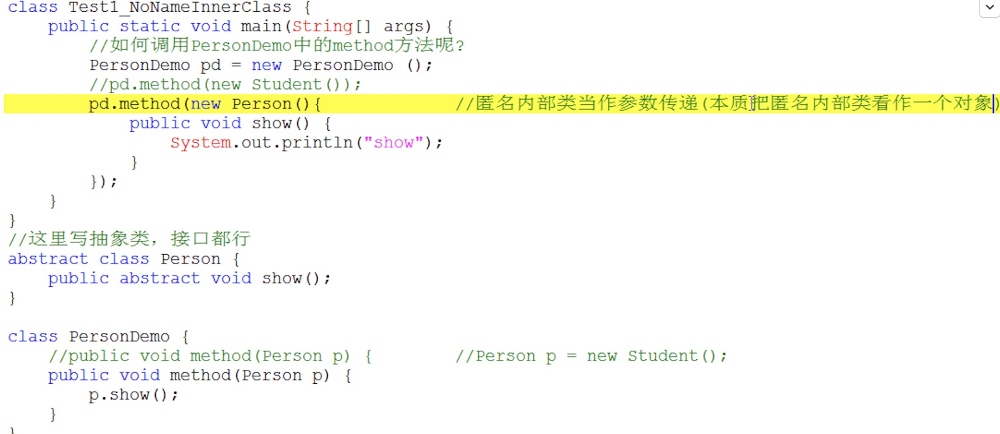

面向对象


面向对象三大特征 
[封装、继承、多态]

封装：就是将对象的“属性”和“行为”抽象出来，包装到类中 [类]
继承：就是将具有相同的“属性”和“行为”对象抽象出来，并包装成一个父类 [父类]
多态：就是多种形态，相同的“属性”和“行为”却有不同的表现方式 [子类]

面向对象设计原则
七大原则：
    开：面向扩展开放，面向修改关闭
    口：接口隔离原则
    合：组合/聚合原则
    里：里氏替换原则
    最：最少知识原则 (迪米特法则)
    单：单一职责原则
    依：依赖倒置原则


### 继承
子类会自动拥有父类所有[非private]修饰的属性和方法
格式：
    class 子类 extends 父类 {…}
	子类对象既可以调用自身的private修饰的成员,也可以调用父类的非private修饰的成员
	子类的对象调用成员变量的时候,子类自己有,使用子类,子类自己没有则调用父类的变量 
	
继承的注意事项 
    在Java中，[类只支持单继承]，不允许多继承，也就是说一个类只能有一个直接父类，
	1:多个类可以继承一个父类                                   //爹可以多个儿子
	2:在Java中，允许多层继承，即一个类的父类可以再去继承另外的父类   // A<---B<---c
    3:在Java中，子类和父类是一种相对概念，也就是说一个类是某个类父类的同时，也可以是另一个类的子类。


### 1、关键字
this关键字	当前类对象的引用 
super关键字	当前类的父类对象  [构造方法默认第一行都是隐式super() 调用父类中的无参构造方法]

注：
	1、this()函数主要应用于同一类中从某个构造函数调用另一个重载版的构造函数。
	2、this()只能用在构造函数中，并且也只能在第一行。所以在同一个构造函数中this()和super()不能同时出现。
	3、super()函数在子类构造函数中调用父类的构造函数时使用，而且必须要在构造函数的第一行

final关键字
	1、final 修饰类
		不可以被继承，但是可以继承其他类。[除了继承，类的本身使用方式没变]
	2、final修饰方法 [可以继承使用]
		可以被继承但是不可以被重写 [如父类中没有被final修饰方法，子类覆盖后可以加final]
	3、final修饰基本数据类型变量
		final修饰的变量称为常量，这些变量只能赋值一次 [其值固定不变]
	4、final修饰引用数据类型
		引用类型的变量值为对象地址值，地址值不能更改，但是地址内的对象属性值可以修改
			final Person p = new Person();
			p.name = "小明";  [可以更改p对象中name属性值]
	5、修饰成员变量
	      修饰成员变量，需要在创建对象前赋值，否则报错。(当没有显式赋值时，多个构造方法的均需要为其赋值。)	
		（只能赋值一次,赋值不能是默认初始值）

static关键字		
		static属于类，不属于对象
			 共享：所有的对象都能使用同一个static成员 [一般我们把共性数据定义为静态]
			 生命周期问题： 静态的生命周期优先于对象存在(随着类的加载而加载，随着类的消失而消失)
			 所在的位置不同：非静态的成员变量存在于堆　静态：存在方法区数据共享区
			 被static修饰的成员可以并且建议通过类名直接访问
			 	
注意事项	
	静态方法中不能使用this，super
	静态成员只能访问静态成员
	如果在方法中使用到了静态的成员，则将方法定义成静态


### 2、方法的重载
[同名不同参]
在同一个类中，（方法名相同，参数列表不同）。与返回值类型无关。[构造函数]
参数列表不同：
1:参数个数不同
2:参类型不同数
3:参数的顺序不同(算重载,但是在开发中不用)

[根据输入的参数不同则调用不同的方法]


### 3、方法的重写
继承中
子类中出现与父类一模一样的方法时，会出现覆盖操作，也称为override重写、复写或者覆盖

子类重写方法对父类方法更新：super.父方法名(); 之后再添加更新的功能
[子类的对象调用方法的时候,子类自己有,使用子类,子类自己没有则调用父类的方法] 

重载与重写对比:
	重载: 同一个类中，同名不同参数的方法（与返回值和修饰符无关）
	重写: 在子类和父类中，一模一样的两个方法（子类的权限>=父类权限）[注意返回值类型]


### 4、抽象类
[基于继承]
格式：
关键字：abstract
```java
public abstract class Animal{
    //定义方法时，怎么实现，不知道...所以没有方法体
	public abstract void eat(Object obj); 		
}
```
[注：抽象类中可以有成员变量 、成员方法 和 抽象方法]

注：	    
1.抽象的方法, 必须存在于抽象的类中[或接口中], 但抽象类中不一定有抽象方法
2.抽象类,不能实例化对象: 没有意义  原因:如果真的让你new了, 对象.调用抽象方法,抽象方法没有主体,根本就不能运行

使用: 
定义子类继承抽象类,将抽象方法进行重写 
子类必须实现继承的抽象类中所有抽象方法  或者 子类也是一个抽象类继续继承抽象方法[或已经实现了部分方法]再由下一级子类继承再实现
只有覆写了抽象类中所有的抽象方法后，其子类才可以创建对象。[部分实现或没实现时该子类还是一个抽象类]

关键字abstract不可以和哪些关键字共存？	
1:private: 抽象方法,需要子类重写, 如果父类方法是私有的,子类继承不了,也就没有了重写
2:final: final修饰的类，不允许子类继承。“太监类”,抽象类如果被final修饰则不能被实现，就没有意义类
3:static: 抽象类中的抽象方法不可以使用static构成静态抽象方法，抽象类是不能实例化的，即不能被分配内存;
          而static修饰的方法在类实例化之前就已经别分配了内存，
          这样一来矛盾就出现了：抽象类不能被分配内存，而static方法必须被分配内存。所以抽象类中不能有静态的抽象方法。


### 5、接口
关键字：interface

格式：
```java
public interface 接口名 {	
    //常量；		
    //抽象方法1;
}
```
[接口中只能定义抽象方法和常量]
			
注：接口中的常量调用：直接用接口名调用, 因为是静态的 不用创建对象

定义步骤:
	使用interface代替了原来的class
	其他步骤与定义类相同：
	    接口中的方法均为公共访问的抽象方法
	    接口中无法定义普通的成员变量
	
			
接口的实现类:
关键字：implements
```java
class Test implements 接口 {  
	//重写接口抽象方法；
}
```
注意：全部实现或部分实现 [部分实现时子类为抽象类]
			 

接口的多实现:
```java
class Zi implements Fu1,Fu2 {    // 多实现。同时实现多个接口。
    public void show1(){}		 // 需要实现所有的抽象方法或者部分实现
	public void show2(){}		 // 部分实现时，实现类则是抽象类
}
```
			
接口的多继承:
```java
interface Zi extends Fu1,Fu2,Fu3{
	void show3();
}
```
			
#### 类在继承类的同时实现多接口:
当一个类已经继承了一个父类，它又需要扩展额外的功能，这时接口就派上用场了
接口的出现避免了单继承的局限性。[父类中定义的事物的基本功能。接口中定义的事物的扩展功能]
```java
class Zi extends Fu implements Inter,Inter2 {
    public void show1() {
    }
}
```
[优先选用接口,尽量少用抽象类]


### 6、多态
一个事物的多种形态。
[最终多态体现为:父类引用变量可以指向子类对象]

[多态的前提是：必须有继承关系 或者 类实现接口关系，否则无法完成多态]

fu f=new zi();
父类类型  变量名 = new 子类类型();
变量名.方法名();  调用子类的重写方法

#### 多态同名成员:
多态成员变量
	当子父类中出现同名的成员变量时：
	简单记：编译和运行都参考等号的左边（父类）。[父类中没有则编译失败]

多态成员方法
    子类重写父类方法:
	    编译时期：参考父类，如果父类中没有调用的方法，编译失败
	    运行时期：参考子类，并运行子类中的重写方法
	    简而言之：编译看左边（父类），运行看右边（子类）

[注：在多态中 编译都是看父类，运行 只有非静态方法找子类 其余成员都是找父类]

#### instanceof关键字
在继承中比较引用类型:
	可以通过instanceof关键字来判断某个对象是否属于某种数据类型
	对象  instanceof  数据类型;	[只针对有继承关系的]
-
	多态-向上转型
	    [只能使用父类共性的内容]
		父类类型  变量名 = new 子类类型();
		Person p = new Student();  

	多态-向下转型
	    [可以访问子类特有方法]
		子类类型 变量名 = (子类类型) 父类类型的变量;
		Person p = new Student();
		Student stu = (Student) p;

		在向下转型时容易发生ClassCastException类型转换异常。在转换之前必须做类型判断。
		如：if( !a instanceof Dog){…}


### 7、构造方法
构造方法的格式：
修饰符 方法名[类名](参数列表){ 
    //this.成员变量=参数；
}
```java
public class Test{

    private String str;

    //方法名与类名相同
    public Test(String str){
        this.str = str;
    }   
}
```
[作用：在new的同时给成员变量赋值, 给对象属性进行初始化]

构造方法的体现：
	构造方法[没有返回值]类型。也不需要写返回值。
	构造方法名称必须和类型保持一致。
	
构造方法运行特点:
	在new 对象的时候自动调用执行。且执行一次
	[构造方法不能继承也不能重写 可以重载]


### 8、匿名对象
[只能使用一次]

new Person(); 匿名对象直接使用，没有变量名。
new Person().eat() eat方法被一个没有名字的Person对象调用了。
	
匿名对象可以作为方法接收的参数、方法返回值使用:
```java
public class Test{
    public static Person getPerson(){
        //匿名对象作为方法接收的参数
        Demo.method(new Person());

    	//匿名对象作为方法返回值
    	return new Person();
    }
}
```
			
	
### 9、内部类
#### 9.1.成员内部类
成员内部类: [定义在外部类中的成员位置]。与类中的成员变量相似，可[通过外部类对象进行访问]

定义格式:
class 外部类 { 
	修饰符 class 内部类 {
		//其他代码
	}
}
访问：
外部类名.内部类名 变量名 = new 外部类名().new 内部类名();

注：
如果内部类是私有的，则必须在外部类中创建一个方法，用来给私有内部类实例化对象和调用内部类的方法，
测试类中直接实例化外部类的对象且调用自身的方法，这样间接访问

#### 9.2.局部内部类
局部内部类，[定义在外部类方法中的局部位置]。与访问方法中的局部变量相似，可[通过调用方法进行访问]
		
定义格式:
class 外部类 { 
	修饰符 返回值类型 方法名(参数) {
		class 内部类 {
			//其他代码
		}
		//实例化内部类
	}
}
在外部类方法中，直接实例化内部类对象，进行调用，测试类中直接实例化外部类对象调用方法

#### 9.3.匿名内部类
是局部内部类的一种。[只能写在方法中]
		 
前提：继承或接口实现

定义格式: [整体看成一个子类的匿名对象]
new 父类/接口() { 
	//抽象方法重写
};----->或 .重写的方法(); //直接调用内部方法

匿名内部类的本质是一个实现了接口或继承了某个类的子类的匿名对象
内部类可以用作返回值和参数

注：
如果匿名内部类中实现了多个方法，则用多态：
    匿名内部类是一个子类对象，所以用父类引用指向子类对象，再用多态对象调用重写方法
	就是将匿名类变成普通的实例化，给一个变量

匿名内部类。简化代码:
		
	 



  
### 10、权限修饰符
private：仅能在本类中访问使用
default：本包中的类都可以访问
protected：本包中的类与其他包中的子类【内部】可以访问
public：所有包中的所有类都可以访问

[注意：一个文件中只能有一个public修饰的类]


### 11、代码块
局部代码块:定义在方法或语句中
	局部代码块作用:可以限定变量的声明周期.
			
构造代码块：定义在类中成员位置的代码块【构造方法上面】
	优先于构造方法执行，[每创建一个对象均会执行一次构造代码块]
			
静态代码块：定义在成员位置，使用static修饰的代码块【类中方法外】
	优先于构造代码块执行。[内存加载时就执行]
	类不管创建多少对象，静态代码块[仅执行一次]

```java
public class A{
    static {
        System.out.println("静态代码块");
    }
    
    {   
        System.out.println("构造代码块");
    }
    public A(){
    }

    public static void main(String[] args){
      { 
        System.out.println("局部代码块");
        }
        //..... 
    }
}
```


### 12、对象序列化
对象的序列化：将一个对象写到内存
对象的反序列化：将一个对象从内存中读出

序列化：
只要 [类 实现了Serilizable接口]，这个类的所有属性和方法都会自动序列化。

若有些属性不需要序列化，可以进行排除：
使用[transient关键字]，在不需要序列化的属性前添加，则此属性就不会被序列化到指定的目的地中，transient关键字只能修饰成员变量
public transient int age;

序列号冲突问题：
当一个类实现Serializable接口后，创建对象并将对象写入文件，之后更改了源代码：
比如：将成员变量的修饰符有private改成public，再次从文件中读取对象时会报异常
解决：固定序列号
序列化中自定义的序列号，这样每次编译类时生成的serialVersionUID值都是固定的
private static final long serialVersionUID = 1478652478456L; 
		


### 13、递归
方法自己调用自己
适合于: 方法中运算的主体不变, 但是运行的时候, 参与运行的方法参数会变化, 当前方法内调用自己的这种现象

[使用递归最重要的是: 指定返回条件，否则会造成栈溢出]

示例：
```java
public class Test{
    public void method(String parentId, List<Object> list){
        //根据 parentId 获取所有的子集
        List<Object> children = server.selectList(parentId);

        //跳出递归的条件
        if (CollectionUtils.isEmpty(children)){
            return;
        }

        //逻辑操作
        list.addAll(children);

        //递归
        for (Object child:children){
            method(child.getId(),list);
        }
    }
}
```
		


### 14、可变参数
JDK1.5新的特性  
前提: 方法参数数据类型确定,  参数的个数任意

可变参数语法: 数据类型...变量名	[本质就是一个数组]
```java
public class A{
    public int method(int...arr){
    	//方法体
    	return 返回值;
    }
    
    public static void main(String[] args){
        //可不传
        method();
        //可传任意
        method(2,3,4,5,6,7);
    }
}
```
注意事项
[一个方法中,可变参数只能有一个，且 必须写在参数列表的最后一位] ，在可变参数后面的参数是接收不到数据.