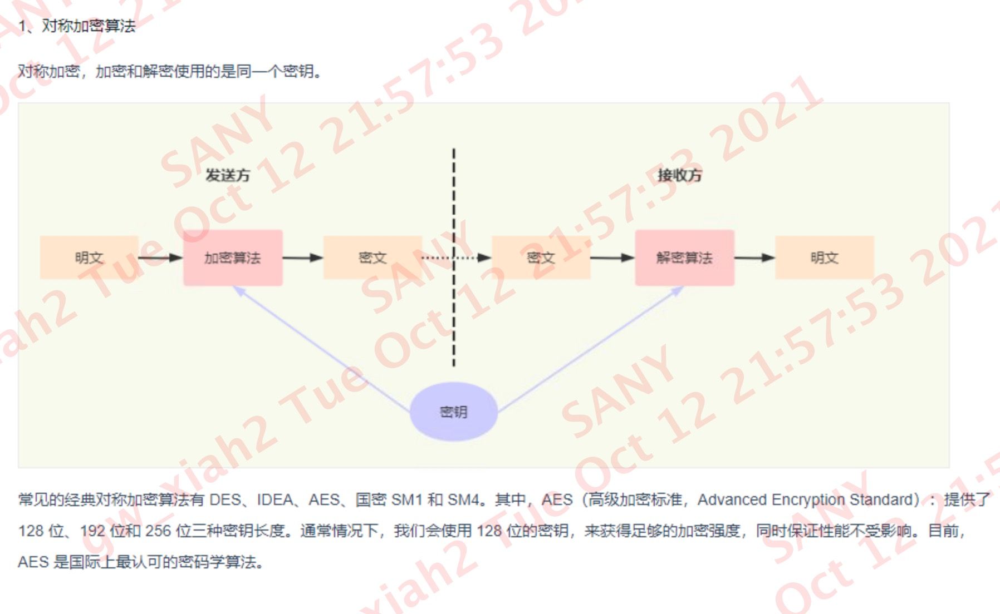

RSA非对称加密

[公钥与私钥](../../接口签名/公钥与私钥.md)

一：对称加密
对称加密指的就是加密和解密使用同一个秘钥，所以叫对称加密。 对称加密只有一个秘钥，作为私钥。

加密过程：
加密: 原文+密钥 = 密文
解密：密文-密钥 = 原文

常见的对称加密算法： DES, AES, 3DES等

特点：
优点 - 算法简单，加解密容易，效率高，执行快。
缺点 - 相对来说不安全，只有一把钥匙，密文如果被拦截，且密钥被劫持，那么信息很容易被破译。

二：非对称加密
非对称加密指的是：加密和解密使用不同的秘钥，一把作为公开的公钥，另一把作为私钥。 
公钥加密的信息，只有私钥才能解密。
私钥加密的信息，只有公钥才能解密。
常见的给对称加密: RSA,ECC

区别：
对称加密算法，加解密的效率要高很多。 但是缺陷在于对秘钥的管理上，以及在非安全信道中通讯时，密钥交换的安全性不能保障。 
所以在实际的网络环境中，会将两者混合使用。

特点：
优点 - 安全，即使密文和公钥被拦截，但是由于无法获取到私钥，也就无法破译到密文。
缺点 - 加密算法复杂，安全性依赖算法和密钥， 且加密和解密效率很低。

对称加密和非对称加密的区别
一： 对称加密： 加密解密使用同一个密钥，被黑客拦截不安全
二：非对称加密：公钥加密，私钥解密。公钥可以公开给别人进行加密，私钥永远在自己手里，非常安全，黑客拦截也没用，因为私钥尚未公开。 
             著名的RSA加密算法就是用的非对称加密。

简单理解：
对称加密： A和B传输数据，使用同一个密钥，不安全
非对称加密: A和B传输数据， A具有自己的公私钥，B具有自己的公私钥。
(公钥是在公网上公开的，任何人都能看见， 私钥自己保留)
A拿着B的公钥+信息数据， 传递给B。 这个时候 ， 只有B手里的密钥才能解开。
假设C拦截了A传递的信息，他是解不开的， 因为C没有这个公钥对应的私钥。
所以比较安全。

[RSAUtil](./RSA非对称加密/RSAUtil.java)

[加密](./RSA非对称加密/EncryptUtil.java)
[解密](./RSA非对称加密/DecryptUtil.java)