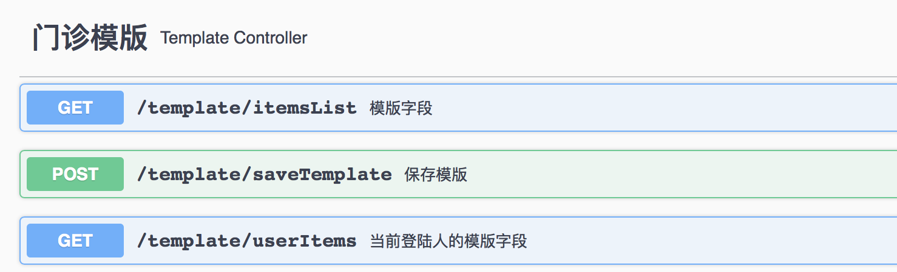

使用Swagger自动生成文档


[参考](https://blog.csdn.net/lsqingfeng/article/details/123678701)

##### 1、添加依赖
```xml
<dependency>
	<groupId>io.springfox</groupId>
	<artifactId>springfox-swagger2</artifactId>
	<version>2.7.0</version>
</dependency>
<dependency>
	<groupId>io.springfox</groupId>
	<artifactId>springfox-swagger-ui</artifactId>
	<version>2.7.0</version>
</dependency>
```

##### 2、启动类添加注解
```text
@EnableSwagger2
```

访问地址
```html
http://localhost:服务端口/swagger-ui.html
```

##### 3、常用注解
描述类：
```java
import io.swagger.annotations.Api;

@Api(value = "appInspect", tags = "诊断")
public class AppInspectController {
    //...
}
```

描述方法：
```java
import io.swagger.annotations.ApiOperation;

public class test{
    @GetMapping(value = "/checkItems")
    @ApiOperation(value="检测项目",notes = "备注")
    public List<AppInspectItemsVo> checkItems() {
        //...
    }
}
```

描述实体对象：
```java
import io.swagger.annotations.ApiModel;

@ApiModel(description = "App_创建病历")
@Data
public class AppCreateCaseDto implements Serializable {
    //...
}
```

描述字段：
```java
import io.swagger.annotations.ApiModelProperty;

public class test{
    @ApiModelProperty(value = "治疗项目ID",required = true,notes = "备注")
    @NotNull(message = "治疗项目ID不能为空")
    private Long cureItemId;
}
```
required = true  必填

描述方法上的参数: [对象参数，使用`描述字段`]
```java
public class test{
    public UserTest userAge(@ApiParam(value = "用户名") String name) {
        //...
    }
}
```


页面示例
