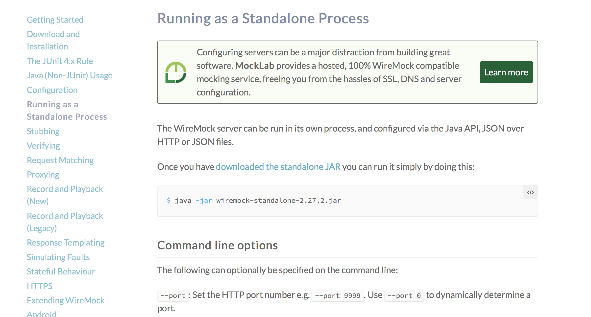

使用WireMock伪造REST服务

好处：
前后端分离开发，开发前后端可以提供给前端一些特定的数据，是前端可以直接开始工作，后端再逐步完善代码。
WireMock类似一个独立的服务器，前端开发完再将地址切换会真正的服务器即可。


1、去官网下载服务包
[官网地址](http://wiremock.org/docs/running-standalone/)

Docs > Running as a Standalone Process 



启动并指定端口
```shell script
$ java -jar wiremock-standalone-2.27.2.jar --port 8062
```


2、添加依赖 [不需要版本号] [<version>2.5.1</version>]
```xml
<dependency>
	<groupId>com.github.tomakehurst</groupId>
	<artifactId>wiremock</artifactId>
</dependency>
```


3、编写客户端处理逻辑
```java
import static com.github.tomakehurst.wiremock.client.WireMock.aResponse;
import static com.github.tomakehurst.wiremock.client.WireMock.configureFor;
import static com.github.tomakehurst.wiremock.client.WireMock.get;
import static com.github.tomakehurst.wiremock.client.WireMock.removeAllMappings;
import static com.github.tomakehurst.wiremock.client.WireMock.stubFor;
import static com.github.tomakehurst.wiremock.client.WireMock.urlPathEqualTo;

import java.io.IOException;

import org.apache.commons.io.FileUtils;
import org.apache.commons.lang.StringUtils;
import org.springframework.core.io.ClassPathResource;

public class MockServer {

	public static void main(String[] args) throws IOException {
		WireMock.configureFor(8062);		//WireMock服务地址和端口
		WireMock.removeAllMappings();		//清空之前的配置

		mock("/order/1", "01");
		mock("/order/2", "02");
	}

  //路径 和 对应的返回文档   【src/main/resources/mock/response/】
	private static void mock(String url, String file) throws IOException {
		ClassPathResource resource = new ClassPathResource("mock/response/" + file + ".txt");
		String content = StringUtils.join(FileUtils.readLines(resource.getFile(), "UTF-8").toArray(), "\n");
    
    //返回
		stubFor(get(urlPathEqualTo(url)).willReturn(aResponse().withBody(content).withStatus(200)));
	}

}
```

```json
{
	"id":1,
	"type":"C"
}
```


4、前端接口响应
localhost:8062/order/1
{"id":1,"type":"c"}