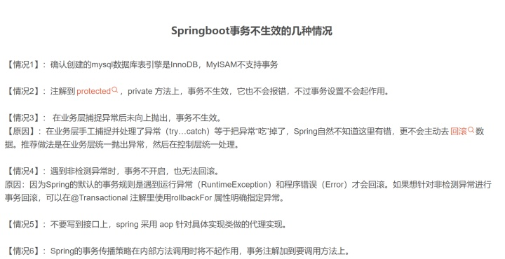

事务


[数据库的存储引擎必须是：innoDB]

###1.什么是事务？
####1.1.事务说明
事务是逻辑上的[一组]操作，要么都执行，要么都不执行。

>注意点：
>1.数据库的存储引擎必须是：innoDB
>2.spring事务只对运行时异常RuntimeException奏效，编译时异常Exception是不会回滚的

[事务本身是针对连接来说的，因此一个连接可能会多次进行事务操作。
一个事务只连接一次数据库，无论有多少select,insert等复合起来的。]

循环中嵌套数据库操作：
会严重印象数据库的性能，循环内部每次都进行表操作，查询数据库需要占用时间，消耗资源，连接数据库也需要占用时间，消耗资源。
[虽然一个事务只创建一个连接，但是每次操作数据库都要通过这个连接=>耗时]

示例：
事务最经典也经常被拿出来说例子就是转账了：
>假如小明要给小红转账1000元，这个转账会涉及到两个关键操作就是：
>将小明的余额减少1000元，将小红的余额增加1000元。
>万一在这两个操作之间突然出现错误比如银行系统崩溃，导致小明余额减少而小红的余额没有增加，这样就不对了。
>事务就是保证这两个关键操作要么都成功，要么都要失败。


####1.2.事务的特性？
* 原子性： 事务是最小的执行单位，不允许分割。事务的原子性确保动作要么全部完成，要么完全不起作用；
* 一致性： 执行事务前后，数据保持一致，多个事务对同一个数据读取的结果是相同的；
* 隔离性： 并发访问数据库时，一个用户的事务不被其他事务所干扰，各并发事务之间数据库是独立的；
* 持久性： 一个事务被提交之后。它对数据库中数据的改变是持久的，即使数据库发生故障也不应该对其有任何影响。


原子性实现：
主要是基于MySQL[日志系统的redo和undo机制]
事务是一组SQL语句，里面有选择，查询、删除等功能。每条语句执行会有一个节点。
例如，删除语句执行后，在事务中有个记录保存下来，这个记录中储存了我们什么时候做了什么事。
如果出错了，就会回滚到原来的位置，redo里面已经存储了我做过什么事了，然后逆向执行一遍就可以了。


####1.3.如果不考虑隔离性则会出现几个问题
脏读			:一个事务读到另一个事务还没有提交的数据.
不可重复读	:一个事务读到了另一个事务已经提交的update的数据,导致在当前的事务中多次查询结果不一致.
虚读/幻读	:一个事务读到另一个事务已经提交的insert的数据,导致在当前的事务中多次的查询结果不一致.

不可重复度和幻读区别：
[不可重复读的重点是修改，幻读的重点在于新增或者删除]
例1（同样的条件, 你读取过的数据, 再次读取出来发现值不一样了 ）：
    事务1中的A先生读取自己的工资为1000的操作还没完成，
    事务2中的B先生就修改了A的工资为2000，导致A再读自己的工资时工资变为 2000；
    这就是不可重复读。
例2（同样的条件, 第1次和第2次读出来的记录数不一样 ）：
    假某工资单表中工资大于3000的有4人，事务1读取了所有工资大于3000的人，共查到4条记录，
    这时事务2 又插入了一条工资大于3000的记录，事务1再次读取时查到的记录就变为了5条，
    这样就导致了幻读。


####1.4.事务隔离级别
SQL 标准定义了四个隔离级别：
* READ-UNCOMMITTED(读取未提交)：  最低的隔离级别，允许读取尚未提交的数据变更，[可能会导致脏读、幻读或不可重复读]
* READ-COMMITTED(读取已提交)：    允许读取并发事务已经提交的数据，[可以阻止脏读，但是幻读或不可重复读仍有可能发生].[Oracle]
* REPEATABLE-READ(可重复读)：     对同一字段的多次读取结果都是一致的，除非数据是被本身事务自己所修改，[可以阻止脏读和不可重复读，但幻读仍有可能发生].[Mysql+间隙锁=SERIALIZABLE]
* SERIALIZABLE(可串行化)：        最高的隔离级别，完全服从ACID的隔离级别。所有的事务依次逐个执行，这样事务之间就完全不可能产生干扰，
                                也就是说，[该级别可以防止脏读、不可重复读以及幻读]

图表：
隔离级别			   脏读	     不可重复读	   幻读
READ-UNCOMMITTED	√			√			√
READ-COMMITTED		×			√			√
REPEATABLE-READ		×			×			√
SERIALIZABLE		×			×			×

[MySQL InnoDB 存储引擎的默认支持的隔离级别是 REPEATABLE-READ（可重复读）
Oracle默认级别：读已提交]

Mysql示例:
查询隔离级别：
```sql
SELECT @@tx_isolation;
+-----------------+
| @@tx_isolation  |
+-----------------+
| REPEATABLE-READ |
+-----------------+
```
这里需要注意的是：
与 SQL 标准不同的地方在于：
InnoDB 存储引擎在 REPEATABLE-READ（可重复读）事务隔离级别下使用的是 [Next-Key Lock 锁算法],因此[可以避免幻读的产生]。
这与其他数据库系统(如 SQL Server)是不同的。
所以说InnoDB 存储引擎的默认支持的隔离级别是 REPEATABLE-READ（可重读） 已经可以完全保证事务的隔离性要求，即:
达到了 SQL标准的SERIALIZABLE(可串行化)隔离级别。
[因此：事务隔离级别越高越影响性能，InnoDB 存储引擎默认使用 REPEATABLE-READ（可重读）并不会有任何性能损失]


####1.5.扩展
InnoDB有三种行锁的算法：
1：Record Lock：单个行记录上的锁。
2：Gap Lock：间隙锁，锁定一个范围，但不包括记录本身。GAP锁的目的，是为了防止同一事务的两次当前读，出现幻读的情况。
3：Next-Key Lock：1+2，锁定一个范围，并且锁定记录本身。对于行的查询，都是采用该方法，主要目的是解决幻读的问题。



[事务的原理](./事务的实现原理.md)

[Spring 注解管理事务](./事务/Spring%20注解管理事务.md)

SpringBoot 事务:
使用mybatis-spring-boot-starter会自动添加spring-tx依赖和spring-jdbc依赖，
同时Spring Boot会向容器自动注入DataSourceTransactionManager，
这样可以不需要额外配置就可以使用@Transactional事务注解，进而在代码中进行事务管理及控制
@Transactional(rollbackFor = Exception.class)

		

###2.事务传播机制
[事务传播机制](./事务传播机制.md)

####2.2.同一个 Service 事务失效
[在一个Service内部，事务方法之间的嵌套调用，普通方法和事务方法之间的嵌套调用，都不会开启新的事务]
是因为spring采用动态代理机制来实现事务控制，而动态代理最终都是要调用原始对象的，而原始对象在去调用方法时，是不会再触发代理了

所以：同一个Service
非事务方法调用事务方法，事务不生效
[示例](https://www.cnblogs.com/huangjinyong/p/14142662.html?ivk_sa=1024320u)
事务方法调用事务方法，被调的新事务不生效
[示例](https://wenku.baidu.com/view/200b57f24a649b6648d7c1c708a1284ac85005e0.html)

原理：
spring采用动态代理机制来实现事务控制
代理类中：在有事务注解的地方 动态的插入了事务方法，调用方法还是使用'原来的bean'进行调用。
```java
@Service
class A{
    method a(){    //标记1 非事务方法调用事务方法
        b();
    }

    @Transactinal
    method b(){}
}
 
//Spring扫描注解后，创建了另外一个代理类，并为有注解的方法插入一个startTransaction()方法：
class proxy$A{
    A objectA = new A();
 
    method a(){    //标记3
        objectA.a();    //由于a()没有注解，所以不会启动transaction，而是直接调用A的实例的a()方法
    }

    method b(){    //标记2
        startTransaction(); //事务方法
        objectA.b();
    }
}
/**
* 当我们调用A的bean的a()方法的时候，也是被proxyA拦截，执行proxyA拦截，执行proxyA.a()（标记3），
* 然而，由以上代码可知，这时候它调用的是objectA.a()，也就是由原来的bean来调用a()方法了，所以代码跑到了“标记1”。
* 由此可见，“标记2”并没有被执行到，所以startTransaction()方法也没有运行。
*/
```

解决方案：
1.把方法B抽离到另外一个XXService中去，并且在这个Service中注入XXService，使用XXService调用方法B。
2.同一个Service类中的方法相互调用需要使用注入的对象来调用，不要直接使用this.方法名来调用，this.方法名调用是对象内部方法调用，不会通过Spring代理类。
3.通过在方法内部获得当前类代理对象的方式,通过代理对象调用方法B

第三种使用：
1：springboot启动类加上注解:@EnableAspectJAutoProxy(exposeProxy = true)
2：修改a方法：使用代理类调用：((A)AopContext.currentProxy()).b();


###3.Mysql事务操作
MYSQL数据库事务默认是自动提交的

1.手动开启事务
```sql
开启事务
start transaction;

操作多条sql
此时数据还没有真正写入数据库
insert/update/delete...

提交/回滚
commit/rollback;
```

2.MYSQL设置不自动提交	
```sql
查看与commit相关参数
show variables like '%commit%';

将autocommit参数设置为OFF.
1ON/0OFF
set autocommit = 0;
```
注：
如果关闭自动提交，则每次执行完必须使用commit/rollback来提交或者后退
事务开启后，没有执行commit/rollback之前，数据是还没有真正写入到数据库