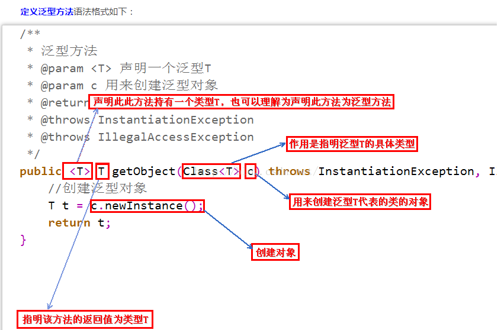

泛型


泛型，即“参数化类型”

一提到参数，最熟悉的就是定义方法时有形参，然后调用此方法时传递实参。

那么参数化类型怎么理解呢？
顾名思义，就是将类型由原来的具体的类型参数化，类似于方法中的变量参数，此时类型也定义成参数形式（可以称之为类型形参），
然后在使用/调用时传入具体的类型（类型实参）。

泛型的本质是为了参数化类型（在不创建新的类型的情况下，通过泛型指定的不同类型来控制形参具体限制的类型）。
也就是说在泛型使用过程中，操作的数据类型被指定为一个参数，这种参数类型可以用在类、接口和方法中，分别被称为泛型类、泛型接口、泛型方法。

泛型只在编译阶段有效
也就是说Java中的泛型，只在编译阶段有效。
在编译过程中，正确检验泛型结果后，会将泛型的相关信息擦出，并且在对象进入和离开方法的边界处添加类型检查和类型转换的方法。
也就是说，泛型信息不会进入到运行时阶段.
[对此总结成一句话：泛型类型在逻辑上可以看成是多个不同的类型，实际上都是相同的基本类型。]


###1.泛型类
泛型类型用于类的定义中，被称为泛型类。
通过泛型可以完成对一组类的操作对外开放相同的接口。最典型的就是各种容器类，如：List、Set、Map。

泛型类的最基本写法：
```text
class 类名称 <泛型标识：可以随便写任意标识号，标识指定的泛型的类型> {
  private 泛型标识（成员变量类型) var; 
  .....
}
```

eg: 一个最普通的泛型类：
```java
//在实例化泛型类时，必须指定T的具体类型
public class Generic<T>{ 			//此处T可以随便写为任意标识，常见的如T、E、K、V等形式的参数常用于表示泛型
    
    private T key;					//key这个成员变量的类型为T,T的类型由外部指定  

    public Generic(T key) {			//泛型构造方法形参key的类型也为T，T的类型由外部指定
        this.key = key;
    }

    public T getKey(){ 				//泛型方法getKey的返回值类型为T，T的类型由外部指定
        return key;
    }
}
```

cs:
泛型的类型参数只能是“包装类”类型（包括自定义类），不能是简单类型
传入的实参类型需与泛型的类型参数类型相同，即为Integer.
`Generic<Integer> genericInteger = new Generic<Integer>(123456);`

定义的泛型类，就一定要传入泛型的类型参数么？
并不是这样，在使用泛型的时候如果传入泛型的类型参数，则会根据传入的类型参数做相应的限制，此时泛型才会起到本应起到的限制作用。//Generic<String>
如果不传入泛型的类型参数的话，在泛型类中使用泛型的方法或成员变量定义的类型可以为任何的类型。 //无限制

看一个例子：
Generic generic = new Generic("111111");	//不指定泛型的类型参数，而是通过构造器的实参类型，最终确定泛型的类型参数

注意：
泛型的类型参数只能是类类型，不能是简单类型。
不能对确切的泛型类型使用instanceof操作。如下面的操作是非法的，编译时会出错。
if(ex_num instanceof Generic<Number>){   
} 


###2.泛型接口
[比较常用]
泛型接口与泛型类的定义及使用基本相同。
泛型接口常被用在各种类的生产器中，可以看一个例子：

```java
//定义一个泛型接口
public interface Generator<T> {
    public T next();
}
```

当实现泛型接口的类，未传入泛型实参时：
```java
/**
 * 未传入泛型实参时，与泛型类的定义相同，在声明类的时候，需将泛型的声明也一起加到类中
 * 即：class FruitGenerator<T> implements Generator<T>{
 * 如果不声明泛型，如：class FruitGenerator implements Generator<T>，编译器会报错："Unknown class"
 */
class FruitGenerator<T> implements Generator<T>{
    @Override
    public T next() {
        return null;
    }
}
```

当实现泛型接口的类，传入泛型实参时：
```java
/**
 * 传入泛型实参时：
 * 定义一个生产器实现这个接口,虽然我们只创建了一个泛型接口Generator<T>
 * 但是我们可以为T传入无数个实参，形成无数种类型的Generator接口。
 * 在实现类实现泛型接口时，如已将泛型类型传入实参类型，则所有使用泛型的地方都要替换成传入的实参类型
 * 即：Generator<T>，public T next();中的的T都要替换成传入的String类型。
 */
public class FruitGenerator implements Generator<String> {

    private String[] fruits = new String[]{"Apple", "Banana", "Pear"};

    @Override
    public String next() {
        Random rand = new Random();
        return fruits[rand.nextInt(3)];
    }
}
```


###3.泛型方法


[泛型类，是在实例化类的时候指明泛型的具体类型；
泛型方法，是在调用方法的时候指明泛型的具体类型]
示例1：
```java
public class test{
/**
 * 泛型方法的基本介绍
 * @param tClass 传入的泛型实参
 * @return T 返回值为T类型
 * 说明：
 *     1）public 与 返回值中间<T> 非常重要，可以理解为声明此方法为泛型方法。
 *     2）只有声明了<T>的方法才是泛型方法，泛型类中的使用了泛型的成员方法并不是泛型方法。
 *     3）<T>表明该方法将使用泛型类型T，此时才可以在方法中使用泛型类型T。
 *     4）与泛型类的定义一样，此处T可以随便写为任意标识，常见的如T、E、K、V等形式的参数常用于表示泛型。
 */
public <T> T genericMethod(Class<T> tClass)throws Exception{
        T instance = tClass.newInstance();
        return instance;
}

Object obj = genericMethod(Class.forName("com.test.test"));
}
```
示例2：
```java
public class GenericTest {
   //这个类是个泛型类，在上面已经介绍过
   public class Generic<T>{     
        private T key;

        public Generic(T key) {
            this.key = key;
        }

        //我想说的其实是这个，虽然在方法中使用了泛型，但是这并不是一个泛型方法。
        //这只是类中一个普通的成员方法，只不过他的返回值是在声明泛型类已经声明过的泛型。
        //所以在这个方法中才可以继续使用 T 这个泛型。
        public T getKey(){
            return key;
        }
    }

    /** 
     * 这才是一个真正的泛型方法。
     * 首先在public与返回值之间的<T>必不可少，这表明这是一个泛型方法，并且声明了一个泛型T
     * 泛型的数量也可以为任意多个 
     *    如：public <T,K> K showKeyName(Generic<T> container){
     *        ...
     *        }
     */
    public <T> T showKeyName(Generic<T> container){
        System.out.println("container key :" + container.getKey());
        T test = container.getKey();
        return test;
    }
}
```

####类中的泛型方法
当然这并不是泛型方法的全部，泛型方法可以出现在任何地方和任何场景中使用。
但是有一种情况是非常特殊的，当泛型方法出现在泛型类中时，我们再通过一个例子看一下：
```java
public class GenericFruit {
 
    class GenerateTest<T>{
        //泛型类型 必须与类的泛型一致
        public void show_1(T t){
            System.out.println(t.toString());
        }

        // 在泛型类中声明了一个泛型方法，使用泛型E，这种泛型E可以为任意类型。
        // 可以类型与T相同，也可以不同。
        // 由于泛型方法在声明的时候会声明泛型<E>，因此即使在泛型类中并未声明泛型，编译器也能够正确识别泛型方法中识别的泛型。
        public <E> void show_3(E t){
            System.out.println(t.toString());
        }

        // 在泛型类中声明了一个泛型方法，使用泛型T，
        // 注意这个T是一种全新的类型，可以与泛型类中声明的T不是同一种类型。
        public <T> void show_2(T t){
            System.out.println(t.toString());
        }
    }

    public static void main(String[] args) {
        Apple apple = new Apple();
        Person person = new Person();

        GenerateTest<Fruit> generateTest = new GenerateTest<Fruit>();
        //apple是Fruit的子类，所以这里可以
        generateTest.show_1(apple);
       //编译器会报错，因为泛型类型实参指定的是Fruit，而传入的实参类是Person
        //generateTest.show_1(person);

        //使用这两个方法都可以成功
        generateTest.show_2(apple);
        generateTest.show_2(person);

        //使用这两个方法也都可以成功
        generateTest.show_3(apple);
        generateTest.show_3(person);
    }
}
```

####泛型方法与可变参数
再看一个泛型方法和可变参数的例子：
```java
public class test{
public <T> void printMsg( T... args){
    for(T t : args){
        Log.d("泛型测试","t is " + t);
    }
}

//printMsg("111",222,"aaaa","2323.4",55.55);
}
```

####静态方法与泛型
静态方法有一种情况需要注意一下，那就是在类中的静态方法使用泛型：
静态方法无法访问类上定义的泛型；[泛型类是在实力化时才定义]
如果静态方法操作的引用数据类型不确定的时候，必须要将泛型定义在方法上。

即：如果静态方法要使用泛型的话，必须将静态方法也定义成泛型方法 。
```java
public class StaticGenerator<T> {
    /**
     * 如果在类中定义使用泛型的静态方法，需要添加额外的泛型声明（将这个方法定义成泛型方法）
     * 即使静态方法要使用泛型类中已经声明过的泛型也不可以。
     * 如：public static void show(T t){..},此时编译器会提示错误信息：
          "StaticGenerator cannot be refrenced from static context"
     */
    public static <T> void show(T t){
    }
}
```

####泛型方法总结
泛型方法能使 [“方法独立于类”] 而产生变化，以下是一个基本的指导原则：
无论何时，如果你能做到，你就该尽量使用泛型方法。
也就是说，如果使用泛型方法将整个类泛型化，那么就应该使用泛型方法。
另外对于一个static的方法而已，无法访问泛型类型的参数。所以如果static方法要使用泛型能力，就必须使其成为泛型方法。


###4.泛型上下边界
在使用泛型的时候，我们还可以为传入的泛型类型实参进行上下边界的限制
如：类型实参只准传入某种类型的父类或某种类型的子类。

####为泛型添加上边界，即传入的类型实参必须是指定类型的子类型
```text
public void showKeyValue1(Generic<? extends Number> obj){
    Log.d("泛型测试","key value is " + obj.getKey());
}

Generic<String> generic1 = new Generic<String>("11111");
Generic<Integer> generic2 = new Generic<Integer>(2222);
Generic<Float> generic3 = new Generic<Float>(2.4f);
Generic<Double> generic4 = new Generic<Double>(2.56);

//这一行代码编译器会提示错误，因为String类型并不是Number类型的子类
//showKeyValue1(generic1);

showKeyValue1(generic2);
showKeyValue1(generic3);
showKeyValue1(generic4);
```

再来一个泛型方法的例子：
```text
//在泛型方法中添加上下边界限制的时候，必须在权限声明与返回值之间的<T>上添加上下边界，即在泛型声明的时候添加
//public <T> T showKeyName(Generic<T extends Number> container)，编译器会报错："Unexpected bound"
public <T extends Number> T showKeyName(Generic<T> container){
    System.out.println("container key :" + container.getKey());
    T test = container.getKey();
    return test;
}
```
[在泛型方法中添加上下边界限制的时候，必须在权限声明与返回值之间的<T>上添加上下边界]
通过上面的两个例子可以看出：[泛型的上下边界添加，必须与泛型的声明在一起]