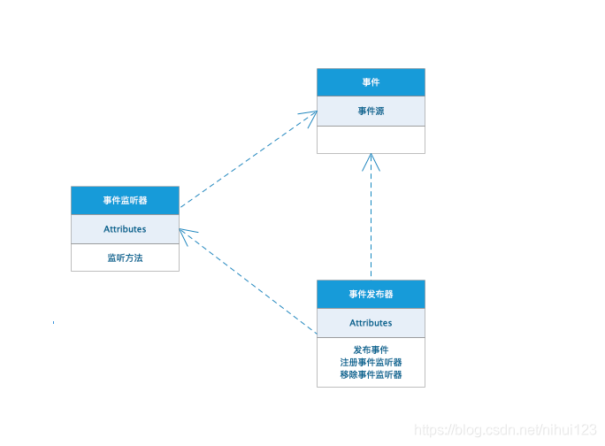
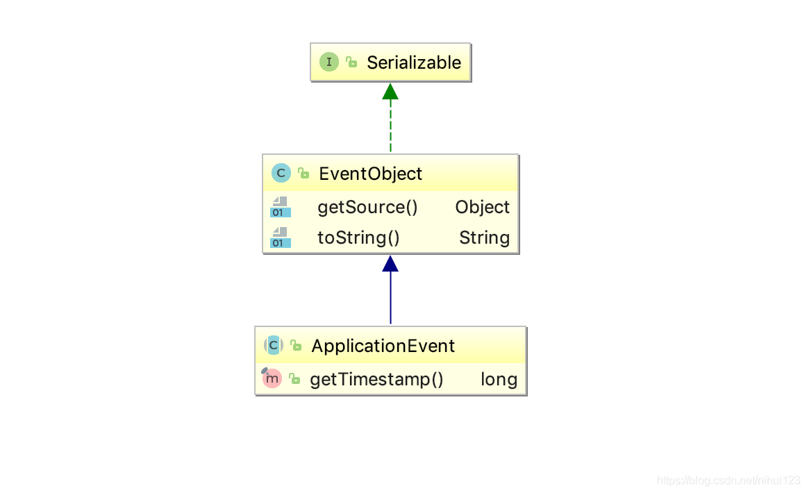

监听器


底层：观察者模式

###什么是事件监听机制
典型的观察者模式将有依赖关系的对象抽象为了观察者和主题两个不同的角色,多个观察者同时观察一个主题,两者只通过抽象接口保持松耦合状态,
这样双方可以相对独立的进行扩展和变化:比如可以很方便的增删观察者,修改观察者中的更新逻辑而不用修改主题中的代码。
但是这种解耦进行的并不彻底,这具体体现在以下几个方面:
- 1.抽象主题需要依赖抽象观察者,而这种依赖关系完全可以去除。
- 2.主题需要维护观察者列表,并对外提供动态增删观察者的接口,
- 3.主题状态改变时需要由自己去通知观察者进行更新。

我们可以把主题(Subject)替换成事件(event),把对特定主题进行观察的观察者(Observer)替换成对特定事件进行监听的监听器(EventListener),
而把原有主题中负责维护主题与观察者映射关系以及在自身状态改变时通知观察者的职责从中抽出,放入一个新的角色事件发布器(EventPublisher)中,
事件监听模式的轮廓就展现在了我们眼前,

如下图所示


常见事件监听机制的主要角色如下
- 事件及事件源:对应于观察者模式中的主题。事件源发生某事件是特定事件监听器被触发的原因。
- 事件监听器:对应于观察者模式中的观察者。监听器监听特定事件,并在内部定义了事件发生后的响应逻辑。
- 事件发布器:事件监听器的容器,对外提供发布事件和增删事件监听器的接口,维护事件和事件监听器之间的映射关系,并在事件发生时负责通知相关监听器。


# Spring容器对事件监听机制的支持
Spring容器,具体而言是ApplicationContext接口定义的容器提供了一套相对完善的事件发布和监听框架,其遵循了JDK中的事件监听标准,
并使用容器来管理相关组件,使得用户不用关心事件发布和监听的具体细节,降低了开发难度也简化了开发流程。

下面看看对于事件监听机制中的各主要角色,Spring框架中是如何定义的,以及相关的类体系结构


####实现：
1、定义事件源包装对象
需要继承`ApplicationEvent`,并且里面可以实现自己的一些必要参数等等，让在收到广播时进行获取
注：不支持lombok注解
```java
import com.examples.entity.dao.UserTest;
import org.springframework.context.ApplicationEvent;

public class UserRegisterEvent extends ApplicationEvent {
    // 监听的实际对象
    private UserTest user;

    public UserRegisterEvent(Object source, UserTest user) {
        super(source);
        this.user = user;
    }

    public UserTest getUser() {
        return user;
    }

    public void setUser(UserTest user) {
        this.user = user;
    }

    @Override
    public String toString() {
        return "UserRegisterEvent{" +
                "user=" + user +
                '}';
    }
}
```

2、注册监听器
使用注解：@EventListener
参数：
- `condition`可以使用SpEL表达式，就是当满足条件才执行
- `classes`当触发event对象是这个class才会被执行

```java
import com.examples.entity.dao.UserTest;
import org.springframework.context.event.EventListener;
import org.springframework.stereotype.Component;

@Component
public class WebObserved {
    //EventListener有两个参数（可以不写，直接在方法参数里面写上要监听的事件即可）：
    //    classes：表示哪一个事件类
    //    condition：当满足什么条件是会调用该方法
    @EventListener(condition = "#userRegisterEvent.user.userName == '小王'")
    public void onApplicationEvent(UserRegisterEvent userRegisterEvent) {
        UserTest user = userRegisterEvent.getUser();
        System.out.println(user.toString());
    }

    @EventListener(condition = "#userRegisterEvent.user.userName == '小李'")
    public void onApplicationEvent2(UserRegisterEvent userRegisterEvent) {
        UserTest user = userRegisterEvent.getUser();
        System.out.println(user.toString());
    }
}
```
当然可以不写参数，但是如果有实体类相同的两个监听器，那么就属于订阅模式。

配置两个监听器：
```java
@Component
public class EventComponent {
    @EventListener
    public void onApplicationEvent(Test1 test1) {
        System.out.println("顾客1:" + test1.getName() + "调用发送短信接口成功!");
    }
    @EventListener
    public void onApplicationEvent2(Test1 test1) {
        System.out.println("顾客2:" + test1.getName() + "调用发送短信接口成功!");
    }
}
```

运行结果： 张三调用了两个事件
```tex
顾客1:张三调用发送短信接口成功!
顾客2:张三调用发送短信接口成功!
```

以上是注解式，还可以使用实现类实现ApplicationListener接口：
```java
@FunctionalInterface
public interface ApplicationListener<E extends ApplicationEvent> extends EventListener {

	/**
	 * Handle an application event.
	 * @param event the event to respond to
	 */
	void onApplicationEvent(E event);

}
```


3、事件发布
注入org.springframework.context.ApplicationContext
使用publishEvent方法发布事件

```java
import org.springframework.context.ApplicationContext;

public class test{
    @Autowired
    private ApplicationContext applicationContext;

    @GetMapping("/userAge")
    public UserTest userAge() {
        UserTest userTest = new UserTest();
        userTest.setUserName("小王");
        userTest.setUserAge(12);
        applicationContext.publishEvent(new UserRegisterEvent(this, userTest));
        return userTest;
    }

    @GetMapping("/userAge2")
    public UserTest userAge2() {
        UserTest userTest = new UserTest();
        userTest.setUserName("小李");
        userTest.setUserAge(12);
        applicationContext.publishEvent(new UserRegisterEvent(this, userTest));
        return userTest;
    }
}
```
即：不同的事件源使用不同的监听器，产生不同的操作。


总结：
通过观察者模式的引入，实现了Java底层对于事件监听机制的封装，而Spring则是对于JDK的事件机制做了进一步的封装。