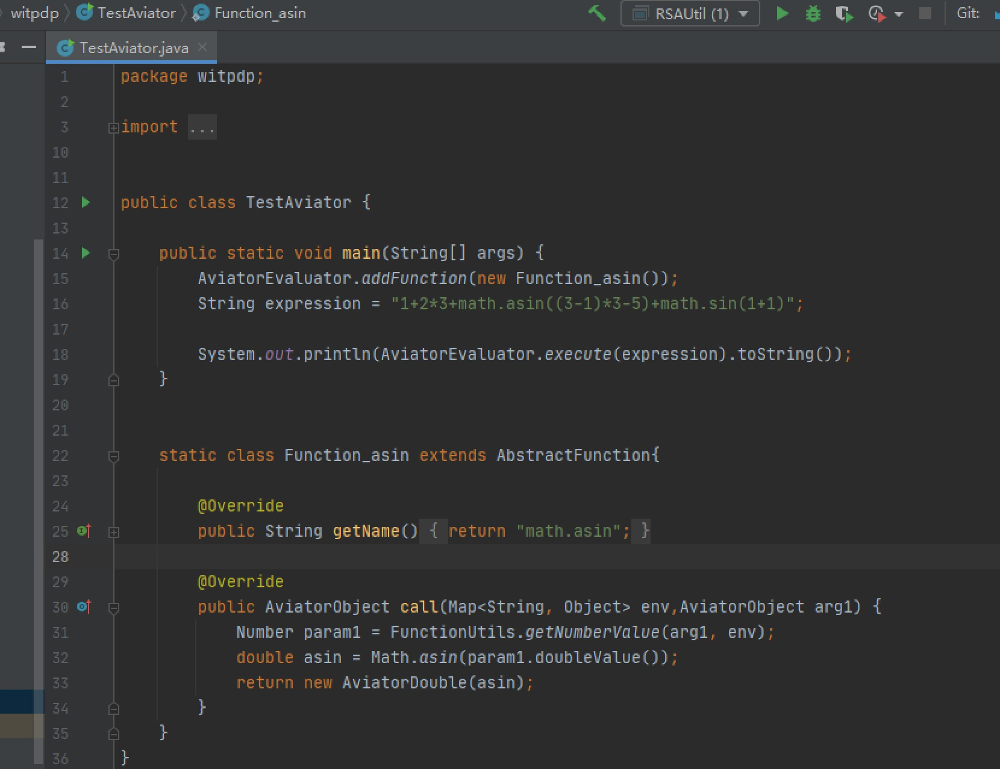

计算公式引擎Aviator


###1.简介
Aviator是一个高性能、轻量级的 java 语言实现的[表达式求值]引擎, 主要用于各种表达式的动态求值。
现在已经有很多开源可用的 java 表达式求值引擎,为什么还需要 Avaitor 呢?

Aviator的设计目标是轻量级和高性能,相比于Groovy、JRuby的笨重, Aviator非常小, 加上依赖包也才450K,不算依赖包的话只有70K; 
当然, Aviator的语法是受限的, 它不是一门完整的语言, 而只是语言的一小部分集合。
其次, Aviator的实现思路与其他轻量级的求值器很不相同, 其他求值器一般都是通过解释的方式运行, 而Aviator则是直接将表达式编译成Java 字节码, 交给JVM去执行。
简单来说, Aviator的定位是介于Groovy这样的重量级脚本语言和IKExpression这样的轻量级表达式引擎之间。

Aviator支持大部分运算操作符, 包括算术操作符、关系运算符、逻辑操作符、位运算符、正则匹配操作符(=~)、三元表达式, 并且支持操作符的优先级和括号强制优先级, 支持自定义函数.


###2.Aviator
[参考](https://it007.blog.csdn.net/article/details/107043615?spm=1001.2101.3001.6661.1&utm_medium=distribute.pc_relevant_t0.none-task-blog-2%7Edefault%7ECTRLIST%7Edefault-1-107043615-blog-114975157.pc_relevant_multi_platform_whitelistv1&depth_1-utm_source=distribute.pc_relevant_t0.none-task-blog-2%7Edefault%7ECTRLIST%7Edefault-1-107043615-blog-114975157.pc_relevant_multi_platform_whitelistv1&utm_relevant_index=1)
[参考](https://blog.csdn.net/qq_42170691/article/details/113849827?utm_medium=distribute.pc_relevant.none-task-blog-2~default~baidujs_title~default-1-113849827-blog-106943108.pc_relevant_multi_platform_whitelistv2&spm=1001.2101.3001.4242.2&utm_relevant_index=4)

####2.1.添加依赖
Aviator依赖了commons-beanutils, 使用Aviator可以添加下面的maven依赖:
```xml
<dependency>
    <groupId>com.googlecode.aviator</groupId>
    <artifactId>aviator</artifactId>
    <version>5.0.1</version>
</dependency>
```

####2.2.常用的方法
```java
public class Test  {
    @Test
	public void playAviator(){
		String string = AviatorEvaluator.execute("1.2+3+4").toString();// 8.2
		
		Map<String, Object> paramMap=new HashMap<>();
		paramMap.put("a", 5);
		paramMap.put("b", 4);
		string = AviatorEvaluator.execute("a+b/3.0", paramMap).toString();// 6.333333333333333
		
		//推荐使用的方式
		string = AviatorEvaluator.compile("a/(b-1.0)").execute(paramMap).toString();// 1.6666666666666667
		System.out.println(string);
	}
}
```

####2.3.使用手册
1.执行表达式
Aviator的使用都是集中通过com.googlecode.aviator.AviatorEvaluator这个入口类来处理, 最简单的例子, 执行一个计算1+2+3的表达式:
```java
import com.googlecode.aviator.AviatorEvaluator;
public class TestAviator {
    public static void main(String[] args) {
        Long result = (Long) AviatorEvaluator.execute("1+2+3");
        System.out.println(result);
    }
}
```
结果是Long,而不是Integer。
这是因为Aviator的数值类型[仅支持Long和Double], 任何整数都将转换成Long, 任何浮点数都将转换为Double, 包括用户传入的变量数值。


2.调用函数
Aviator 支持函数调用, 函数调用的风格类似lua, 下面的例子获取字符串的长度:
```text
AviatorEvaluator.execute("string.length('hello')");  // 5
```
string.length(‘hello’)是一个函数调用, string.length是一个函数, 'hello’是调用的参数。

再用string.substring来截取字符串:
```text
AviatorEvaluator.execute("string.contains(\"test\", string.substring('hello', 1, 2))");  // true
```
通过string.substring(‘hello’, 1, 2)获取字符串’e’, 然后通过函数string.contains判断e是否在’test’中。
可以看到, 函数可以嵌套调用。


3.自定义函数
Aviator 除了内置的函数之外,还允许用户自定义函数,只要实现com.googlecode.aviator.runtime.type.AviatorFunction接口, 
并注册到AviatorEvaluator即可使用. AviatorFunction接口十分庞大, 通常来说你并不需要实现所有的方法, 只要根据你的方法的参数个数, 
继承AbstractFunction类并override相应方法即可。

可以看一个例子,我们实现一个add函数来做数值的相加:
```java
public class TestAviator {
    public static void main(String[] args) {
        //注册函数
        AviatorEvaluator.addFunction(new AddFunction());
        System.out.println(AviatorEvaluator.execute("add(1, 2)"));           // 3.0
        System.out.println(AviatorEvaluator.execute("add(add(1, 2), 100)")); // 103.0
    }
}
class AddFunction extends AbstractFunction {
    @Override
    public AviatorObject call(Map<String, Object> env, AviatorObject arg1, AviatorObject arg2) {
        Number left = FunctionUtils.getNumberValue(arg1, env);
        Number right = FunctionUtils.getNumberValue(arg2, env);
        return new AviatorDouble(left.doubleValue() + right.doubleValue());
    }
    public String getName() {
        return "add";
    }
}
```
注册函数通过AviatorEvaluator.addFunction方法, 移除可以通过removeFunction。




4.编译表达式
上面提到的例子都是直接执行表达式, 事实上 Aviator 背后都帮你做了编译并执行的工作。 你可以自己先编译表达式, 返回一个编译的结果, 
然后传入不同的env来复用编译结果, 提高性能, 这是更推荐的使用方式:
```java
public class TestAviator {
    public static void main(String[] args) {
        String expression = "a-(b-c)>100";
        // 编译表达式
        Expression compiledExp = AviatorEvaluator.compile(expression);
        Map<String, Object> env = new HashMap<String, Object>();
        env.put("a", 100.3);
        env.put("b", 45);
        env.put("c", -199.100);
        // 执行表达式
        Boolean result = (Boolean) compiledExp.execute(env);
        System.out.println(result);  // false
    }
}
```
通过compile方法可以将表达式编译成Expression的中间对象, 当要执行表达式的时候传入env并调用Expression的execute方法即可。 
表达式中使用了括号来强制优先级, 这个例子还使用了>用于比较数值大小, 比较运算符!=、==、>、>=、<、<=不仅可以用于数值, 
也可以用于String、Pattern、Boolean等等, 甚至是任何用户传入的两个都实现了java.lang.Comparable接口的对象之间。

编译后的结果你可以自己缓存, 也可以交给 Aviator 帮你缓存, AviatorEvaluator内部有一个全局的缓存池, 如果你决定缓存编译结果, 可以通过:
```text
public static Expression compile(String expression, boolean cached)
```
将cached设置为true即可, 那么下次编译同一个表达式的时候将直接返回上一次编译的结果。
使缓存失效通过:
```text
public static void invalidateCache(String expression)
```


5.访问数组和集合
可以通过中括号去访问数组和java.util.List对象, 可以通过map.key访问java.util.Map中key对应的value, 一个例子:
```java
public class test{
public static void main(String[] args) {
    final List<String> list = new ArrayList<String>();
    list.add("hello");
    list.add(" world");
    final int[] array = new int[3];
    array[0] = 0;
    array[1] = 1;
    array[2] = 3;
    final Map<String, Date> map = new HashMap<String, Date>();
    map.put("date", new Date());
    Map<String, Object> env = new HashMap<String, Object>();
    env.put("list", list);
    env.put("array", array);
    env.put("mmap", map);
    System.out.println(AviatorEvaluator.execute("list[0]+list[1]", env));   // hello world
    System.out.println(AviatorEvaluator.execute("'array[0]+array[1]+array[2]=' + (array[0]+array[1]+array[2])", env));  // array[0]+array[1]+array[2]=4
    System.out.println(AviatorEvaluator.execute("'today is ' + mmap.date ", env));  // today is Wed Feb 24 17:31:45 CST 2016
}
}
```


6.三元操作符
Aviator 不提供if else语句, 但是提供了三元操作符?:用于条件判断,使用上与 java 没有什么不同:
```text
AviatorEvaluator.exec("a>0? 'yes':'no'", 1);  // yes
```
Aviator 的三元表达式对于两个分支的结果类型并不要求一致,可以是任何类型,这一点与 java 不同.


7.大数计算和精度
从 2.3.0 版本开始,aviator 开始支持大数字计算和特定精度的计算, 本质上就是支持java.math.BigInteger和java.math.BigDecimal两种类型, 
这两种类型在 aviator 中简称 为big int和decimal类型。 类似99999999999999999999999999999999这样的数字
在 Java 语言里是没办法编译通过 的, 因为它超过了Long类型的范围, 只能用BigInteger来封装。但是 aviator 通过包装,
可以直接支持这种大整数的计算,例如:
```java
public class test{
public static void main(String[] args) {
    System.out.println(AviatorEvaluator.exec("99999999999999999999999999999999 + 99999999999999999999999999999999"));
}
}
```
结果为类型big int的: 199999999999999999999999999999998


8.decimal 的计算精度
Java 的java.math.BigDecimal通过java.math.MathContext支持特定精度的计算,任何涉及到金额的计算都应该使用decimal类型。
默认 Aviator 的计算精度为MathContext.DECIMAL128,你可以自定义精度, 通过:
```text
AviatorEvaluator.setMathContext(MathContext.DECIMAL64);
```
即可设置,更多关于decimal的精度问题请看java.math.BigDecimal的 javadoc 文档。


####2.4.数据类型
Number类型: 数字类型,支持四种类型,分别是:
long, double, java.math.BigInteger(简称 big int)和java.math.BigDecimal(简 称 decimal),规则如下:
 >任何以大写字母 N 结尾的整数都被认为是 big int
 >任何以大写字母 M 结尾的数字都被认为是 decimal
 >其他的任何整数都将被转换为 Long
 >其他任何浮点数都将被转换为 Double

超过 long 范围的整数字面量都将自动转换为 big int 类型
其中 big int 和 decimal 是 2.3.0 版本开始引入的。数字还支持十六进制(以0x或者0X开头的数字), 以及科学计数法,如1e-3等。 不支持其他进制。

String类型: 字符串类型, 单引号或者双引号括起来的文本串, 如’hello world’, 变量如果传入的是String或者Character也将转为String类型
Bool类型: 常量true和false,表示真值和假值,与 java 的Boolean.TRUE和Boolean.False对应
Pattern类型: 正则表达式, 以//括起来的字符串,如/\d+/,内部 实现为java.util.Pattern
变量类型: 与 Java 的变量命名规则相同,变量的值由用户传入
nil类型: 常量nil,类似 java 中的null,但是nil比较特殊,nil不仅可以参与==、!=的比较, 也可以参与>、>=、<、<=的比较, 
        Aviator 规定任何类型都大于nil除了nil本身,nil==nil返回true。 用户传入的变量值如果为null,那么也将作为nil处理,nil打印为null


####2.5.支持的函数
sysdate()	            返回当前日期对象java.util.Date
rand()	                返回一个介于0-1的随机数，double类型
print([out],obj)	    打印对象，如果指定out，向out打印，否则输出到控制台
println([out],obj)	    与print类似，但是在输出后换行
now()	                返回System.currentTimeMillis
long(v)	                将值的类型转为long
double(v)	            将值的类型转为double
str(v)	                将值的类型转为string
date_to_string(date,format)	        将Date对象转化化特定格式的字符串,2.1.1新增
string_to_date(source,format)	    将特定格式的字符串转化为Date对象,2.1.1新增
string.contains(s1,s2)	            判断s1是否包含s2，返回Boolean
string.length(s)	                求字符串长度,返回Long
string.startsWith(s1,s2)	        s1是否以s2开始，返回Boolean
string.endsWith(s1,s2)	            s1是否以s2结尾,返回Boolean
string.substring(s,begin[,end])	    截取字符串s，从begin到end，end如果忽略的话，将从begin到结尾，与java.util.String.substring一样。
string.indexOf(s1,s2)	            java中的s1.indexOf(s2)，求s2在s1中的起始索引位置，如果不存在为-1
string.split(target,regex,[limit])	Java里的String.split方法一致,2.1.1新增函数
string.join(seq,seperator)	        将集合seq里的元素以seperator为间隔连接起来形成字符串,2.1.1新增函数
string.replace_first(s,regex,replacement)	Java里的String.replaceFirst 方法，2.1.1新增
string.replace_all(s,regex,replacement)	    Java里的String.replaceAll方法 ，2.1.1新增
math.abs(d)	        求d的绝对值
math.sqrt(d)	    求d的平方根
math.pow(d1,d2)	    求d1的d2次方
math.log(d)	        求d的自然对数
math.log10(d)	    求d以10为底的对数
math.sin(d)	        正弦函数
math.cos(d)	        余弦函数
math.tan(d)	        正切函数
map(seq,fun)	    将函数fun作用到集合seq每个元素上，返回新元素组成的集合
filter(seq,predicate)	    将谓词predicate作用在集合的每个元素上，返回谓词为true的元素组成的集合
count(seq)	                返回集合大小
include(seq,element)	    判断element是否在集合seq中，返回boolean值
sort(seq)	                排序集合，仅对数组和List有效，返回排序后的新集合
reduce(seq,fun,init)	    fun接收两个参数，第一个是集合元素，第二个是累积的函数，本函数用于将fun作用在集合每个元素和初始值上面，返回最终的init值
seq.eq(value)	            返回一个谓词，用来判断传入的参数是否跟value相等,用于filter函数，如filter(seq,seq.eq(3)) 过滤返回等于3的元素组成的集合
seq.neq(value)	            与seq.eq类似，返回判断不等于的谓词
seq.gt(value)	            返回判断大于value的谓词 seq.ge(value)	返回判断大于等于value的谓词
seq.lt(value)	            返回判断小于value的谓词
seq.le(value)	            返回判断小于等于value的谓词
seq.nil()	                返回判断是否为nil的谓词
seq.exists()	            返回判断不为nil的谓词


####2.5.支持的操作符
算术运算符
Aviator 支持常见的算术运算符,包括: [+ - * / %] 五个二元运算符, 和一元运算符 [-(负)]。
其中- * / %和一元的-仅能作用于Number类型。
+不仅能用于Number类型,还可以用于String的相加,或者字符串与其他对象的相加。
Aviator 规定,任何类型与String相加,结果为String。

逻辑运算符
Avaitor 的支持的逻辑运算符包括: [!, &&, ||]
逻辑运算符的操作数只能为Boolean。
&&和||都执行短路规则。

关系运算符
Aviator 支持的关系运算符包括: [<, <=, >, >=, ==, != ]
关系运算符可以作用于Number之间、String之间、Pattern之间、Boolean之间、变量之间以及其他类型与nil之间的关系比较, 
不同类型除了nil之外不能相互比较。

位运算符
Aviator 支持所有的 Java 位运算符,包括:  [&, |, ^, ~, >>, <<, >>>]

匹配运算符
匹配运算符  [=~] 用于String和Pattern的匹配,它的左操作数必须为String,右操作数必须为Pattern。 
匹配成功后,Pattern的分组将存于变量$num,num为分组索引。

三元运算符
Aviator 没有提供if else语句,但是提供了三元运算符 [?:] ,形式为bool ? exp1: exp2。 
其中bool必须为Boolean类型的表达式, 而exp1和exp2可以为任何合法的 Aviator 表达式,并且不要求exp1和exp2返回的结果类型一致。