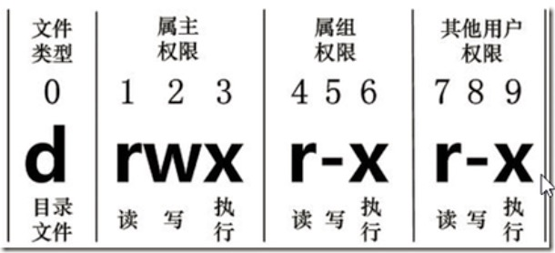
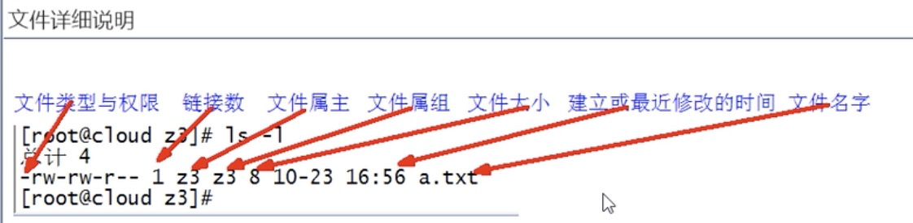

Linux文件权限

linux系统是一种典型的多用户系统，不同的用户处于不同的地位，拥有不同的权限。
为了保护系统的安全性，系统对不同的用户访问同一文件（包括目录）的权限做出了不同的规定。

在Linux中我们可以使用ll或者ls -l命令来显示一个文件的属性以及文件所属的用户和组。

d rwx r-x r-x
从左到右的10个字符表示：0-9
以三个为一组，且均为【rwx】的三个参数组合。

其中，r代表可读（read）、w代表可写（write）、x代表可执行（execute）。
[注：这三个的权限位置不会改变, 如果没有权限，就会出现减号表示-]

第0位确定文件类型
第1-3位确定属主（该文件的所有者）拥有该文件的权限-user。
第4-6位确定属组（所有者的同组用户）拥有该文件的权限-group。
第7-9位确定其他用户拥有该文件的权限-other。

作用到文件：
r代表可读（read）：可以读取，查看。
w代表可写（write）：可以修改，但是不代表可以删除该文件，删除的前提条件是对该文件所在的目录有写权限，才能删除该文件。
x代表可执行（execute）：可以被系统执行。

作用到目录：
r代表可读（read）：可以读取，ls查看目录内容。
w代表可写（write）：可以修改，目录内创建+删除+重命名目录。
x代表可执行（execute）：可以进入该目录。

0位表示文件的类型
-：文件
d：目录
c：字符流，装置文件里面的串行端口设备，例如键盘、鼠标（一次性读取装置）
s：socket
p：管道
l：链接文档（link file）
b：设备文件，装置文件里面的可供存储的接口设备（可随机存取装置）

2、修改文件目录权限
chmod
改变文件或目录权限

文件：r：查看；w：修改；x：执行文件
目录：r：列出目录内容；w：在目录中创建和删除；x：进入目录

删除一个文件的前提条件：该文件所在的目录有写权限，才能删除该文件。

操作：
- rw- r— r—

二进制：有就是1 无就是0，所以1就是有字符，0就是-。
rw- 就是 有有无 = 110，对应的十进制就是：6
r—  就是 有无无 = 100，对应的十进制就是：4

所以：- rw- r— r—  就是 - 644

所以：修改文件权限：只要根据二进制调整数值

chmod  744  1.txt
- rwx r— r—

chmod  754  1.txt
- rwx r-x r—

3、修改文件或目录的所属组
chgrp  最终组  被修改的文件

需要root权限

原文件：所属用户：li4 ，所属组：test
- rwx r-x r-x  1  li4  test  0  12-13  15:27  a.txt

调整组：
chgrp  dev  a.txt
- rwx r-x r-x  1  li4  dev  0  12-13  15:27  a.txt

4、改变文件或者目录的所有者
chown  最终落地用户  将被修改的文件
chown  最终用户:落地用户组  将被修改的文件		//同时修改所属用户和所属组
 
原文件：所属用户：li4 ，所属组：test
- rwx r-x r-x  1  li4  test  0  12-13  15:27  a.txt

修改：
chown  li5  a.txt
- rwx r-x r-x  1  li5  test  0  12-13  15:27  a.txt

chown  li5:dev  a.txt
- rwx r-x r-x  1  li5  dev  0  12-13  15:27  a.txt