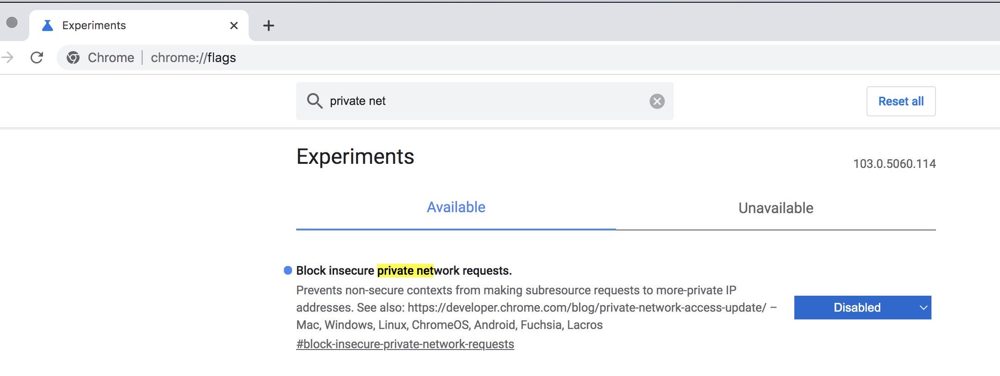

公网访问内网

问题：
Access to XMLHttpRequest at 'http://192.168.199.162:30000/api/oauth/CurrentUser?n=1657600350' 
from origin 'http://36.152.29.211:21000' has been blocked by CORS policy: 
The request client is not a secure context and the resource is in more-private address space `private`.

问题描述：
公网访问内网跨域限制

解决：
浏览器输入：chrome://flags/#block-insecure-private-network-requests
在：Block insecure private network requests
选择：Disabled
点击：Relaunch

