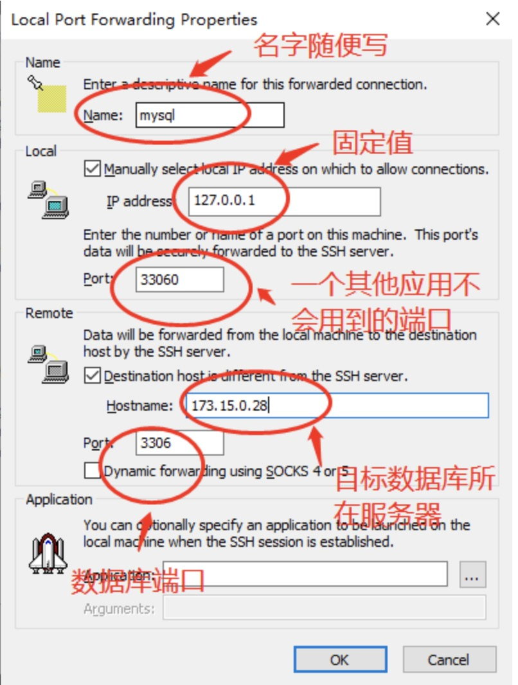
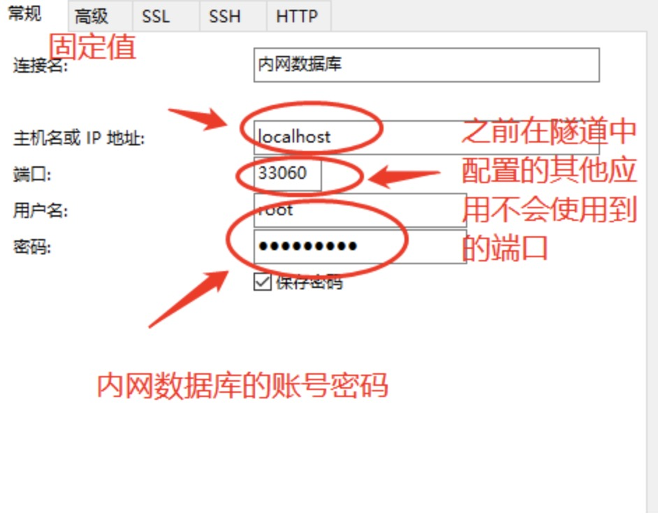
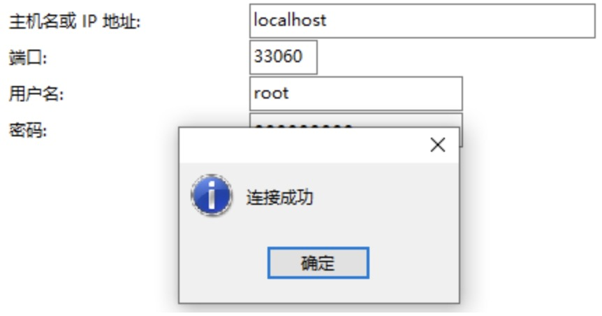

跳板机

需求
在开发中，有时候我们会碰到这么一个情况。
数据库的服务器在内网，如果想连接，必须得先ssh登陆到跳板机，然后在跳板机ssh到达数据库所在服务器，进而操作数据库。
遗憾的是，如果跳板机和数据库所在服务器如果都没有像Navicat这种数据库客户端连接工具，那么操作数据库会很吃力，只能通过敲命令行的方式进行操作。
那么接下来，教大家一个方法，可以通过本机的数据库客户端工具直接连接到内网服务器的数据库。

实现
第一步：在SecureCRT 或者Xshell等工具上配置跳板机的地址，保证能连上跳板机服务器

第二步：给跳板机配置隧道，我这里使用的是SecureCRT(Xshell同样可以)，双击跳板机服务器-->Properties-->Port Forwarding-->Add,
       就会看到如下界面，并根据自己的服务器的情况填写相应参数。

第三步：给Navicat配置连接参数，使用时要保证跳板机处于连接状态。

第四步：点击连接测试，出现下图，表示连接成功！

从此可以通过Navicat这种数据库客户端连接工具操作数据库了