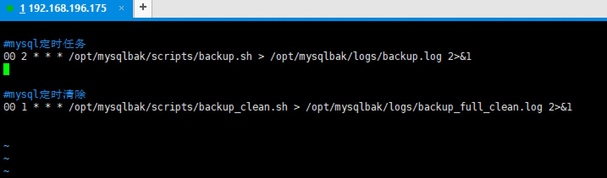

定时备份Mysql


[参考](https://blog.csdn.net/ren365880/article/details/104013976)
[参考](https://blog.csdn.net/persevere_wxh/article/details/120510196)

### 新建目录
```shell script
mkdir -p /data/mysqlbak/data
mkdir -p /data/mysqlbak/scripts
mkdir -p /data/mysqlbak/logs
```

### 创建备份脚本
```shell script
cd /data/mysqlbak/scripts
vi backup.sh
```

### 编辑脚本
```shell script
#!/bin/bash

#备份目录
BACKUP_ROOT=/data/mysqlbak
BACKUP_FILEDIR=$BACKUP_ROOT/data

#当前日期
DATE=$(date +%Y%m%d)

######备份######

#查询所有数据库
#-uroot -p123456账号密码 并且不备份正则匹配到的数据库，如果要备份的数据库包含在内，用正则开始符号^或者结束符号$修饰一下
DATABASES=$(mysql -uroot -p123456 -e "show databases" | grep -Ev "Database|sys|information_schema|performance_schema|mysql")
#循环数据库进行备份
for db in $DATABASES
do
echo
echo ----------$BACKUP_FILEDIR/${db}_$DATE.sql.gz BEGIN----------
mysqldump -uroot -p123456 --default-character-set=utf8mb4 -q --lock-all-tables --flush-logs -E -R --triggers -B ${db} | gzip > $BACKUP_FILEDIR/${db}_$DATE.sql.gz
echo ----------$BACKUP_FILEDIR/${db}_$DATE.sql.gz COMPLETE----------
echo
done

echo "done"
```

### 设置权限
```shell script
chmod 777 backup.sh
```

### 加入到定时
```shell script
crontab -e
00 2 * * * /data/mysqlbak/scripts/backup.sh > data/mysqlbak/logs/backup.log 2>&1
```

### 设置删除脚本
```shell script
vi backup_clean.sh
```

### 编辑删除脚本
注意：-mtime N 是找到所有N+1天前N天后被更改的档案文件，
-mtime -N 是N天内被改的档案，
-mtime +N 是N天后被改的档案。
```shell script
#!/bin/bash
echo ----------CLEAN BEGIN----------
find /data/mysqlbak/data -mtime +7 -name "*.gz" -exec rm -rf {} \;
echo ----------CLEAN COMPLETE----------
```

### 设置权限
```shell script
chmod 777 backup_clean.sh
```

### 加入到定时任务
```shell script
crontab -e
00 1 * * * /data/mysqlbak/scripts/backup_clean.sh > /data/mysqlbak/logs/backup_full_clean.log 2>&1
```

### 定时文件的位置
/var/spool/cron/
这个目录下存放的是每个用户包括root的crontab任务，每个任务以创建者的名字命名：/var/spool/cron/root


/etc/crontab 这个文件负责安排由系统管理员制定的维护系统以及其他任务的crontab
/etc/cron.d/ 这个目录用来存放任何要执行的crontab文件或脚本

### 查看定时任务
定时不需要重启，配置完即可。

```shell script
crontab -l
```

### 手动执行看看效果
```shell script
 ./backup.sh
```


### 定时配置
[配置](../Kettle/config/linux定时配置.txt)

### 报错
mysqldump命令找不到
原因：这是由于系统默认会查找/usr/bin下的命令，如果这个命令不在这个目录下，当然会找不到命令，
     我们需要做的就是映射一个链接到/usr/bin目录下，相当于建立一个链接文件
解决：whereis mysql
软连接：ln -fs /opt/mysql/bin/mysqldump /usr/bin