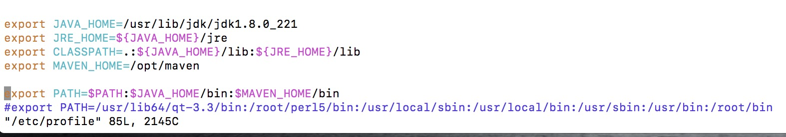

Linux path变量重复

问题：source /etc/profile 导致path中变量重复了

解决：vim /etc/profile
添加：export PATH=/usr/lib64/qt-3.3/bin:/root/perl5/bin:/usr/local/sbin:/usr/local/bin:/usr/sbin:/usr/bin:/root/bin
保存：:wq
刷新：source /etc/profile
查看：echo $PATH
发现：path 路径变为：/usr/lib64/qt-3.3/bin:/root/perl5/bin:/usr/local/sbin:/usr/local/bin:/usr/sbin:/usr/bin:/root/bin

再次：vim /etc/profile
注释：export PATH
还原：export PATH=$PATH:$JAVA_HOME/bin:$MAVEN_HOME/bin 用原来的path拼接新的
刷新：source /etc/profile
查看：echo $PATH
发现：path 路径变为：/usr/lib64/qt-3.3/bin:/root/perl5/bin:/usr/local/sbin:/usr/local/bin:/usr/sbin:/usr/bin:/root/bin:/usr/lib/jdk/jdk1.8.0_221/bin:/opt/maven/bin

[注意：刷新：source /etc/profile 不能多次使用，会造成path重复]
