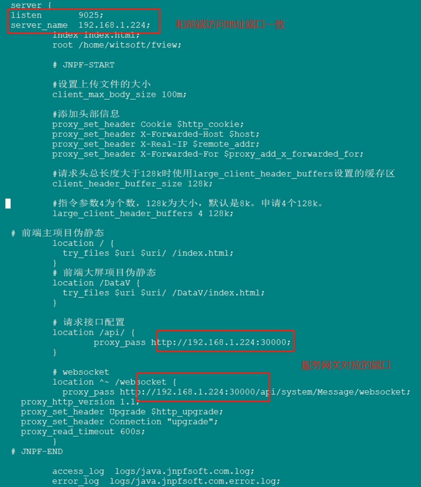

安装Nginx

配置地址：
在线：
/etc/nginx/nginx.conf
离线：
/usr/local/nginx

###1.离线安装
```shell script
#1、安装所需环境
#安装gcc
yum install gcc-c++
#安装PCRE pcre-devel
yum install -y pcre pcre-devel
#安装zlib
yum install -y zlib zlib-devel
#安装Open SSL
yum install -y openssl openssl-devel


#2、创建nginx目录并下载安装包
cd /opt
mkdir nginx

#离线下载tar包
wget http://nginx.org/download/nginx-1.13.7.tar.gz
cd /opt/nginx

#解压tar
tar -xvf nginx-1.13.7.tar.gz
cd /opt/nginx/nginx-1.13.7

#执行命令 考虑到后续安装ssl证书 添加两个模块
./configure --with-http_stub_status_module --with-http_ssl_module
#执行make命令
make
#执行make install命令
make install
```
```shell script
cd /usr/local/nginx

#配置nginx.conf
cd conf
vim nginx.conf

#启动
cd /usr/local/nginx/sbin
./nginx
#停止
./nginx -s stop
```

###2.在线安装
```shell script
yum install epel-release

#安装
yum -y install nginx

#修改nginx的端口,默认80
vi /etc/nginx/nginx.conf

    server {
        listen       11000;
        listen       [::]:11000;
        server_name  _;
        root         /opt/front/jnpf-server/html;

        #前端地址/api的都被代理赚到指定地址
        location /api {
          proxy_pass http:192.168.199.162:30000;
        }         

        error_page 404 /404.html;
        location = /404.html {
        }

        error_page 500 502 503 504 /50x.html;
        location = /50x.html {
        }
    }

#listen: 监听的端口
#root:   主目录[远程发布的目录]

#关闭selinux，将SELINUX=disabled
#先临时关闭
setenforce 0 
#编辑文件,永久关闭 SELINUX=disabled
vi /etc/selinux/config 

#启动Nginx
#设置开机启动
systemctl enable nginx 
#启动
systemctl start nginx 
#停止
systemctl stop nginx 
#重启
systemctl restart nginx 
#访问
http://192.168.199.162:11000/
```
[Nginx配置](../image/Nginx配置.jpg)
配置多个server监听：
1.创建多个*.conf文件进行配置
2.将所有的*.conf文件加载进主配置文件: include /xxx/*.conf


####统一端口 不同路径
```shell script
    server {
        listen 81;//监听的端口
        server_name localhost;//监听的域名
        location /message {//当当问这个路径时实际上会去访问下面这个地址
			proxy_pass http://localhost:xxx;//你的服务地址端口
        }
		
	   location / {//多个路径可以实现访问不同的页面
            root   D:/ddm-web;
            index  index.html;
        }
    }


#vue路由 因为前端的路径地址不是一个真实的地址，所以找不到，nginx会报404，所以要rewrite到index页面重新定位路由
[参考](https://blog.csdn.net/qq_14952889/article/details/106852221?spm=1001.2101.3001.6650.5&utm_medium=distribute.pc_relevant.none-task-blog-2%7Edefault%7EESLANDING%7Edefault-5-106852221-blog-121870602.pc_relevant_eslanding_v1&depth_1-utm_source=distribute.pc_relevant.none-task-blog-2%7Edefault%7EESLANDING%7Edefault-5-106852221-blog-121870602.pc_relevant_eslanding_v1&utm_relevant_index=10)

server {
        listen       11000;
        server_name  _;

        location / {
            root   /opt/front/jnpf-server/html;
            index  index.html index.htm;
            try_files $uri $uri/ @rewrites;
        }

        location @rewrites {
            rewrite ^.*$ /index.html last;
        }

        error_page 404 /404.html;
        location = /404.html {
        }

        error_page 500 502 503 504 /50x.html;
        location = /50x.html {
        }
}
```
[踩坑：刷新token丢失]
解决：



常用正则表达式
语法规则： location [=|~|~*|^~] /uri/ { … }

= 开头表示：精确匹配。
^~ 开头表示：区分大小写以什么开头。
~ 开头表示：区分大小写的正则匹配。
~* 开头表示：不区分大小写的正则匹配。
!~ 和!~*分别表示：区分大小写 不匹配 及不区分大小写 不匹配的正则匹配。
/ 表示：通用匹配，任何请求都会匹配到。
多个location配置的情况下匹配顺序为（未验证）：
首先匹配 =，其次匹配^~, 其次是按文件中顺序的正则匹配，最后是交给 / 通用匹配。当有匹配成功时候，停止匹配，按当前匹配规则处理请求。


实测
```shell script
server {
    listen       80;
    listen  [::]:80;
    server_name  location.test.com;

    access_log  /var/log/nginx/location.host.access.log  main;

    #*********************注意多个location通常按精确的放前面，模糊大范围的放后面，nginx先找= ******************************
    location = /login.html {#精确匹配 /login
	root /usr/share/nginx/html/test-equal;#请求/login.html相当于寻找资源/usr/share/nginx/html/test-equal/login.html
    }
    location ^~ /prefix/ {#区分大小写且以/prefix/开头
	root /usr/share/nginx/html/test-prefix;#root代表根目录，请求/prefix/prefix.html相当于寻找资源/usr/share/nginx/html/test-prefix/prefix/prefix.html 
    }
    location ~ \.(png|jpg)$ {#不区分大小写且以.png或.jpg结尾
	root /usr/share/nginx/html/test-suffix;#请求/suffix/a.png相当于寻找资源/usr/share/nginx/html/test-suffix/suffix/a.png
    }
    location ^~ /jd/ {# 区分大小写且以/jd/开头
	proxy_pass https://www.jd.com/;#proxy_pass  此处的url以/结尾，则nginx会取掉location部分再转发，例如，请求/jd/电器?name=1 则会转发到https://www.jd.com/电器?name=1
    }
    location ^~ /s {# /会匹配到所有的
	proxy_pass https://www.baidu.com;#proxy_pass  此处的url没有以/结尾，则匹配到的地址全部拼接到代理后的地址，例如，请求/s?name=1 则会转发到https://www.baidu.com/s?name=1
    }
    location  / {# 会返回index.html
	root /usr/share/nginx/html;
	index index.html;	
    }  
}
```


###示例：
```shell script
    server {
        listen 11001;
        server_name _;
		
	   location / {
            root   /opt/front/performance;
            index  index.html index.htm;
        }
    }
```

文件包含：
index.html
start.html
performance.html

访问：
localhost:11001/
默认加载index.html

localhost:11001/start.html
加载start.html

localhost:11001/performance.html
加载performance.html


### nginx开启gzip
解决：对一些图片，css或js压缩，加快响应速度
[Ng开启压缩](https://www.cnblogs.com/lcword/p/15286606.html)

开启gzip配置是在 [http块内]或者在[单个server块里]添加的:
```shell script
http {
    #开启gzip
    gzip on;
    #设置缓存的单位，压缩的时候要分配的缓冲区，缓冲区以8K为单位，往缓冲区写入内容的时候超过4K的时候，那么就会按照16倍的大小创建新的缓冲区，
    #也就是建立一个128K的存储，这样把压缩的内容倒进去
    gzip_buffers 16 8K;
    #压缩级别1-9  9最小的压缩,传输最快 但是消耗cpu
    #比如level为1的话，压缩的比例比较低，但是效率比较高，官方推荐6
    gzip_comp_level 6;
    #启用gzip压缩的最小文件；小于设置值的文件将不会被压缩
    gzip_min_length 100;
    #进行压缩的文件类型, 比如文本的，js、css等文本文件压缩，默认压缩text/html 不需要指定，否则报错
    gzip_types text/plain application/javascript application/x-javascript text/css application/xml text/javascript application/x-httpd-php image/jpeg image/gif image/png image/x-icon;
    #配置禁用gzip条件,支持正则。此处表示ie6及以下不启用gzip（因为ie低版本不支持）
    gzip_disable "MSIE [1-6]\."; 
    #是否在http header中添加Vary: Accept-Encoding,建议开启
    gzip_vary on;
}
```

重启nginx
查看响应头会看到gzip这样的压缩


[完整版示例](../nginx/pdp-cloud.conf)


### nginx 缓存|不缓存
```shell script
server {
        listen       18080;
        #listen        80;
        server_name  localhost;
        error_page   500 502 503 504  /50x.html;
        
		location / {
	           root /Users/huangqingpeng/Desktop/workspaces/qiankun/vue-qiankun-demo/dist;
         	   try_files $uri $uri/ /index.html;
          	   index  index.html index.htm;
          	   
                #配置页面不缓存html和htm结尾的文件
                if ($request_filename ~* .*\.(?:htm|html)$)
                 {
                    add_header Cache-Control "private, no-store, no-cache, must-revalidate, proxy-revalidate";
                  }
                 if ($request_filename ~* .*\.(?:js|css)$)
                 {
                   expires      7d;
                 }
                if ($request_filename ~* .*\.(?:jpg|jpeg|gif|png|ico|cur|gz|svg|svgz|mp4|ogg|ogv|webm)$)
                {
                  expires      7d;
                }
        }
｝
```


### nginx限流
Nginx 提供两种限流方式，一是控制速率，二是控制并发连接数。


#### 1.控制速率，正常限流
ngx_http_limit_req_module 模块提供限制请求处理速率能力，使用了漏桶算法(leaky bucket)。

下面例子使用 nginx limit_req_zone 和 limit_req 两个指令，限制单个IP的请求处理速率:
在 nginx.conf [http] 中添加限流配置：
格式：`limit_req_zone key zone rate;`

参数：
key ：定义限流对象，binary_remote_addr 是一种key，表示: 基于remote_addr(客户端IP) 来做限流，binary_ 的目的是: 压缩内存占用量。
zone：定义共享内存区来存储访问信息， myRateLimit:10m 表示一个大小为10M，名字为myRateLimit的内存区域。
      1M能存储16000 IP地址的访问信息，10M可以存储16W IP地址访问信息。
rate 用于设置最大访问速率，rate=10r/s 表示[每秒最多处理10个请求]

Nginx 实际上以[毫秒]为粒度来跟踪请求信息，因此 10r/s 实际上是限制：每100毫秒处理一个请求。
[这意味着，自上一个请求处理完后，若后续100毫秒内又有请求到达，将拒绝处理该请求]

示例：
```shell script
http {
    limit_req_zone $binary_remote_addr zone=myRateLimit:10m rate=10r/s;
}
```

配置 [server]，使用 limit_req 指令应用限流：
```shell script
server {
    location / {
		limit_req zone=myRateLimit burst=20 nodelay;
        		proxy_pass http://my_upstream;
    }
}
```

参数：
burst: 处理突发流量
译为突发、爆发，表示在[超过设定的处理速率后能额外处理的请求数]。当 rate=10r/s 时，将1s拆成10份，即每100ms可处理1个请求。
此处，burst=20 ，若同时有21个请求到达，Nginx 会处理第一个请求，剩余20个请求将放入队列，然后每隔100ms从队列中获取一个请求进行处理。
若请求数大于21，将拒绝处理多余的请求，直接返回503.

不过，单独使用 burst 参数并不实用。
假设 burst=50 ，rate依然为10r/s，排队中的50个请求虽然每100ms会处理一个，但第50个请求却需要等待 50 * 100ms即 5s，
这么长的处理时间自然难以接受。
因此，[burst 往往结合 nodelay 一起使用]

nodelay: 针对的是 burst 参数，burst=20 nodelay 表示这20个请求立马处理，不能延迟，相当于特事特办。
         不过，即使这20个突发请求立马处理结束，后续来了请求也不会立马处理。
         burst=20 相当于缓存队列中占了20个坑，即使请求被处理了，这20个位置这只能按 100ms一个来释放。

这就达到了速率稳定，但突然流量也能正常处理的效果。


#### 2.限制连接数
ngx_http_limit_conn_module 提供了限制连接数的能力，利用 limit_conn_zone 和 limit_conn 两个指令即可。

下面是 Nginx 官方例子：
```shell script
limit_conn_zone $binary_remote_addr zone=perip:10m;
limit_conn_zone $server_name zone=perserver:10m;

server {
    ...
    limit_conn perip 10;
    limit_conn perserver 100;
}
```

参数：
limit_conn perip 10 作用的key 是 $binary_remote_addr，表示限制单个IP同时最多能持有10个连接。
limit_conn perserver 100 作用的key是 $server_name，表示虚拟主机(server) 同时能处理并发连接的总数。

[需要注意的是：只有当 request header 被后端server处理后，这个连接才进行计数]


#### 3.设置白名单
限流主要针对外部访问，内网访问相对安全，可以不做限流，通过设置白名单即可。
利用 Nginx ngx_http_geo_module 和 ngx_http_map_module 两个工具模块即可搞定。

在 nginx.conf 的 [http] 部分中配置白名单：
```shell script
geo $limit {
    default 1;
    10.0.0.0/8 0;
    192.168.0.0/24 0;
    172.20.0.35 0;
}

map $limit $limit_key {
    0 "";
    1 $binary_remote_addr;
}

limit_req_zone $limit_key zone=myRateLimit:10m rate=10r/s;
```

参数：
geo: 对于白名单(子网或IP都可以)将返回0, 其他IP将返回1。
map: 将 limit 转换为 limit_key, 如果是 $limit 是0(白名单), 则返回空字符串; 如果是1, 则返回客户端实际IP。
limit_req_zone: 限流的key 不再使用binary_remote_addr, 而是 limit_key 来动态获取值。
                如果是白名单, limit_req_zone 的限流key则为空字符串, 将不会限流; 
                若不是白名单, 将会对客户端真实IP进行限流。


除限流外，ngx_http_core_module 还提供了[限制数据传输速度的能力]即常说的下载速度。
例如：
```shell script
location /flv/ {
    flv;
    limit_rate_after 20m;
    limit_rate       100k;
}
```
[这个限制是针对每个请求的，表示客户端下载前20M时不限速，后续限制100kb/s]