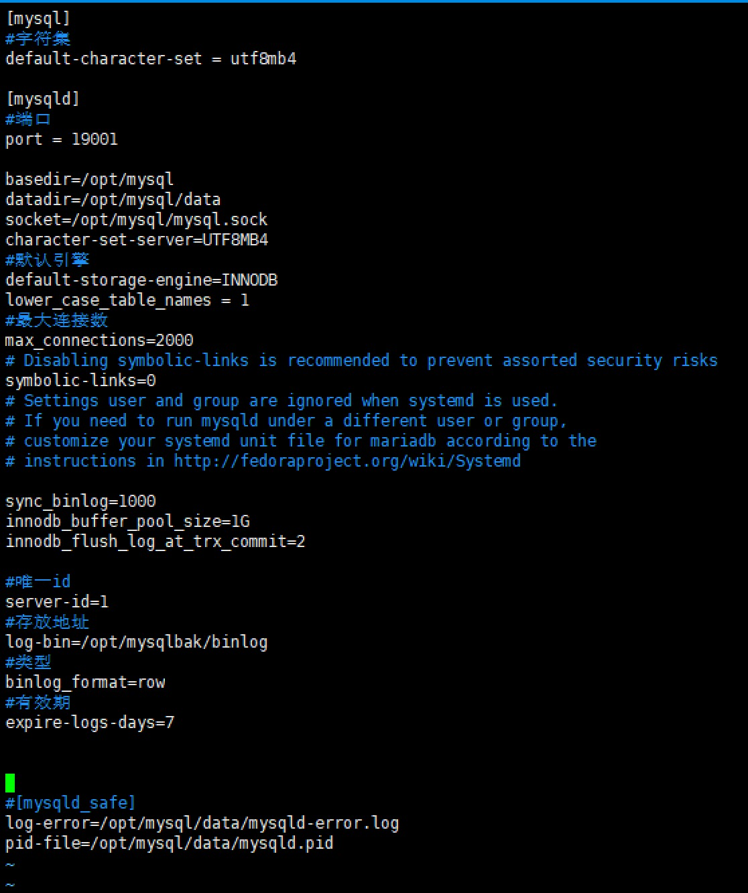

安装mysql


###1.下载包
[参考](https://blog.csdn.net/shishishilove/article/details/119866660?spm=1001.2101.3001.6650.3&utm_medium=distribute.pc_relevant.none-task-blog-2%7Edefault%7ECTRLIST%7Edefault-3-119866660-blog-124338426.pc_relevant_aa&depth_1-utm_source=distribute.pc_relevant.none-task-blog-2%7Edefault%7ECTRLIST%7Edefault-3-119866660-blog-124338426.pc_relevant_aa&utm_relevant_index=6)
[官网](https://dev.mysql.com/downloads/mysql/)
选择：【linux-Generic(glibc 2.12)(x86,64-bit)】-> 【Compressed TAR Archive】进行下载
[直接下载](https://dev.mysql.com/get/Downloads/MySQL-8.0/mysql-8.0.26-linux-glibc2.12-x86_64.tar.xz)
[wget](wget https://dev.mysql.com/get/Downloads/MySQL-8.0/mysql-8.0.26-linux-glibc2.12-x86_64.tar.xz)


###2.安装
```shell script
cd /opt

#上传安装包
#解压
tar -xzf mysql-8.0.26-linux-glibc2.12-x86_64.tar.gz

#重命名
mv mysql-8.0.26-linux-glibc2.12-x86_64 mysql

#创建data目录
cd /opt/mysql
mkdir data

#创建用户组以及用户和密码
groupadd mysql
useradd -g mysql mysql

#授权用户
chown -R mysql.mysql /opt/mysql

#切换到bin目录下
cd bin

#初始化数据库
./mysqld --user=mysql --basedir=/opt/mysql --datadir=/opt/mysql/data/ --initialize --lower-case-table-names=1
```
初始化参数说明：
【--user=mysql】：安装mysql,用户身份是mysql用户组。
【--basedir=/usr/local/mysql】：指定了安装 MySQL 的安装路径。
【--datadir=/usr/local/mysql/data/】：指定了 MySQL 的数据库文件放在什么路径下。
【--initialize】：初始化。
【--lower-case-table-names=1】：是否数据目录所在的文件系统对文件名的大小写敏感。
    0-大小写敏感；1-大小写不敏感；2-大小写不敏感 (注：只在对大小写不敏感的文件系统上适用)。
    linux下lower_case_table_names默认值为 0
    Windows下默认值是 1
    Mac OS下默认值是 2
    大小写区分规则如下
      linux下：
            数据库名与表名是严格区分大小写的；
            表的别名是严格区分大小写的；
            列名与列的别名在所有的情况下均是忽略大小写的；
            变量名也是严格区分大小写的；
       windows下：
            都不区分大小写
       Mac OS下（非UFS卷）：
            都不区分大小写

[初始化命令执行后，在最后会显示初始密码，记得一定要先保存下来，第一次登录需要使用]

```shell script
#编辑my.cnf文件
vim /etc/my.cnf
全部清空

#修改
[mysql]
#字符集
default-character-set = utf8mb4

[mysqld]
#端口
port = 3306

basedir=/opt/mysql
datadir=/opt/mysql/data
socket=/opt/mysql/mysql.sock
character-set-server=UTF8MB4
#默认引擎
default-storage-engine=INNODB
lower_case_table_names = 1
#最大连接数
max_connections=2000
#同步日志
sync_binlog=1000
#事务提交时刷新日志机制, 2表示每次事务都往内存提交日志, 但每秒往磁盘仅写入一次
innodb_flush_log_at_trx_commit=2
#innodb缓冲池大小, 系统物理内存的80%
innodb_buffer_pool_size=1G
sql-mode="STRICT_TRANS_TABLES,NO_AUTO_CREATE_USER,NO_ENGINE_SUBSTITUTION,NO_ZERO_DATE,NO_ZERO_IN_DATE,ERROR_FOR_DIVISION_BY_ZERO"
# Disabling symbolic-links is recommended to prevent assorted security risks
symbolic-links=0
# Settings user and group are ignored when systemd is used.
# If you need to run mysqld under a different user or group,
# customize your systemd unit file for mariadb according to the
# instructions in http://fedoraproject.org/wiki/Systemd

#开启binlog
#设置唯一id
server-id=1
#开启bin-log，产生的bin-log文件名即为bin-log.*, 注意：此次指定log日志位置和名称，自定义的路径需要创建并进行授权
log-bin=/opt/mysqlback/mysql-bin/binlog
#指定bin-log为row类别，其他两种是statement、mixed
binlog_format=row
#对指定的数据库开启bin-log，这里是对wh数据库开启bin-log服务
binlog-do-db=bjintranat
#7天删除
expire-logs-days=7

 
# [mysqld_safe]
log-error=/opt/mysql/data/mysqld-error.log
pid-file=/opt/mysql/data/mysqld.pid
```


```shell script
#添加mysql服务到系统服务中
cd /opt/mysql
cp -a ./support-files/mysql.server /etc/init.d/mysql

#授权以及添加服务
chmod +x /etc/init.d/mysql
chkconfig --add mysql

#启动mysql
service mysql start
#停止
service mysql stop
#查看启动状态
service mysql status

#将mysql命令添加到服务
ln -s /opt/mysql/bin/mysql /usr/bin

#登录mysql密码，使用之前初始密码
mysql -uroot -p


[报错: Cannot connect to local MYSQL server through socket '/tmp/mysql.sock'(2)]
[解决:设置软连接: ln -s /opt/mysql/mysql.sock /tmp/mysql.sock]


#修改【root】用户的密码
#登陆后，!QAZ1qaz：密码
ALTER USER 'root'@'localhost' IDENTIFIED WITH mysql_native_password BY '!QAZ1qaz';

#执行【flush privileges;】使密码立即生效
flush privileges;

#选择mysql数据库
use mysql;
报错:
Reading table information for completion of table and column names
You can turn off this feature to get a quicker startup with -A

#修改远程连接并立即生效
update user set host='%' where user='root';
flush privileges;


退出连接
exit
```
[创建用户及授权](../../Mysql/23.MySQL创建用户并设置权限.md)


### 卸载
一、首先查询系统是否安装了MySQL
rpm -qa | grep -i mysql

查看MySQL服务运行状态：
service mysql status
Active: active(running)

三、查看MySQL对应的文件夹
find / -name mysql

四、卸载并删除MySQL安装的组键服务
rpm -ev mysql-community-common-5.6.44-2.el7.x86_64
rpm -ev mysql-community-release-el7-5.noarch
rpm -ev mysql-community-client-5.6.44-2.el7.x86_64
rpm -ev mysql-community-server-5.6.44-2.el7.x86_64
rpm -ev mysql-community-libs-5.6.44-2.el7.x86_64

在卸载服务是遇到了三个组件服务无法卸载问题，提示缺少依赖postfix-2:2.10.1-7.el7.x86_64：
error: Failed dependencies:
libmysqlclient.so.18()(64bit) is needed by (installed) postfix-2:2.10.1-7.el7.x86_64
libmysqlclient.so.18(libmysqlclient_18)(64bit) is needed by (installed) postfix-2:2.10.1-7.el7.x86_64

解决方法就是在 rpm -ev 加上–nodeps：
–nodeps就是安装时不检查依赖关系

五、删除系统中MySQL的所有文件夹
在上面我们已经通过 find / -name mysql 查找出了所有文件夹，接下直接删除即可：
rm -rf /etc/selinux/targeted/active/modules/100/mysql
rm -rf /var/lib/mysql
rm -rf /var/lib/mysql/mysql
rm -rf /usr/share/mysql

六、最后验证MySQL是否删除完成
rpm -qa | grep -i mysql
如若是空空如也者恭喜你删除成功了。