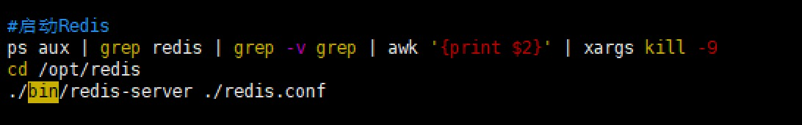

安装Redis


###1.下载压缩包
[参考](https://blog.csdn.net/weixin_39412946/article/details/111573290)
[下载](wget http://download.redis.io/releases/redis-5.0.7.tar.gz)

###2.安装
```shell script
cd /opt

#解压
tar -zvxf redis-5.0.7.tar.gz

#更改文件夹名称为redis
mv redis-5.0.7 redis

#编译
cd /opt/redis
make

#安装
make install PREFIX=/opt/redis
```
prefix这个关键字的作用是编译的时候用于指定程序存放的路径。
假设不添加该关键字Linux会将：
	可执行文件存放在/usr/local/bin目录；
	库文件会存放在/usr/local/lib目录；
	配置文件会存放在/usr/local/etc目录；
	其他的资源文件会存放在usr/local/share目录
[这里指定目录之后，方便后续卸载，直接rm -rf /usr/local/redis 即可删除redis]

```shell script
#启动redis
## 此时未修改redis任何配置文件，默认连接redis密码为空。
## 采取后台进程方式启动
cd /opt/redis
./bin/redis-server& ./redis.conf

#查看Redis是否正在运行
## (1)采取查看进程方式
ps -aux|grep redis
## (2)采取端口监听查看方式
netstat -lanp|grep 6379
```
```shell script
#修改配置文件
cd /opt/redis
vim redis.conf

#1.注释掉bind 127.0.0.1
#如果放开bind 127.0.0.1即只有本机可以访问，如果注释掉，所有环境都可以访问。生产等比较重要的环境还是建议绑定访问的ip

#2.保护模式修改：protected-mode的值默认为yes，将其修改为no
#该模式控制外部网是否可以连接redis服务，默认是yes,所以默认我们外网是无法访问的，如需外网连接rendis服务则需要将此属性改为no

#3.守护进程修改：daemonize的值默认为no，将其修改为yes
#yes表示启用守护进程，默认是no即不以守护进程方式运行

#4.redis密码修改:requirepass
#设置 redis 连接密码:witroot

#5.修改访问端口:port=19003
```
```shell script
#更新配置文件后重启
ps -ef|grep redis
kill -9 进程号
cd /opt/redis
./bin/redis-server ./redis.conf
#因设置了守护进程，此操作同采取后台进程方式

#验证
cd /opt/redis/bin
#               ip                端口      密码
./redis-cli -h 192.168.196.152 -p 19003 -a witroot
#停止
ps aux | grep redis | grep -v grep | awk '{print $2}' | xargs kill -9
```

[redis默认16个库,单节点需要指定数据库，数据库之间隔离不共享，切换：select 数字]


```shell script
#设置开机启动
vi /etc/systemd/system/redis.service

#内容
[Unit]
Description=redis-server
After=network.target
[Service]
Type=forking
ExecStart=/opt/redis/bin/redis-server /opt/redis/redis.conf
PrivateTmp=true
[Install]
WantedBy=multi-user.target

#刷新配置
systemctl daemon-reload
#启动/停止/重启/状态
systemctl start/stop/restart/status redis.service
#设置自启动
systemctl enable redis.service
```

