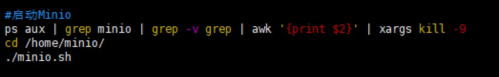

安装Minio


[文档](http://docs.minio.org.cn/docs/master/minio-monitoring-guide)

###1.下载
[下载](wget https://dl.min.io/server/minio/release/linux-amd64/minio)

###2.安装
```shell script
cd /opt
mkdir minio
cd minio
将minio文件上传进文件夹

mkdir config     #创建配置文件夹
mkdir data       # 创建data文件夹

#赋予执行权限
chmod +x minio
```

###3.启动
第一种
```shell script
#命令
./minio server --config-dir /opt/minio/config /opt/minio/data
#访问
http://ip:9000
#账户密码:minioadmin/minioadmin

#后台访问并设置账户密码
nohup MINIO_ACCESS_KEY=minioadmin MINIO_SECRET_KEY=123456789 /opt/minio/minio server --address=0.0.0.0:9000 --console-address=0.0.0.0:9001 --config-dir /opt/minio/config/ /opt/minio/data/ > /opt/minio/minio.log 2>&1 &
#关闭进程可以使用： ps -ef | grep minio 查看进程id，使用kill -9 进程id号，即可关闭进程
```

第二种
```shell script
#脚本
#创建脚本文件
vim /opt/minio/minio.sh

#!/bin/bash
export MINIO_ROOT_USER=root
export MINIO_ROOT_PASSWORD=witrootroot
nohup ./minio server --address ":9000" --console-address ":19002" --config-dir ./config ./data > ./minio.log 2>&1 &

#给这个文件授予权限
chmod 777 minio.sh

#启动
sh minio.sh

#测试访问：
ip:19002
```
[注意：MINIO_ROOT_USER/MINIO_ROOT_PASSWORD]

前端直接根据fileKey预览图片：
前提：将桶的权限[Summary -> Access Policy]设置成：public 
使用：公网IP+内网端口[9000]/fileKey


###4.创建自动启动
```shell script
#开机启动优化
#创建一个开机启动脚本
vi /etc/init.d/minio

#赋予权限
chmod 777 /etc/init.d/minio
#注册到全局中
chkconfig --add /etc/init.d/minio
#开机自动执行脚本
chkconfig /etc/init.d/minioon
#现在可以通过service命令启动关闭了
service minio start/stop/restart
```
```shell script

#!/bin/sh
#chkconfig: 2345 80 90
export JAVA_HOME="/usr/local/java/jdk1.8.0_202"
source /etc/profile;

export MINIO=/path/minio #minio文件的文件夹位置,文件夹下面才是执行文件

export IP_port=1.1.1.111:9001 #本机ip:端口
export IPtwo_port=1.1.1.111:9002 #本机ip:端口2
export PORT=9001 #第一个端口

case "$1" in

start)
        ## 启动minio
        echo "--------minio 开始启动--------------"
        MINIO_ROOT_USER=sfs MINIO_ROOT_PASSWORD=SFS@minio2021 nohup $MINIO/minio server  $MINIO/data --address $IP_port --console-address $IPtwo_port >  $MINIO/log/log.log 2>&1 &
        sleep 10
        MINIO_pid=`lsof -i:$PORT|grep "LISTEN"|awk '{print $2}'`
        until [ -n "$MINIO_pid" ]
            do
              MINIO_pid=`lsof -i:$PORT|grep "LISTEN"|awk '{print $2}'`  
            done
        echo "--------minio 启动成功--------------"
        echo "minio pid is $MINIO_pid"
        ;;

 stop)
         P_ID=`ps -ef | grep -w $MINIO | grep -v "grep" | awk '{print $2}'`
        if [ "$P_ID" == "" ]; then
            echo "===minio 进程 不 存在 or stop 成功"
        else
            kill -9 $P_ID
            echo "minio 成功关闭"
        fi
        ;;   
 
restart)
        $0 stop
        $0 start
        echo "===restart 成功==="
        ;;   
*)
        echo "请使用参数start stop restart"
        echo "默认重启..."
        $0 stop
        $0 start
        echo "===restart 成功==="
        ;;  
esac    
exit 0
```


