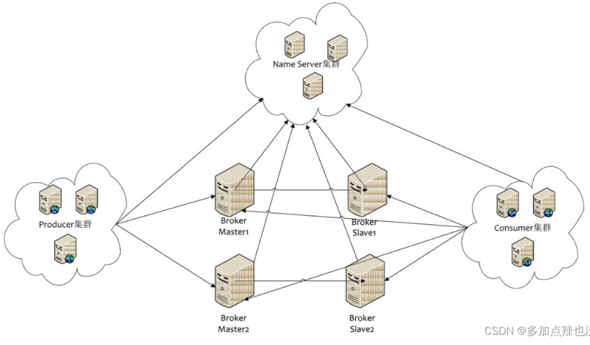
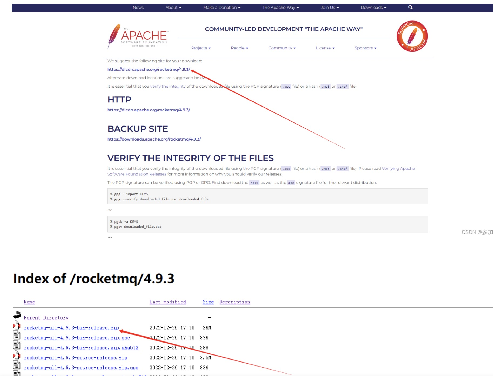
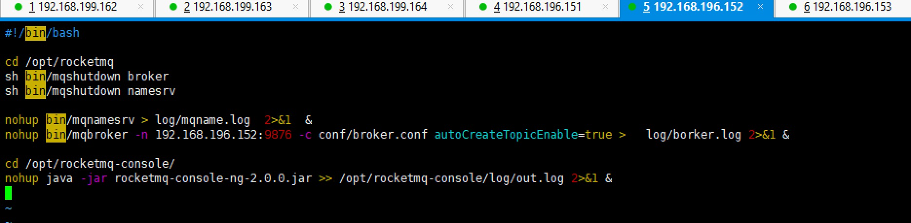

安装RocketMQ


[参考](https://blog.csdn.net/xhmico/article/details/124489116)

###简介
消息队列中间件是分布式系统中的重要组件，主要解决应用耦合、流量削峰等问题，目前主流的 MQ 主要是：RocketMQ、kafka、RabbitMQ等。

RocketMQ 相较于其它 MQ 的优势：
支持事务型消息（消息发送和 DB 操作保持两方的最终一致性，RabbitMQ 和 Kafka 不支持）
支持结合 RocketMQ 的多个系统之间数据最终一致性（多方事务，二方事务是前提）
支持 18 个级别的延迟消息（Kafka 不支持）
支持指定次数和时间间隔的失败消息重发（Kafka 不支持，RabbitMQ 需要手动确认）
支持 Consumer 端 Tag 过滤，减少不必要的网络传输（即过滤由MQ完成，而不是由消费者完成。RabbitMQ 和 Kafka 不支持）
支持重复消费（RabbitMQ 不支持，Kafka 支持）

RocketMQ主要有四大核心组成部分：NameServer、Broker、Producer以及Consumer四部分



###1.配置环境
推荐64位操作系统，Linux/Unix/Mac；
64位JDK 1.8+；
Maven 3.2.x；

###2.下载安装包
官方文档安装参考：https://rocketmq.apache.org/docs/quick-start/
[官网](https://www.apache.org/dyn/closer.cgi?path=rocketmq/4.9.3/)


###3.安装
####3.1.解压
```shell script
#解压
unzip rocketmq-all-4.9.3-bin-release.zip

#移动
mv rocketmq-4.9.3 rocketmq
```
目录结构：
benchmark：这里面就是一些可以直接运行，进行测试的 sh 文件
bean：该目录是比较常用的，里面是一些可执行文件
conf：这里面就是一些配置文件
lib：就是 mq 所依赖的第三方 jar 包

####3.2.配置JVM参数
RocketMQ Broker 默认配置的 jvm 虚拟机内存比较大，运行时报错误内存不足，可以修改 bin 目录下的 runserver.sh和runbroker.sh 文件，将分配内存改小
```shell script
vim bin/runbroker.sh
vim bin/runserver.sh

#都改成
-server -Xms256m -Xmx256m -Xmn256m
```

####3.3.设置环境变量
```shell script
vim /etc/profile
#添加
export NAMESRV_ADDR=服务器IP:9876

#重新加载环境变量
source /etc/profile
```

####3.4.启动
```shell script
cd /opt/rocketmq
mkdir log
nohup bin/mqnamesrv > log/mqname.log  2>&1  &
#开启自动创建topic
nohup bin/mqbroker -n 服务器地址:9876 -c conf/broker.conf autoCreateTopicEnable=true >   log/borker.log 2>&1 &

#若启动失败，日志中出现：
#nohup: failed to run command ‘bin/mqbroker’: Permission denied
#则对当前总目录进行授权：sudo chmod -R xxx #某一目录
```

####3.5.查看进程
```shell script
jps
#出现两个
17239 BrokerStartup
17150 NameservStartup
```

```shell script
// 关闭 Broker
sh bin/mqshutdown broker
// 关闭 NameServer
sh bin/mqshutdown namesrv
```

模拟发送消息 和 消费消息
目前 我们 NameServer 和 Broker 都已经启动成功，就可以进行发送和消费消息，
RocketMQ 安装包默认提供了一个模拟发送消息和消费消息的测试类，我们来验证一下
```shell script
//创建生产者发送消息
sh bin/tools.sh org.apache.rocketmq.example.quickstart.Producer
```
```shell script
//消费消息
sh bin/tools.sh org.apache.rocketmq.example.quickstart.Consumer
```

###4.安装可视化界面
安装可以参考官方文档：https://github.com/apache/rocketmq-externals/tree/master/rocketmq-console
[源码链接](https://github.com/apache/rocketmq-externals)

可以通过 git 拉下来，可以看到这里面有 rocketmq 与各种各样的技术集成，但是这个监控平台只需要启动 rocketmq-console 这个服务就行了

####4.1.修改源码
[源码包](../package/rocketmq-externals-master.zip)
```shell script
unzip rocketmq-externals-master.zip
cd rocketmq-externals-master/rocketmq-console/

#修改参数并编译
vim src/main/resources/application.properties

#端口
server.port=19004

#这个填写自己的nameserver的地址，默认是localhost:9876
rocketmq.config.namesrvAddr=127.0.0.1:9876

#rocketmq-console的数据目录，默认为 /tmp/rocketmq-console/data
rocketmq.config.dataPath=/opt/rocketmq-console/data

#开启认证登录功能，默认为false，密码默认admin/admin
#Must create userInfo file: ${rocketmq.config.dataPath}/users.properties if the login is required
rocketmq.config.loginRequired=true
```
修改了以上参数之后，使用maven进行编译 [需要网络,本地打包]
mvn clean package
```shell script
#上传并运行jar包
mkdir -p /opt/rocketmq-console
mkdir -p /opt/rocketmq-console/data
mkdir -p /opt/rocketmq-console/log

cd /opt/rocketmq-console
#启动并指定端口
nohup java -jar rocketmq-console-ng-2.0.0.jar --server.port=19004 >> /opt/rocketmq-console/log/out.log 2>&1 &
```
运行成功在浏览器输入 http://ip:19004 即可看到运行界面，账号密码: admin/admin


####4.2.配置账号密码
我们开启了登录验证的功能，但是没有设置账户密码，这里默认的账户密码为 admin/admin。我们修改下这个密码。
在 rocketmq-console的数据目录下新建账户文件 users.properties 
```shell script
vim /usr/local/rocketmq-console/data/users.properties
```

设置账号密码
```shell script
# 该文件支持热修改，即添加和修改用户时，不需要重新启动console
# 格式， 每行定义一个用户， username=password[,N]  #N是可选项，可以为0 (普通用户)； 1 （管理员）  

#定义管理员 
admin=123456,1

#定义普通用户
#user1=user1
#user2=user2
```
然后我们杀进程，重启这个jar包即可

