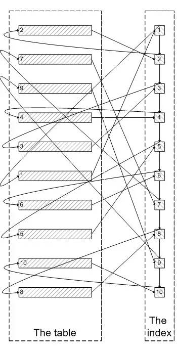

分页查询优化


当需要从数据库查询的表有上万条记录的时候，一次性查询所有结果会变得很慢，特别是随着数据量的增加特别明显，这时需要使用分页查询。
对于数据库分页查询，也有很多种方法和优化的点。


### 一般分页查询
一般的分页查询使用简单的 limit 子句就可以实现。
limit 子句声明如下：
```sql
SELECT * FROM table LIMIT [offset,] rows | rows OFFSET offset
```

LIMIT 子句可以被用于指定 SELECT 语句返回的记录数。

需注意以下几点：
- 第一个参数指定第一个返回记录行的偏移量，注意从`0`开始
- 第二个参数指定返回记录行的最大数目
- 如果只给定一个参数：它表示返回最大的记录行数目
- 第二个参数为 -1 表示检索从某一个偏移量到记录集的结束所有的记录行
- 初始记录行的偏移量是 0(而不是 1)


下面是一个应用实例：
```sql
select * from orders_history where type=8 limit 1000,10;
```
该条语句将会从表中查询`offset: 1000`开始之后的10条数据，也就是第1001条到第1010条数据（`1001 <= id <= 1010`）。
针对这种查询方式，下面测试查询记录量对时间的影响：
```sql
select * from orders_history where type=8 limit 10000,1;
select * from orders_history where type=8 limit 10000,10;
select * from orders_history where type=8 limit 10000,100;
select * from orders_history where type=8 limit 10000,1000;
select * from orders_history where type=8 limit 10000,10000;
```
三次查询时间如下：
- 查询1条记录：3072ms 3092ms 3002ms
- 查询10条记录：3081ms 3077ms 3032ms
- 查询100条记录：3118ms 3200ms 3128ms
- 查询1000条记录：3412ms 3468ms 3394ms
- 查询10000条记录：3749ms 3802ms 3696ms

另外我还做了十来次查询，从查询时间来看，基本可以确定，在查询记录量低于100时，查询时间基本没有差距，随着查询记录量越来越大，
所花费的时间也会越来越多。
针对查询偏移量的测试：
```sql
select * from orders_history where type=8 limit 100,100;
select * from orders_history where type=8 limit 1000,100;
select * from orders_history where type=8 limit 10000,100;
select * from orders_history where type=8 limit 100000,100;
select * from orders_history where type=8 limit 1000000,100;
```
三次查询时间如下：
- 查询100偏移：25ms 24ms 24ms
- 查询1000偏移：78ms 76ms 77ms
- 查询10000偏移：3092ms 3212ms 3128ms
- 查询100000偏移：3878ms 3812ms 3798ms
- 查询1000000偏移：14608ms 14062ms 14700ms

随着查询偏移的增大，尤其查询偏移大于10万以后，查询时间急剧增加。
[这种分页查询方式会从数据库第一条记录开始扫描，所以越往后，查询速度越慢，而且查询的数据越多，也会拖慢总查询速度]

为什么？
我们看一下
```sql
select * from test where val=4 limit 300000,5;
```
的查询过程：
1:查询到索引叶子节点数据。
2:根据叶子节点上的主键值去聚簇索引上查询需要的全部字段值。
3:最后将不符合的全部抛掉。

类似于下面这张图：


像上面这样，需要查询 300005 次索引节点，查询 300005 次聚簇索引的数据，最后再将结果过滤掉前 300000 条，取出最后 5 条。
[MySQL 耗费了大量随机 I/O 在查询聚簇索引的数据上，而有 300000 次随机 I/O 查询到的数据是不会出现在结果集当中的]

肯定会有人问：
既然一开始是利用索引的，为什么不先沿着索引叶子节点查询到最后需要的 5 个节点，然后再去聚簇索引中查询实际数据。
这样只需要 5 次随机 I/O。

解决：使用子查询


## 使用子查询优化
这种方式先定位偏移位置的 id，然后往后查询，这种方式适用于 [id 递增] 的情况。

```sql
select * from orders_history where type=8 limit 100000,1;
    
select id from orders_history where type=8 limit 100000,1;

select * from orders_history where type=8 and 
id>=(select id from orders_history where type=8 limit 100000,1) 
limit 100;
    
select * from orders_history where type=8 limit 100000,100;
```
4条语句的查询时间如下：
- 第1条语句：3674ms
- 第2条语句：1315ms
- 第3条语句：1327ms
- 第4条语句：3710ms

针对上面的查询需要注意：
- 比较第1条语句和第2条语句：使用 select id 代替 select * 速度增加了3倍
- 比较第2条语句和第3条语句：速度相差几十毫秒
- 比较第3条语句和第4条语句：得益于 select id 速度增加，第3条语句查询速度增加了3倍

这种方式相较于原始一般的查询方法，将会增快数倍。

或者：
```sql
SELECT * FROM product a JOIN (select id from product limit 866613, 20) b ON a.id = b.id;
```


### 使用 id 限定优化
这种方式假设数据表的 [id是 连续递增] 的，则我们根据查询的页数和查询的记录数可以算出查询的id的范围，
可以使用 `id between and `来查询：
```sql
select * from orders_history where type=2 
    and id between 1000000 and 1000100 limit 100;
```
查询时间：15ms 12ms 9ms

这种查询方式能够极大地优化查询速度，基本能够在几十毫秒之内完成。
限制是只能使用于明确知道id的情况，不过一般建立表的时候，都会添加基本的id字段，这为分页查询带来很多便利。

还可以有另外一种写法：
```sql
select * from orders_history where id >= 1000001 limit 100;
```
当然还可以使用 in 的方式来进行查询，这种方式经常用在多表关联的时候进行查询，使用其他表查询的id集合，来进行查询：
```sql
select * from orders_history where id in (select order_id from trade_2 where goods = 'pen')
limit 100;
```
这种 in 查询的方式要注意：某些 mysql 版本不支持在 in 子句中使用 limit。


### 使用临时表优化
这种方式已经不属于查询优化，这儿附带提一下。
对于使用 id 限定优化中的问题，需要 id 是连续递增的，
但是在一些场景下，比如使用历史表的时候，或者出现过数据缺失问题时，可以考虑使用临时存储的表来记录分页的id，使用分页的id来进行 in 查询。
这样能够极大的提高传统的分页查询速度，尤其是数据量上千万的时候。


### 关于数据表的id说明
一般情况下，在数据库中建立表的时候，强制为每一张表添加 id 递增字段，这样方便查询。
如果像是订单库等数据量非常庞大，一般会进行分库分表。
    这个时候不建议使用数据库的 id 作为唯一标识，而应该使用分布式的高并发唯一 id 生成器来生成，
    并在数据表中使用另外的字段来存储这个唯一标识。
使用先使用范围查询定位 id （或者索引），然后再使用索引进行定位数据，能够提高好几倍查询速度。
即先 select id，然后再 select *；