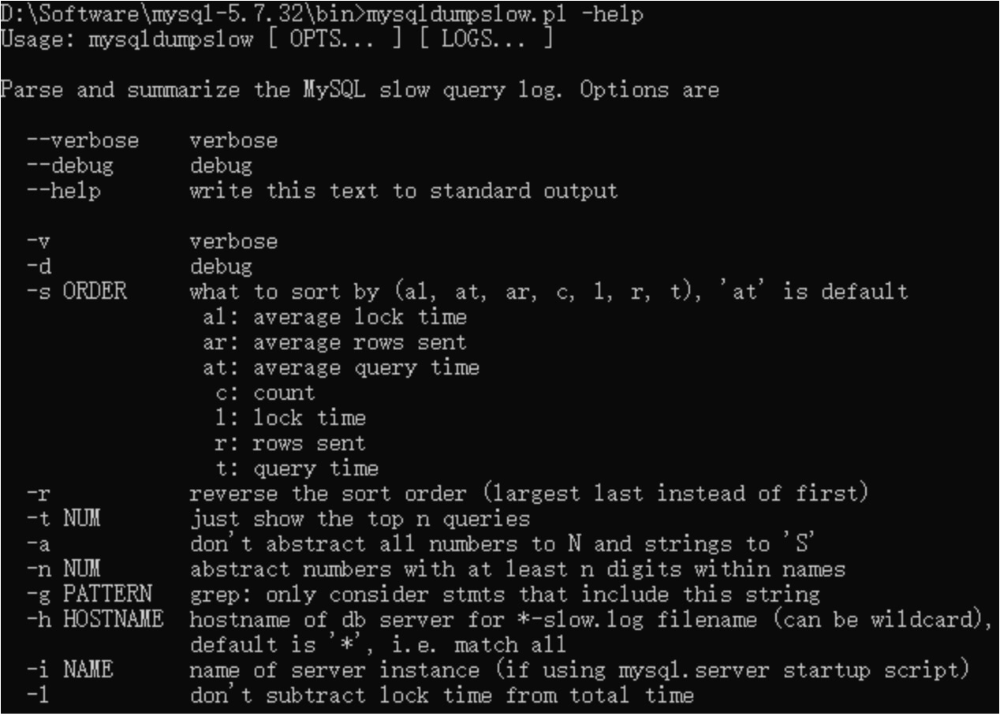
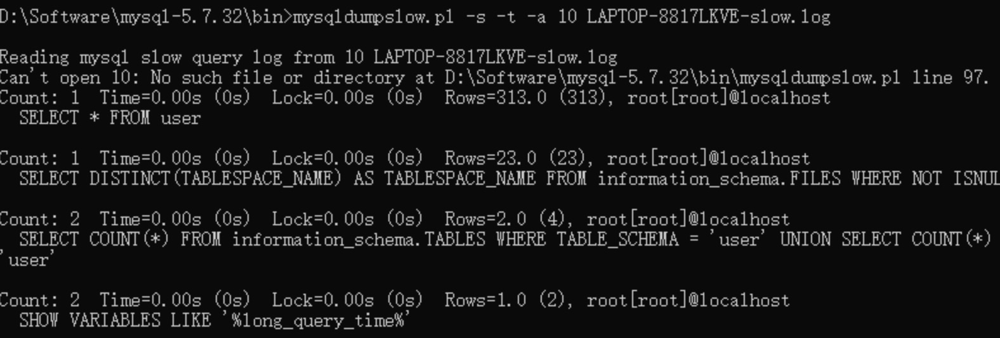

慢查询日志

以下是慢查询的相关参数，大家感兴趣的可以看下：

参数                                   含义
log_output                            日志输出位置，默认为 FILE，即保存为文件，若设置为 TABLE，则将日志记录到 mysql.show_log 表中，支持设置多种格式
slow_query_log_file                   指定慢查询日志文件的路径和名字，可使用绝对路径指定，默认值是主机名-slow.log，位于配置的 datadir 目录
long_query_time                       执行时间超过该值才记录到慢查询日志，单位为秒，默认为 10
min_examined_row_limit                对于查询扫描行数小于此参数的SQL，将不会记录到慢查询日志中，默认为 0
log_queries_not_using_indexes         是否将未使用索引的 SQL 记录到慢查询日志中，开启此配置后会无视 long_query_time 参数，默认为 OFF
log_throttle_queries_not_using_indexes设定每分钟记录到日志的未使用索引的语句数目，超过这个数目后只记录语句数量和花费的总时间，默认为 0
log-slow-admin-statements             记录执行缓慢的管理 SQL，如 ALTER TABLE、ANALYZE TABLE、CHECK TABLE、CREATE INDEX、DROP INDEX、OPTIMIZE TABLE 和 REPAIR TABLE，默认为 OFF
log_slow_slave_statements             记录从库上执行的慢查询语句，如果 binlog 的值为 row，则失效，默认为 OFF


### 开启慢查询
有两种方式可以开启慢查询
1. 修改配置文件
修改配置文件 my.ini，在[mysqld]段落中加入如下参数：
```text
[mysqld]
log_output='FILE,TABLE'
slow_query_log='ON'
long_query_time=0.001
```
然后需要重启 MySQL 才可以生效，命令为 `service mysqld restart`

2. 设置全局变量
无需重启即可生效，但是重启会导致设置失效，设置的命令如下所示:
```text
SET GLOBAL slow_query_log = 'ON';
SET GLOBAL log_output = 'FILE,TABLE';
SET GLOBAL long_query_time = 0.001;
```
这样就可以将慢查询日志同时记录在文件以及 mysql.slow_log 表中。
通过第二种方式开启慢查询日志，然后使用全表查询语句 `SELECT * FROM user`
然后再查询慢查询日志：`SELECT * FROM mysql.slow_log`，可以发现其中有这样一条记录：


其中:
`start_time` 为执行时间，
`user_host` 为用户的主机名，
`query_time` 为查询所花费的时间，
`lock_time` 为该查询使用锁的时间，
`rows_sent` 为这条查询返回了多少数据给客户端，
`rows_examined` 表示这条语句扫描了多少行，
`db` 为数据库，
`sql_text` 为这条 SQL，
`thread_id` 为执行这条查询的线程 id。

这样我们就可以通过 slow_log 表的数据进行分析，然后对 SQL 进行调优了。


以上是通过 Table 来进行分析的，下面来通过文件的慢查询是怎么样的。
如果不知道文件保存在哪里，可以使用 `SHOW VARIABLES LIKE '%slow_query_log_file%'` 来查看文件保存位置，
打开慢查询日志文件，可以看出每五行表示一个慢 SQL，这样查看比较费事，可以使用一些工具来查看。


#### mysqldumpslow
MySQL 内置了 mysqldumpslow 这个工具来帮助我们分析慢查询日志文件，Windows 环境下使用该工具需要安装 Perl 环境。
可以通过 `-help` 来查看它的命令参数:

比如我们可以通过 `mysqldumpslow -s t 10 LAPTOP-8817LKVE-slow.log` 命令得到按照查询时间排序的 10 条 SQL 。



#### pt-query-digest
除此之外还有 pt-query-digest，这个是 Percona Toolkit 中的工具之一，
下载地址：`https://www.percona.com/downloads/percona-toolkit/LATEST/`
如果是 Windows 系统，可以在安装 Perl 的环境下，把脚本下载下来：`https://raw.githubusercontent.com/percona/percona-toolkit/3.x/bin/pt-query-digest`

下面先对 pt-query-digest 进行简单的介绍：
pt-query-digest 是用于分析 MySQL 慢查询的一个第三方工具，可以分析 binlog、General log 和 slowlog，
也可以通过 showprocesslist 或者通过 tcpdump 抓取的 MySQL 协议数据来进行分析，可以把分析结果输出到文件中，
分析过程是先对查询语句的条件进行参数化，然后对参数化以后的查询进行分组统计，统计出各查询的执行时间、次数、占比等，
可以借助分析结果找出问题进行优化。


#### show processlist
还有种情况是慢查询还在执行中，慢查询日志里是找不到慢 SQL 呢，这个时候可以用 `show processlist` 命令来寻找慢查询，
该命令可以显示正在运行的线程，执行结果如下图所示，可以根据 `Time` 的大小来判断是否为慢查询。
