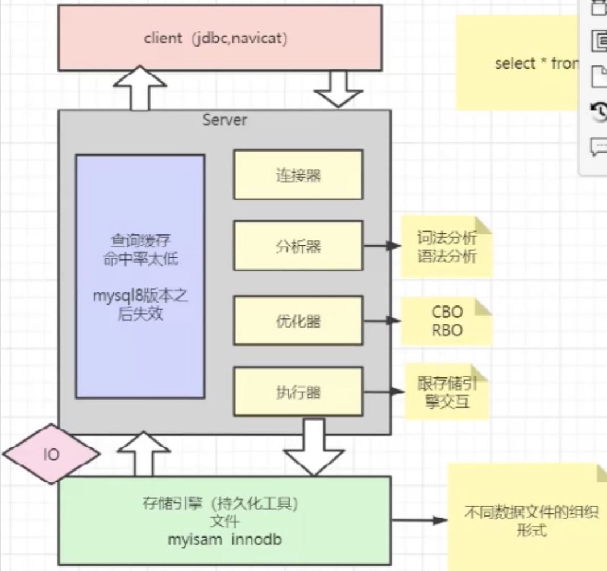
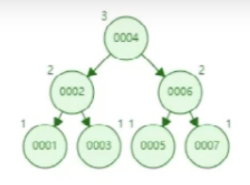
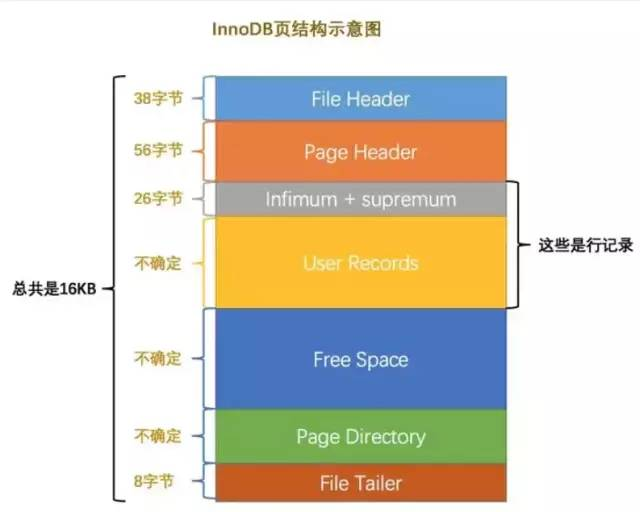
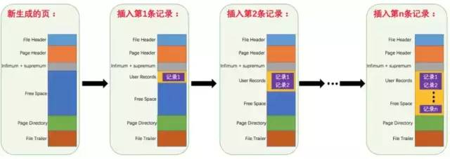

索引




索引：排序好的快速查找B+树数据结构
目的：提高查询速度

如何提高查询速度： 
IO: 存储引擎 与 Mysql服务中执行器之间的交互 [读/写]
1: 减少IO时长
2: 减少IO次数


###1、索引的数据结构的选择
问题：
1: 索引需要持久化存储吗？要
2: 存储时候存储什么数据？K-V格式的数据
3: 使用什么数据结构？树，hash表


索引的存储对象：
存储结构：
索引字段[key] 哪个文件 在当前文件的偏移量

索引存储肯定是key-value的形式存储，key即对应的主键/关键字，value则应该是个对象：1:索引指向的文件  2:在对应文件中的位置。
所以：当索引文件变得越来越大时，索引效率会急剧下降。[需要将索引文件读取到内存，越大越耗内存，效率越低]

对应两种模式：
hive  -> OLAP->联机分析处理->对海量的历史数据进行分析操作，要求产生决策性的影响，不要求在极短的时间内返回结果 [数据仓库]
mysql -> OLTP->联机事务处理->为了支撑业务系统的需求，必须在极短的时间内返回结果 [关系型数据库]


###2、数据结构分析
####2.1.hash表
数组+链表
索引的选择是与存储引擎相关的，在mysql中memory存储引擎使用的索引是hash表，而且innodb支持自适应hash。

缺点：
1:hash碰撞，必须要设计良好的hash算法，避免产生hash冲突问题。
2:hash需要内存吗？利用hash存储的话需要将所有的数据文件添加到内存，比较耗费内存空间。
3:无法进行范围查询，只适合等值查询。


####2.2.二叉树
二叉树/二分树是一种比顺序结构更加高效地查找目标元素的结构，
它可以从第一个父节点开始跟目标元素值比较，如果相等则返回当前节点，
如果目标元素值小于当前节点，则移动到左侧子节点进行比较，
大于的情况则移动到右侧子节点进行比较，反复进行操作最终移动到目标元素节点位置。

[跟根节点进行比较：大的放右边，小的放左边]

二叉搜索树相比于其它数据结构的优势在于查找、插入的时间复杂度较低，为 O(logn)。


缺点：
[单腿过长]
一般情况下，我们设计索引时都会在表中提供一个 自增整形字段（ID）作为建立索引 的列，
在这种场景下使用二叉树的结构会导致我们的索引总是添加到右侧，在查找记录时 跟没加索引的情况是一样 的。
如下图所示：[由二叉树退变成链表 时间复杂度为：O(n)]


####2.3.AVL树
平衡二叉查找树，是一个严格意义上的二叉树，树的分支高度差不能超过1即：左右层级相同。
解决了上面二叉树遇到的自增整形索引的问题，AVL树会左旋、右旋对结构进行调整。 [不会变成链表]



缺点：
查询的效率得到提升，插入数据的效率降低：多了旋转操作
[适合：读多写少的业务]


####2.4.红黑树
红黑树不算严格意义上的二叉树，不要求左右层级相同 [最长路径不超过最短路径的2倍]，
它继承了二叉树的优点，而且解决了上面二叉树遇到的自增整形索引的问题，
从下面的动态图中可以看出红黑树会左旋、右旋对结构进行调整，始终保证左子节点数 < 父节点数 < 右子节点数的规则。 
[对AVL树进一步优化：只有层级路径超过2倍的才进行旋转]


缺点：
在[数据量大的时候，深度也很大]
从图中可以看出每个父节点只能存在两个子节点，如果我们有很多数据，那么树的深度依然会很大，可能就会超过十几二十层以上，对我们的磁盘寻址不利，
依然会花费很多时间查找。

为啥会深度加深？
因为只有二叉
[无论是二叉树还是红黑树，都会因为树的深度过深而造成io次数变多，影响数据读取的效率]


####2.4.B-树
既然红黑树存在缺点，那么我们可以在红黑树的基础上构思一种新的储存结构。
解决的思路也很简单：
既然觉得树的深度太长，就只需要适当地增加每个树节点能存储的数据个数即可，但是数据个数也必须要设定一个合理的阈值，
不然一个节点数据个数过多会产生多余的消耗。

按照这样的思路，我们先来了解下关于B-Tree的一些知识点：
我们描述一颗B树时需要指定它的 阶数，阶数表示了一个结点最多有多少个孩子结点，一般用字母m表示阶数。
当m取2时，就是我们常见的二叉搜索树。

在实际应用中的B树的阶数m都非常大（通常大于100），所以即使存储大量的数据，B树的高度仍然比较小

一颗m阶的B树定义如下：
1）每个结点最多有m-1个关键字(key)。 			//4阶=最少3key
2）根结点最少可以只有1个关键字。
3）非根结点至少有Math.ceil(m/2)-1个关键字。	//4阶=1最少key，5阶=最少2key			//向上取整数
4）每个结点中的关键字都按照从小到大的顺序排列，每个关键字的左子树中的所有关键字都小于它，而右子树中的所有关键字都大于它。//左小右大
5）所有叶子结点都位于同一层，或者说根结点到每个叶子结点的长度都相同。

在这里需要说明下的是，[BTree的结构里每个节点包含了索引值和表记录的信息]
我们可以按照Map集合这样理解：key=索引，value=表记录
如下图所示：


BTree的结构可以弥补红黑树的缺点，[解决数据量过大时整棵树的深度过长的问题]
相同数量的数据只需要更少的层，相同深度的树可以存储更多的数据，查找的效率自然会更高。

缺点：
从上面得知，在查询单条数据是非常快的。但如果[范围查的话，BTree结构每次都要从根节点查询一遍，效率会有所降低]，
因此在实际应用中采用的是另一种BTree的变种B+Tree（B+树）。


####2.5.B+树
1. 为什么要对BTree继续做优化？
要解答这个疑问需要先了解BTree每个节点结构（上面已经说明）和MySQL数据库它是如何读取索引数据的：
索引和表数据在不使用的时候是存储在文件中的，也就是磁盘，当我们执行查询操作时会DBMS（数据库管理系统）
首先会先从内存中查找，如果找到直接使用，如果找不到则从磁盘文件中读取；
操作系统储存数据的最小单位是页（page），一页假设是4K大小（由操作系统决定），对内存和磁盘读取数据是按一页的整数倍读取的。[默认16K]

这里我们假设数据库一次IO操作就读取1页4K的数据，再假设一个磁盘块就是一个大节点，
内含多个小节点的索引和数据，其大小是10MB，那么我们要从磁盘中读取完整个大节点需要进行 10M / 4K = 2500次IO操作，
这样就可以看出 [如果大节点数据总量越大，需要执行的IO操作越多，花费的时间也越长]，
[因此为了提高性能，数据库会建议我们一个大节点只存储一页4K大小的数据]，这里的数据包含了索引和表记录。 [所以可以看成一页就是一块磁盘块]

1: 每个页存储空间是有限的，如果数据比较大的话会导致节点中存储的key数量变小，从而影响树的深度，增大io的次数，降低查询性能。

另外我们还能计算出树的度Degree应该设置成多大才合理：
Degree = 内存页大小（4K） / 单个索引值字节大小

2: 进一步分析，[索引值的大小相对于整条记录的大小是很小的]，如果我们需要查找的数据刚好是在最后，
那么前面遍历过的节点中存储的记录数据是不是对我们来说是没用的，它会占用比索引大得多的空间，导致我们一个大节点里能遍历的索引数量大大减少，
需要向下继续遍历的几率就更大，花费更多时间查找。


那么有没有办法可以优化呢？
[B+Tree存储结构，只有叶子节点存储数据]
新的B+树结构没有在所有的节点里存储记录数据，而是只在最下层的叶子节点存储，上层的所有非叶子节点只存放索引信息，
这样的结构 [可以让单个节点存放下更多索引值，增大度Degree的值，提高命中目标记录的几率]
这种结构会在上层非叶子节点存储一部分冗余数据，但是这样的缺点都是可以容忍的，因为冗余的都是索引数据，不会对内存造成大的负担。

B+Tree和B-Tree的不同点在于：
  (1) 非叶子节点只存储键值信息
  (2) 所有叶子节点之间都有链指针
  (3) 数据记录都存放在叶子节点中
  


所有叶子节点之间都有链指针，这点优化有什么用呢？
我们直接看B+Tree结构，如果我们进行范围查找where id > 4的记录，
我们只需要先找到id = 4的记录后自然就能通过叶子节点间的双向指针方便地查询出大于4的所有记录。

注意：在B+树上有两个头指针，一个指向根节点，另一个指向关键字最小的叶子节点，而且所有叶子节点之间是一种链式环结构。
因此：可以对B+树进行两种查询操作：一种是对于主键的范围查找和分页查找，另一种是从根节点开始进行随机查找。


###示例
InnoDB是以ID为索引的数据存储
采用InnoDB引擎的数据存储文件有两个，*.ibd   数据文件    *.frm数据结构类型。
InnoDB通过B+Tree结构对ID建索引，然后在叶子节点中存储记录


[若建立索引的字段不是主键ID，则对该字段建索引，然后在叶子节点中存储的是该记录的主键，然后再通过主键索引树找到对应记录。]

补充：
查看mysql的默认页大小：一般默认16K
```sql
show variables like '%innodb_page_size%';
```




* 各个数据页可以组成一个双向链表。
* 每个数据页中的记录又可以组成一个单向链表。
* 每个数据页都会为存储在它里边儿的 [记录生成一个页目录]，在通过主键查找某条记录的时候可以在页目录中使用二分法快速定位到对应的槽，然后再遍历该槽对应分组中的记录即可快速找到指定的记录。
* 以其他列(非主键)作为搜索条件：只能从最小记录开始依次遍历单链表中的每条记录。

所以说，如果我们写select * from user where indexname = 'xxx'这样没有进行任何优化的sql语句，默认会这样做：
1. 定位到记录所在的页：需要遍历双向链表，找到所在的页。
2. 从所在的页内中查找相应的记录：由于不是根据主键查询，只能遍历所在页的单链表了
   很明显，在数据量很大的情况下这样查找会很慢！这样的时间复杂度为O（n）。


索引做了些什么可以让我们查询加快速度呢？
其实就是将无序的数据变成有序[树结构]。

很明显的是：
没有用索引我们是需要遍历双向链表来定位对应的页，现在通过 “目录” 就可以很快地定位到对应的页上了！（二分查找，时间复杂度近似为O(logn)）
其实底层结构就是B+树。


#####为啥主键一般选择自动递增的？
影响索引的维护，元素值的添加和删除都会影响到整个树的结构或者说层数。
索引递增，每次都放在树的最后一位，对树的结构和层数影响较小。

[注：分布式需要使用雪花ID，自增不唯一]