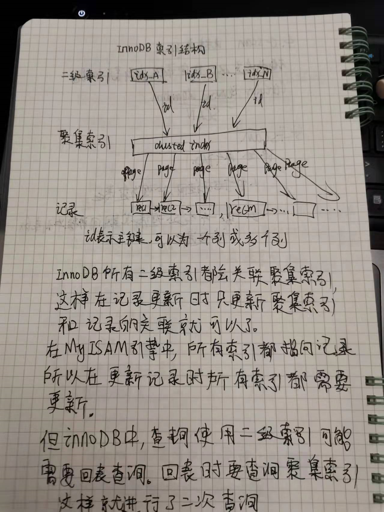

覆盖索引


### 概述
一个[索引包含了所有需要查询的字段值]，那么就称为覆盖索引。[即只需扫描索引而无须回表]。


### 好处
- 索引的大小通常远小于数据行大小，所以如果只需要读取索引，那么MySQL会极大的减少数据访问量。
- 索引是按照值得顺序存储的。
- InnoDB使用聚集索引，也称为First Index，InnoDB的二级索引叶子节点中保存了行的主键值，所以如果二级索引能够覆盖查询，那么可以避免对主键索引的二次查询。

并不是所有类型的索引都是称为覆盖索引。
覆盖索引必须要存储列的值，
所以哈希索引、空间索引和全文索引这三类不存储列值得索引都不能作为覆盖索引，
所以MySQL中只能使用B+tree索引可以做覆盖索引。



当查询使用了覆盖索引，可以在EXPLAIN的Extra列看到"Using index"的信息。

示例:
```sql
alter table sys_user add index idx_phone_name(phone,name);

//索引包含了所有需要查询的字段值
explain select phone,name from sys_user;
```

区别于：组合索引
组合索引：索引的形式
覆盖索引：索引的使用