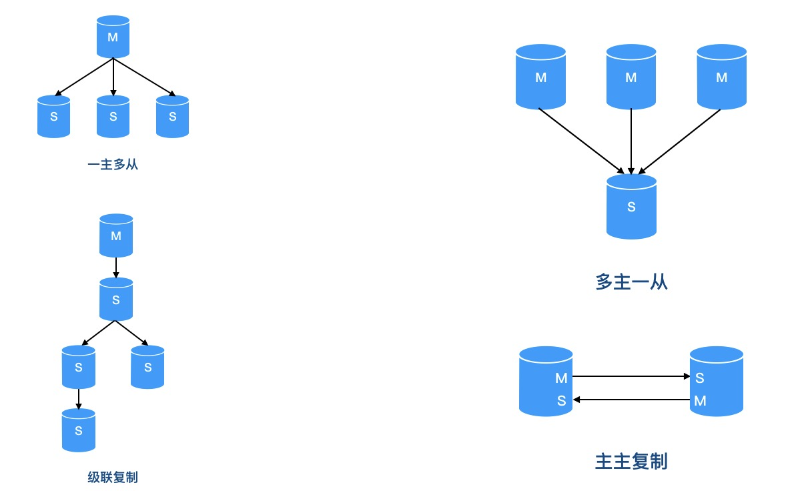
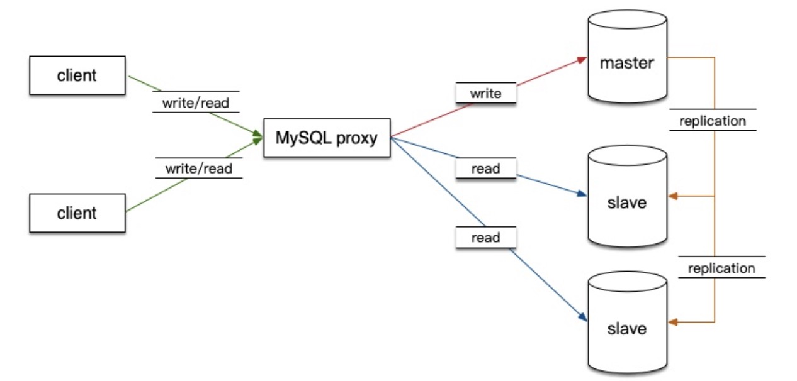
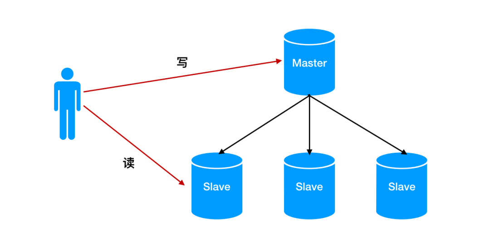
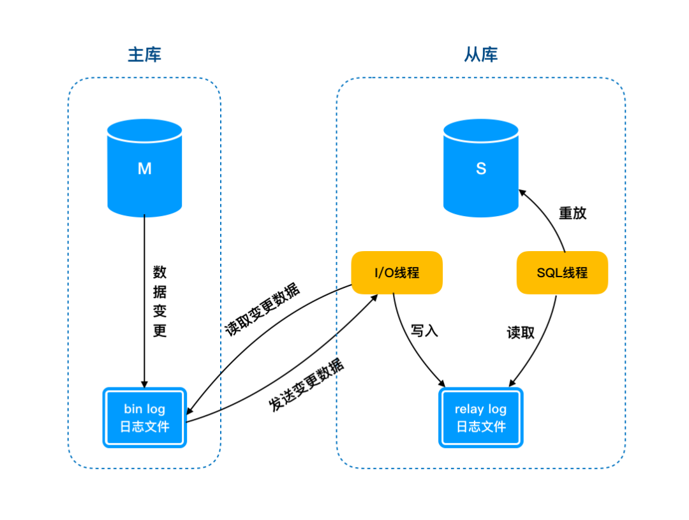
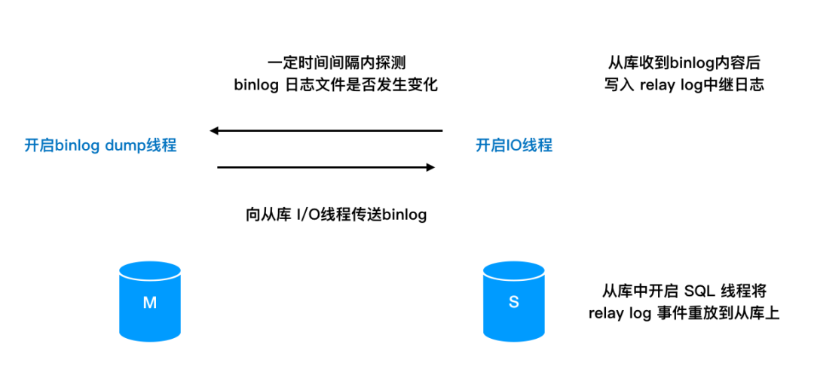
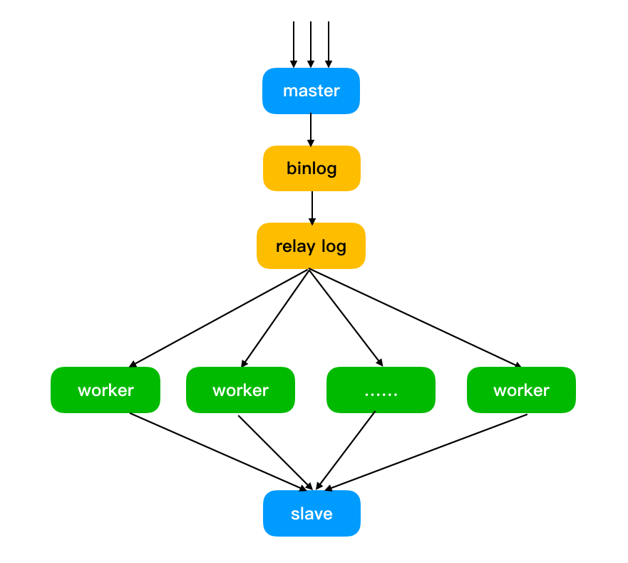

主从复制原理

###一、主从常见架构
随着日益增长的访问量，单台数据库的应接能力已经捉襟见肘。
因此采用 [主库写数据，从库读数据] 这种将读写分离开的主从架构便随之衍生了出来。

在生产环境中，常见的主从架构有很多种，在这里给大家介绍几种比较常见的架构模式。

###二、主从复制原理
了解了主从的基本架构及相关配置后，下面就要进入正题了。
对于主从来说，通常的操作是 主库用来写入数据，从库用来读取数据

读写分离实现：
Mysql中可以实现读写分离的插件有 mysql-proxy / Mycat / Amoeba，
mysql-proxy是实现"读写分离(Read/Write Splitting)"的一个软件（MySQL官方提供 ，也叫中间件），基本的原理是:
在应用和数据库之间增加代理层，代理层接收应用对数据库的请求，根据不同请求类型转发到不同的实例，在实现读写分离的同时可以实现负载均衡。

这样的好处是：
通过将读写压力分散开，避免了所有的请求都打在主库上。同时通过从库进行水平扩展使系统的伸缩性及负载能力也得到了很大的提升。

但是问题就来了，读从库时的数据要与主库保持一致，那就需要主库的数据在写入后同步到从库中。
如何保持主库与从库的数据一致性，主库又是通过什么样的方式将数据实时同步到从库的？

###三、基本原理
Mysql 中主从复制时有两个很重要的日志文件：
- binlog（二进制日志文件）
- relay log（中继日志文件）

在主从同步的过程中，主库会将所有的操作事件记录在 binlog 中，从库通过开启一个 I/O 线程保持与主库的通信，并在一定时间间隔内探测 binlog 日志文件是否发生改变。
如果 binlog 日志发生了变化，主库生成一个 binlog dump 线程向从库 I/O 线程传送 binlog。
从库上的 I/O 线程将 binlog 复制到自己的 relay log 中。
最终由从库中的 SQL 线程读取 relay log 中的事件重放到从库上。

###四、主从延迟原因
上面的流程我们已经知道了主从复制的相关过程了，但是主库有更新就会同步从库，那为什么会出现主从延迟的情况呢？
- 随机重放
    Mysql 主库中写 binlog 的操作是顺序写的，之前我们提到过，磁盘的顺序读写速度是很快的。
    同样的，从库中的 I/O 线程操作日志的速度效率也是很高的。
    但是别忘了，还有一个 SQL 线程来进行数据重放，而重放的过程是随机写盘的。
    到这里你应该就明白了吧，某一时刻 relay log 里的数据来不及重放进从库，就会产生主从延迟的情况。

- 主库并发高
    知道了从库中 SQL 线程的重放情况，对于主库并发高导致主从延迟肯定就不难理解了。
    某一时刻，大量写请求打到主库上，意味着要不断对 binlog 进行写入，此时从库中的 SQL 线程就会应接不暇，自然会产生主从延迟。

- 锁等待
    对于 SQL 单线程来说，当遇到阻塞时就会一直等待，直到执行成功才会继续进行。
    如果某一时刻从库因为查询产生了锁等待的情况，此时只有当前的操作执行完成后才会进行下面的操作，同理也就产生了主从延迟的情况。

###五、主从延迟处理
知道了主从延迟的原因，接下来我们看看如何来进行处理。

- 并行复制
    既然 SQL 单线程进行重放时速度有限，那么能不能采用多线程的方式来进行重放呢？
    MySQL 5.6 版本后，提供了一种并行复制的方式，通过将 SQL 线程转换为多个 work 线程来进行重放，这样就解决了主从延迟的问题。
    
    

- 降低主库并发
    你可能会说了，我现在用的低版本的数据库，也没法升版本啊，那我怎么整。
    对于主库并发高的情况，这种方式你只能通过控制并发来解决延迟了，多用用 Redis。
    
- 读主库
    这种情况你肯定不陌生，对于一些实时性要求比较高的数据，你总不能读从库去拿吧，万一延迟个大半天，你不得贡献自己的年终奖啊。

###六、总结
- 主从复制原理
    主从复制中有两个很重要的日志文件，binlog和relay log，分别位于主库与从库中。
    其中 binlog 是主从复制的基础，通过将操作事件写入 binlog 通过 I/O 线程传送至从库进行同步。

- 主从延迟原因
    1.从库中 SQL 线程重放的过程是随机写盘的，并且 SQL 线程是单线程的，因此数据来不及重放的话就会导致主从延迟。
    2.主库并发高会导致写操作不断写入 binlog，对于 SQL 线程说可能会应接不暇，也会产生主从延迟。
    3.重放过程中如果遇到锁等待也是产生延迟的原因之一。

- 主从延迟处理
    MySQL 5.6版本以后通过并行复制的方式来解决 SQL 单线程产生的主从延迟问题。
    对于低版本来说，可以通过降低主库的并发来解决。
    如果对数据实时性要求比较严格的话，可以通过读主库来达到目的。