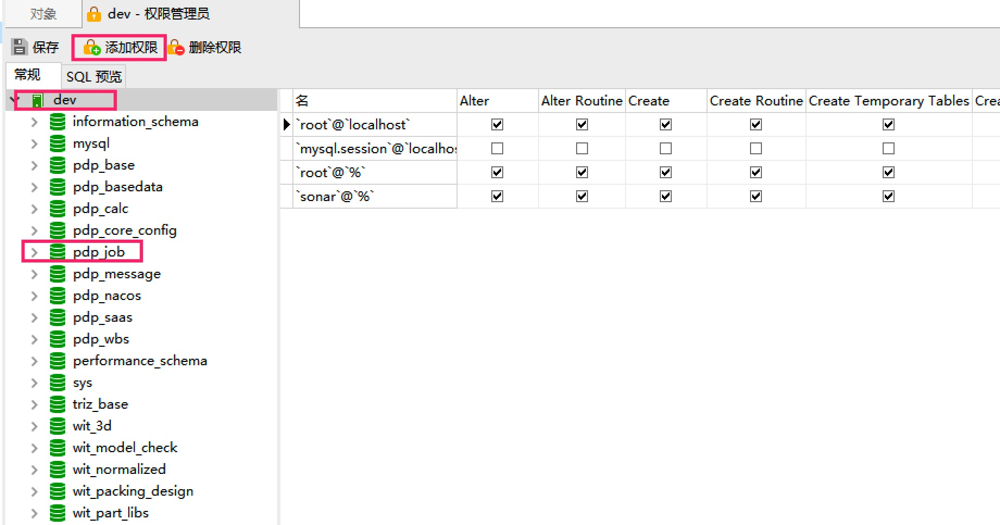

Navicat配置mysql数据库用户权限

用数据库的时候就会遇到有多个用户,分配用户权限的情况，有些用户只读，有些用户可以读写，有些用户只能操作一个或者多个数据库，
如何给mysql的用户设置权限，我这里描述一下如何用navicat图形操作分配用户权限

>如果用sql grant分配权限的话，参考MYSQL数据库管理之权限管理
>基本sql grant命令：
>分配用户单个数据库全部权限：grant all on 数据库名.* to 用户名@’%’ identified by ‘密码’;
>查询数据库用户权限：show grants for 用户名@’%’;

[命令操作](./23.MySQL创建用户并设置权限.md)

### 1.创建用户

[注: 其中的Host配置为%表示所有IP都可以访问]

### 2.分配权限
两种：
#### 2.1 创建用户的同时赋予权限

服务器权限：管理员的权限，普通用户不填
对整个Mysql的权限控制

只针对选择的数据库赋予权限

#### 2.2 创建用户后赋予权限

重点：
在最上层的dev添加权限，是对所有数据库都有效的
选中单个数据库在点击添加权限，是对选中的一个数据库有效

### 3.mysql权限
[参考](https://blog.csdn.net/weixin_40482816/article/details/115539115)

命令：show privileges;

