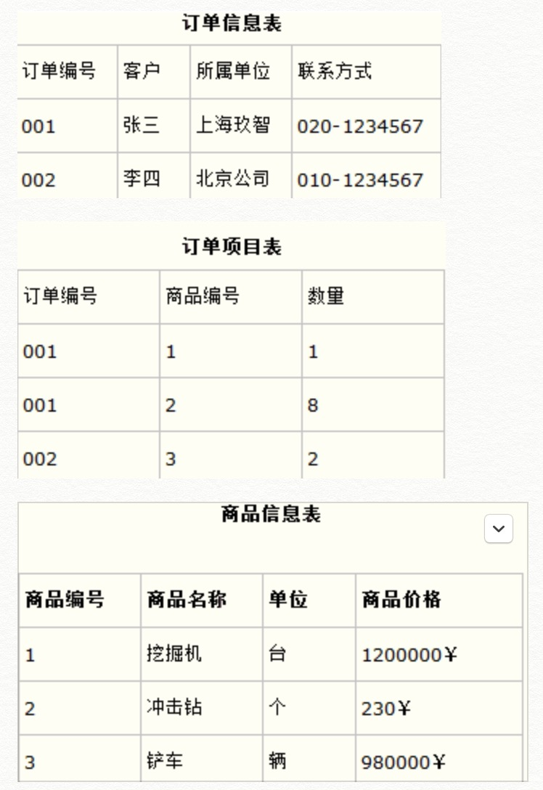

数据库三大范式

概述
一般地，在进行数据库设计时，应遵循三大原则，也就是我们通常说的三大范式，即：
第一范式要求：确保表中每列的原子性，也就是不可拆分；
第二范式要求：确保表中每列与主键相关，而不能只与主键的某部分相关（主要针对联合主键），主键列与非主键列遵循完全函数依赖关系，也就是完全依赖；
第三范式要求：确保主键，列之间没有传递函数依赖关系，也就是消除传递依赖。

简：
1、列的原子性
2、主键和列相关
3、主键和列没有传递依赖

####第一范式
第一范式要求：确保表中每列的原子性，也就是不可拆分；

例子引入
第一种表设计

第二种表设计

分析
第一种表设计不满足第一范式，为什么不满足第一范式？
因为region列不具有原子性，能拆分成省份、市和具体地址；
[白话：字段需要独立]

####第二范式
第二范式要求：确保表中每列与主键相关，而不能只与主键的某部分相关（主要针对联合主键），主键列与非主键列遵循完全函数依赖关系，也就是完全依赖；

例子引入
需求描述：
设计一个订单信息表，订单有多种商品，将订单编号和商品编号作为联合主键。
第一种表设计

第二种表设计

分析
第一种表设计不满足第二范式:
订单编号和商品编号作为联合主键，由于商品名称，单位，价格这几列只与商品编号有关，与订单编号无关，因此与主键（联合主键）无关，违反范式第二原则；

第二种表设计满足第二范式，把第一种设计表进行拆分，把商品信息分离到另一个表中，把订单项目表也分离到另一个表中。
[白话：表需要独立]

####第三范式
第三范式要求：确保主键，列之间没有传递函数依赖关系，也就是消除传递依赖。

例子引入
需求描述：
1 需要在数据库中存储如下信息：
2 学生编号；学生卡号；用户ID号；操作员级别；操作日期；操作时间；

第一种表设计

第二种表设计

分析
第一种表设计不满足第三范式:
在表中，一个UserID能确定一个UserLevel。这样，UserID依赖于StudentNo和CardNo，而UserLevel又依赖于UserID，这就导致了传递依赖，3NF就是消除这种依赖。

第二种表设计满足第三范式，将第一种表格拆分成成两个表格。
[白话：表中冗余了用户ID，则可以根据用户ID获取到用户名，而不需要冗余用户名]