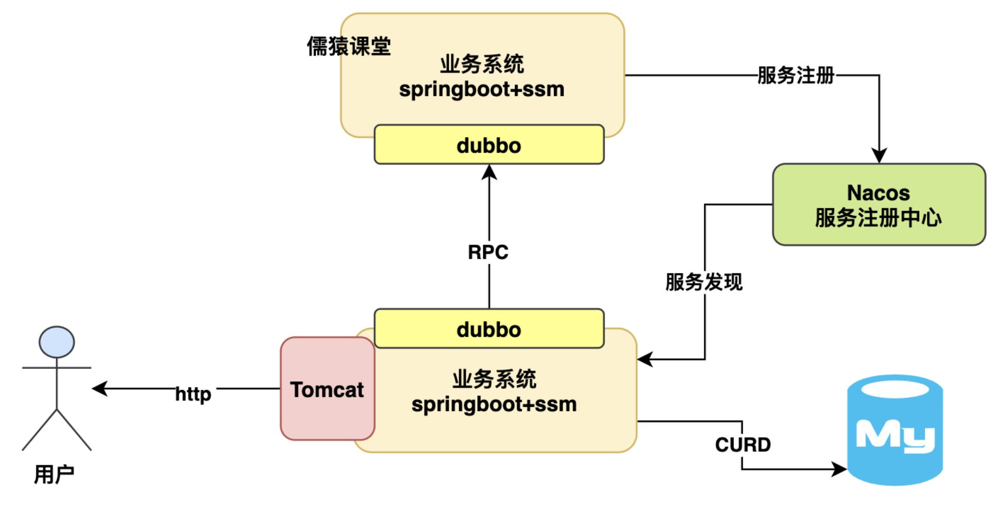

Mysql并发

数据库瓶颈 300-700并发，机械硬盘：300，固态硬盘：700 

###一般业务系统运行流程图
首先，我们先来看一个最最基础的java业务系统连接数据库运行的架构,其实简单来说:
我们平时都是用spring boot+ssm技术栈开发一个java业务系统的，用spring boot内嵌tomcat就可以对外提供http接口了，
然后最多现在会加上nacos+dubbo调用别的系统接口，数据全部靠连接mysql数据库进行crud就可以了
如下图:

上面那种架构的系统，估计就是很多兄弟日常做的最多的系统架构了，
有的兄弟稍微做的高大上一点，大概来说，可能就是会加入一些es、redis、rocketmq一类的中间件简单使用一下，但是大致来说也就这么回事了，
那么还是回归主题，大家知道你上述那种系统下，他连接的数据库能抗多大压力吗？

###一台4核8G的机器能扛多少并发量呢？
说实话，要解决这个问题，一般来说，不是先聊数据能抗多少压力，因为往往不是数据库先去抗高并发，而是你连接数据库的web系统得先去抗高并发！
也就是我们的spring boot+ssm那套业务系统能抗多高并发我们得先搞清楚！

所以要搞明白这个问题，就得先说一个主题:
一般来说我们的spring boot应用系统大致就是部署在2核4G或者4核8G的机器上，这个机器配置其实是很关键的，
所以这里直接告诉大家一个经验值:
即使说咱们如果部署的是一个4核8G的机器，然后spring boot内嵌的tomcat默认开了200个线程来处理请求，
接着每个请求都要读写多次数据库，那么此时，大致来说你的一台机器可以抗大概[500~1000]这个并发量，具体多少得看你的接口复杂度
如下图:

###高并发来袭时数据库会先被打死吗？
所以其实一般来说，当你的高并发压力来袭的时候，通常不会是数据库先扛不住了，而是你的业务系统所在机器抗不住了，
比如你部署了2台机器，那么其实到每秒一两千并发的时候，这两台机器基本上cpu负载都得飙升到90%以上 ，压力很大，而且接口性能会开始往下掉很多了
如下图:

那么这个时候我们的数据库压力会如何呢？
其实一般来说你的两台机器抗下每秒一两千的请求的时候后，数据库压力通常也会到一个小瓶颈，因为为什么呢？
关键是你的业务系统处理每个业务请求的时候，他是会读写多次数据库的，所以业务系统的一次请求可能会导致数据库有多次请求，
也正因为这样，所以此时可能你的数据库并发压力会到[几千]的样子。

###8核16G的数据库每秒大概可以抗多少并发压力？
那么所以下一个问题来了，你的数据库通常是部署在什么样配置的机器上？
一般来说给大家说，数据库的配置如果是那种特别低并发的场景，其实2核4G或者4核8G也是够了，
但是如果是常规化一点的公司的生产环境数据库，通常会是8核16G。

那么8核16G的数据库每秒大概可以抗多少并发压力？
[大体上来说，在几千这个数量级。]

因为这个具体能抗多少并发也得看你数据库里的数据量以及你的SQL语句的复杂度，
所以一般来说8核16G的机器，大概也就是抗到每秒几千并发就差不多了，量再大基本就扛不住了，
因为往往到这个量级下，数据库的cpu、内存、网络、io的负载基本都很高了，尤其是cpu，可能至少也在百分之七八十了
如下图:
