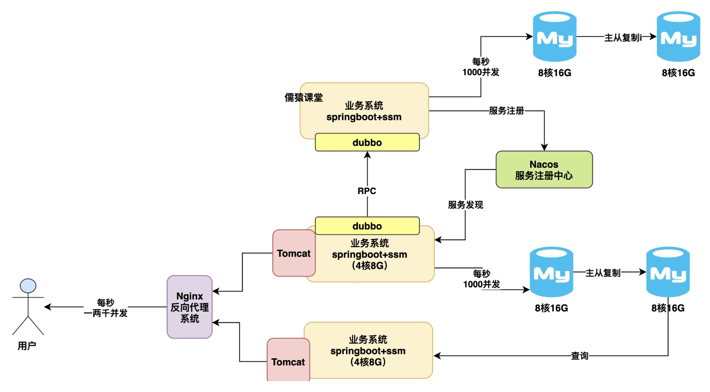

Mysql高并发优化

###1.根据业务系统拆分多个数据库机器优化方案
如果到并发压力，通常来说可以如何进行数据库架构的优化呢？
其实也简单，我们完全可以加机器，把数据库部署到多台机器上去。

因为通常来说，我们的一个数据库里会放很多业务系统的db和tables，所以首先就是可以按照业务系统来进行拆分:
比如说多加一台机器，再部署一个数据库，然后这里放一部分业务系统的db和tables，老数据库机器放另外一部分业务系统的db和tables，
此时一下子就可以缓解老数据库机器的压力了
如下图:

###2. 读写分离架构优化方案
那么接着问题来了，如果说并发压力继续提升，导致拆分出去的两台数据库压力越来越大了呢？
此时可以上一招，叫做读写分离:
就是说给每个数据库挂一个从库，让主数据库基于binlog数据更新日志同步复制给从数据库，让主从数据库保持数据一致，
然后我们的系统其实可以[往主库里写入，在从库里查询]，此时就又可以缓解原来的主数据库的压力了
如下图:

###3. 分库分表架构优化方案
再往下说，如果说即使是给主数据库挂了从库，然后接着并发压力继续提升，让我们的[主数据库写入压力过大]，每秒几千写入，又要扛不住了呢？
此时就只能上终极方案，分库分表了:
就是把主库拆分为多个库，每个库里放一个表的部分数据，然后用多个主库抗高并发写入压力，这样就可以再次分散我们的压力了
如下图:

总结
其实我们的数据库架构演进基本上就是按照今天说的这个顺序和思路逐步逐步的演进的:
刚开始你单台数据库机器抗几千并发扛不住了，就按照业务系统拆分多个数据库机器，然后再扛不住了，就上主从架构分摊读写压力，再扛不住了就分库分表，多个机器抗数据库写入压力，
sss最后总是可以用数据库架构抗住高并发压力的。

