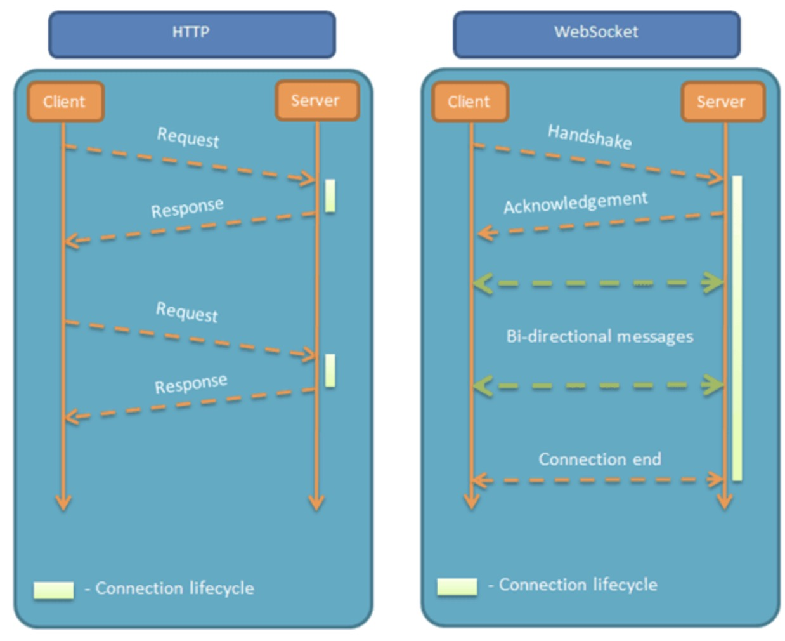
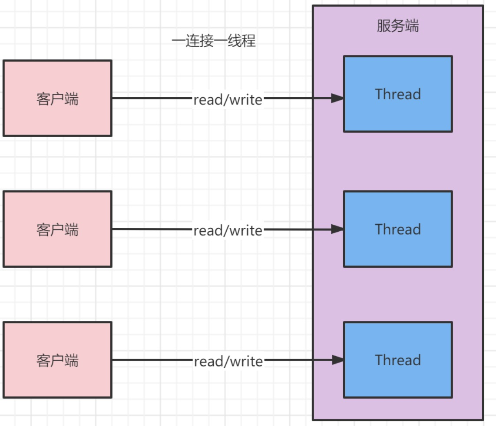
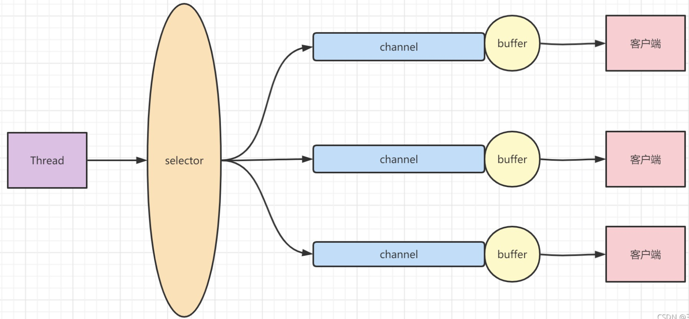
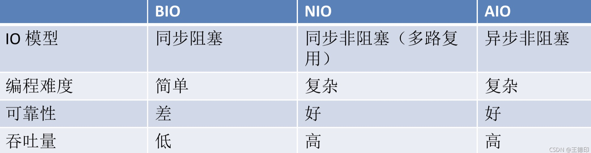
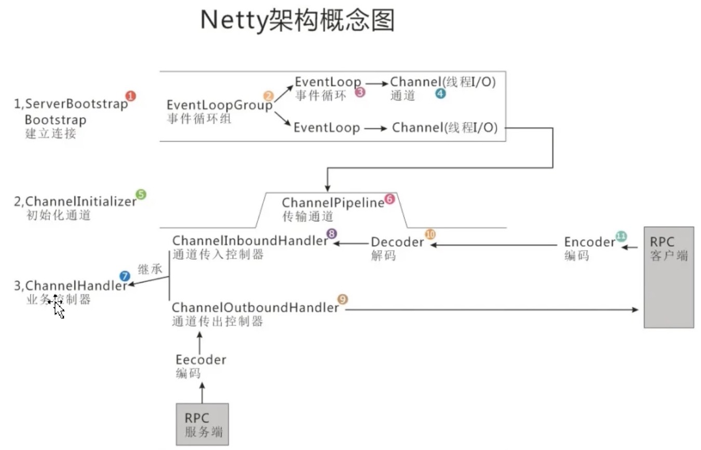

概述

####1.背景
实际的工作开发中，必然会遇到一些需要网页与服务器端保持连接（起码看上去是保持连接）的需求：
比如类似微信网页版的聊天类应用
比如需要频繁更新页面数据（实时数据例如天气，电流电压，pm2.5等等这样类似的数据）的监控系统页面或股票看盘页面
比如服务器读取MySQL或者redis或者第三方的数据主动推送给浏览器客户端等等业务场景。

1.2.我们通常采用如下几种技术：
（1）短轮询：前端利用ajax定期向服务器发起http请求，无论数据是否更新立马返回数据。
    这样存在的缺点就是，一方面如果后端数据木有更新，那么这一次http请求就是无用的，
    另一方面高并发情况下，短链接的频繁创建销毁，以及客户端数量过大造成过多无用的http请求，都会对服务器和带宽造成压力，
    短轮询只适用于客户端连接少，并发量不高的场景；
（2）长轮询：利用comet不断向服务器发起请求，服务器将请求暂时挂起，直到有新的数据的时候才返回，相对短轮询减少了请求次数得到了一定的优化，
    但是在高并发的场景下依然不适用；
（3）SSE：服务端推送（Server Send Event），在客户端发起一次请求后会保持该连接，服务器端基于该连接持续向客户端发送数据，从HTML5开始加入。
（4）Websocket：这是也是一种保持长连接的技术，并且是双向的，从HTML5开始加入，并非完全基于HTTP，适合于频繁和较大流量的双向通讯场景，
    是服务器推送消息功能的最佳实践。而实现websocket的最佳方式，就是netty。
    
    
####2.websocket
2.1.什么是websocekt呢？
websocket是一种在单个TCP连接上进行全双工通信的协议。也就是一种保持长连接的技术，并且是双向的。
websocket协议本身是构建在http协议之上的升级协议，客户端首先向服务器端去建立连接，这个连接本身就是http协议只是在头信息中包含了
一些websocket协议的相关信息，一旦http连接建立之后，服务器端读到这些websocket协议的相关信息就将此协议升级成websocket协议。
WebSocket使得客户端和服务器之间的数据交换变得更加简单，允许服务端主动向客户端推送数据。
在WebSocket API中，浏览器和服务器只需要完成一次握手，两者之间就直接可以创建持久性的连接，并进行双向数据传输。
简单理解，就是一种通讯协议，重点是websocket的实现方式：netty。

2.2.特点：
与 HTTP 协议有着良好的兼容性。默认端口也是80和443，并且握手阶段采用 HTTP 协议，因此握手时不容易屏蔽，能通过各种 HTTP 代理服务器。
依赖于TCP协议
数据格式比较轻量，性能开销小，通信高效。
可以发送文本，也可以发送二进制数据。
没有同源限制，客户端可以与任意服务器通信。
协议标识符是ws（如果加密，则为wss），服务器网址就是 URL

[SpringBoot整合websocket](../Spring%20Cloud/1.SpringBoot/5.SpringBoot%20整合websocket.md)

####3.socket
（1）网络编程本质就是说两个设备之间信息的发送与接收，通过操作相应API调度计算机硬件资源，并且利用管道（网线）进行数据交互的过程。
    相关技术点像ISO七层模型，TCP三次握手/四次挥手等网络编程的基础不再赘述
（2）而socket是对TCP/IP协议的封装，Socket本身并不是协议，而是一个调用接口（API），通过Socket发起系统调用操作系统内核，我们才能使用TCP/IP协议。
（3）我们经常说的I/O，在计算机中指Input/Output,即输入输出，实质上IO分为两种：
    一种是磁盘IO，磁盘上的数据读取到用户空间，那么这次数据转移操作其实就是一次I/O操作，也就是一次文件I/O
    一种是网络IO，当一个客户端和服务端之间相互通信,交互我们称之为网络io(网络通讯)

####4.Java IO模型
有BIO（同步阻塞IO）、NIO（同步非阻塞IO）、AIO（异步IO），netty就是一个NIO的高性能的框架。
1.BIO：传统的IO，同步阻塞IO模型，单向传输，面向流，适用于连接数目比较少且固定的架构，
       这种方式对服务器资源要求比较高，并发局限于应用中，服务器实现模式为一个连接一个线程，即客户端有连接请求时服务器端就需要启动一个线程进行处理，
       如果这个连接不做任何事情会造成不必要的线程开销，可以通过线程池机制改善(实现多个客户连接服务器)。
       
       
2.NIO：同步非阻塞IO模型，双向传输，面向Buffer，适用于连接数据多且连接比较短的架构，如聊天服务器，弹幕系统，服务器间通讯等；
       服务器实现模式为一个线程处理多个连接（一个请求一个线程），包含: Selector 、Channel 、Buffer三大组件。
       2.1.selector选择器：用一个线程处理多个客户端的连接，就会使用到selector选择器，
            selector用于监听多个通道上是否有事件发生（比如连接请求，数据到达等），如果有事件发生，便获取事件然后针对于每个事件进行相应的处理，
            因此可以使用单个线程就可以监听多个客户端通道。
       2.2.channel通道：Channel管道和Java IO中的Stream(流)是差不多一个等级的。
            只不过Stream是单向的，譬如：InputStream, OutputStream.而Channel是双向的，同时进行读写数据，而流只能读或者写。
            可以实现异步读写数据，可以从缓冲区读数据，也可以写数据到缓冲区。
       2.3.buffer缓冲区：Buffer本质上是一个可以读写的内存块，可以理解成容器对象，底层是有一个数组，通过buffer实现非阻塞机制，该对象提供了一组方法，
            可以轻松的使用内存块，缓冲区对象内置了一些机制，能够跟踪和记录缓冲区的状态变化情况。
            Channel提供了从文件，网络读取数据的通道，但是读取和写入的数据必须经过buffer。
       
            
3.AIO：异步IO模型，使用于连接数目多且连接比较长（重操作）的架构，比如相册服务器，充分 调用OS参与并发操作，编程比较复杂。
       在Linux底层用epoll(一种轮询模型)，aio多包了一层封装，aio的api更好用。
       Windows上的aio是自己实现的，不是轮询模型是事件模型，完成端口实现的，要比linxu上的aio效率高。
       

####5.Netty
1.Netty由JBOSS提供的一个开源框架。现为github上的独立项目
2.Netty是一个异步的、基于事件驱动的网络应用框架，用于快速开发高性能、高可靠性的网络IO程序
3.Netty主要是针对TCP/IP协议下，面向客户端的高并发应用，或者peer-to-peer场景下的大量数据的持续传输的应用
4.Netty本质是NIO框架，适用于服务器通讯相关的多种应用场景
5.Netty可以构建Http服务器、socket服务器、websocket服务器等
[官网](https://netty.io/index.html)

5.2.特点：
高并发：Netty 是一款基于 NIO（Nonblocking IO，非阻塞IO）开发异步事件驱动的高性能网络通信框架，
       nio使用了select模型（多路复用器技术），从而使得系统在单线程的情况下可以同时处理多个客户端请求。
       Netty使用了Reactor模型，Reactor模型有三种多线程模型，netty是在主从 Reactor 多线程模型上做了一定的改进。
       Netty有两个线程组，一个作为bossGroup线程组,负责客户端接收,一个workerGroup线程组负责工作线程的工作(与客户端的IO操作和任务操作等等)，
       Netty 的所有 IO 操作都是异步非阻塞的，通过 Future-Listener 机制，用户可以方便的主动获取或者通过通知机制获得 IO 操作结果。
       他的并发性能得到了很大提高。
传输快：Netty 的传输依赖于零拷贝特性，实现了更高效率的传输。
       零拷贝要求内核（kernel）直接将数据从磁盘文件拷贝到Socket缓冲区（套接字），而无须通过应用程序。
       零拷贝减少不必要的内存拷贝，不仅提高了应用程序的性能，而且减少了内核态和用户态上下文切换。
封装好：Netty 封装了 NIO 操作的很多细节，提供了易于使用调用接口。

5.3.应用场景：
①现在物联网的应用无处不在，大量的项目都牵涉到应用传感器和服务器端的数据通信，Netty作为基础通信组件进行网络编程。
②现在互联网系统讲究的都是高并发、分布式、微服务，各类消息满天飞，Netty在这类架构里面的应用可谓是如鱼得水，如果你对当前的各种应用服务器不爽，
    那么完全可以基于Netty来实现自己的HTTP服务器，FTP服务器，UDP服务器，RPC服务器，WebSocket服务器，Redis的Proxy服务器，MySQL的Proxy服务器等等。
    现在非常多的开源软件都是基于netty开发的，例如阿里分布式服务框架 Dubbo 的 RPC 框架，淘宝的消息中间件 RocketMQ；
③游戏行业：无论是手游服务端还是大型的网络游戏，Java 语言得到了越来越广泛的应用。
    Netty 作为高性能的基础通信组件，它本身提供了 TCP/UDP 和 HTTP 协议栈。
    地图服务器之间可以方便的通过 Netty 进行高性能的通信。
④大数据：开源集群运算框架 Spark；分布式计算框架 Storm；

5.4.Netty线程模型：
单线程模型
    指的是所有的IO操作都在同一个NIO线程上完成，一个线程既要处理客户端连接还要处理客户端的读写操作
多线程模型
    多线程模型与单线程模型最大的区别就是有一组NIO(线程池)线程处理IO操作
主从多线程模型
    服务端有两个线程池，主线程池主要处理客户端的连接，从线程池主要处理客户端的读写