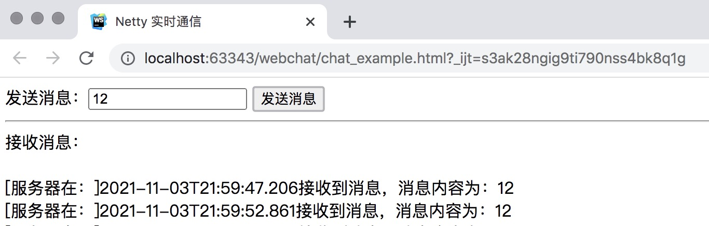

netty websocket示例


####1.添加依赖
```xml
<dependency>
   <groupId>io.netty</groupId>
   <artifactId>netty-all</artifactId>
   <version>4.1.50.Final</version>
</dependency>
```


1.2.搭建websocket服务器
[WebSocketServer](2.netty websocket示例/WebSocketServer.java)
过程：
1.创建服务启动类
2.设置主从线程池
3.添加channel通道
4.添加处理器
5.设置监听端口
6.关闭


1.3.初始化器
[WebSocketServerInitializer](2.netty websocket示例/WebSocketServerInitializer.java)
设置拦截路径


1.4.自定义助手类
处理消息 以及 动作监听
[ChatHandler](2.netty websocket示例/ChatHandler.java)


####2.前端
[chat_example](2.netty websocket示例/chat_example.html)


####3.测试
启动服务器：WebSocketServer
