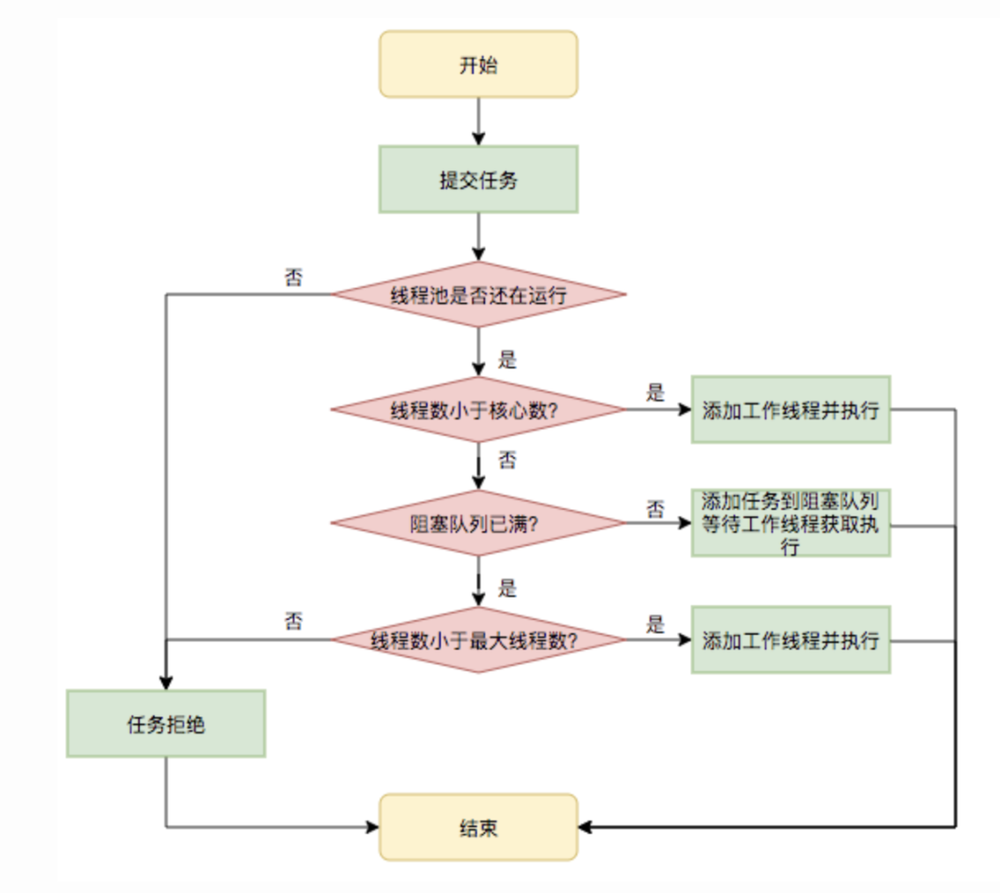

总


###创建多线程的两种方式：
1: 继承Thread类	
2: 实现Runnable接口
可返回值的任务必须实现Callable接口，无返回值的任务必须实现Runnable接口。


####1、线程的生命周期
####1.1.五种状态：
新建（new Thread）：当创建Thread类的一个实例（对象）时，此线程进入新建状态（未被启动）。
例如：Thread  t1=new Thread();

就绪（runnable）：线程已经被启动，正在等待被分配给CPU时间片，也就是说此时线程正在就绪队列中排队等候得到CPU资源。
例如：t1.start();

运行（running）：线程获得CPU资源正在执行任务（run()方法），此时除非此线程自动放弃CPU资源或者有优先级更高的线程进入，线程将一直运行到结束。

堵塞（blocked）：由于某种原因导致正在运行的线程让出CPU并暂停自己的执行，即进入堵塞状态。
正在睡眠：用sleep(long t) 方法可使线程进入睡眠方式。一个睡眠着的线程在指定的时间过去可进入就绪状态。
正在等待：调用wait()方法。（调用motify()方法回到就绪状态）
被另一个线程所阻塞：调用suspend()方法。（调用resume()方法恢复）

死亡（dead）：当线程执行完毕或被其它线程杀死，线程就进入死亡状态，这时线程不可能再进入就绪状态等待执行。
自然终止：正常运行run()方法后终止
异常终止：调用stop()方法让一个线程终止运行


####1.2.终止正在运行的线程
1.使用退出标志，使线程正常退出，也就是当run方法完成后线程终止。
2.使用stop方法强行终止，但是不推荐这个方法，因为stop和suspend及resume一样都是过期作废的方法。
3.使用==interrupt方法中断线程==，是通过启动一个线程去通知当前真正运行的线程,告诉它你别运行了，可以停止了。而不是强者进行停止

我们都知道interrupt是中断的意思，最终的决定权还是在被通知的线程，看它心情，可以停止也可以不停止。
使用：thread.interrupt();


####1.3.判断线程是否停止状态
Thread.java类中提供了两种方法：
1. this.interrupted(): 测试 **当前线程** 是否已经中断；
2. this.isInterrupted(): 测试线程是否已经中断；
interrupted()是静态方法：内部实现是调用的**当前线程**的isInterrupted()，并且会重置当前线程的中断状态(true)[状态会变]
isInterrupted()是实例方法，是调用该方法的**对象所表示的那个线程**的isInterrupted()，不会重置当前线程的中断状态(false)[状态不变]


###2、线程通信
[多个线程并发执行时, 在默认情况下CPU是随机切换线程的]，当我们需要多个线程来共同完成一件任务，
并且我们希望他们有规律的执行, 那么多线程之间需要一些 协调 通信，以此来帮我们达到多线程共同操作一份数据
多个线程在处理同一个资源，并且任务不同时，需要线程通信来帮助解决线程之间对同一个变量的使用或操作。
就是多个线程在操作同一份数据时， 避免对同一共享变量的争夺

于是引出了 等待唤醒机制：（wait()、notify()）:
就是在一个线程进行了规定操作后，就进入等待状态（wait）， 等待其他线程执行完他们的指定代码过后 再将其唤醒（notify）；

####2.1.wait()方法：
线程调用wait()方法，[释放它对锁的拥有权]，同时他会在等待的位置加一个标志，为了以后使用notify()或者notifyAll()方法  唤醒它时，
它好能从当前位置获得锁的拥有权，变成[就绪状态]，要确保调用wait()方法的时候拥有锁，
即，[wait()方法的调用必须放在synchronized方法或synchronized块中]。  
在哪里等待被唤醒时，就在那里开始执行。

####2.2.notify/notifyAll()方法：
notify()方法：会[随机]唤醒一个等待当前对象的锁的线程。唤醒在此对象监视器上等待的[单个]线程。
notifyAll()方法： 会唤醒在此对象监视器上等待的[所有]线程。

当执行notify/notifyAll方法时，会唤醒一个处于等待该 对象锁 的线程，然后继续往下执行代码，直到执行完，
退出对象锁锁住的区域（synchronized修饰的代码块）后再释放锁，才能执行唤醒的线程。
故：不要在notify/notifyAll()后面再写一些耗时的代码。

####2.3.其他：
[wait() 与 notify() 需要搭配 synchronized 关键字使用]

await() 和 signal() 的使用方式: 方便同一个锁中实现基于多个条件的线程间挂起与唤醒操作
wait() 和 notify() 方法是 Object 的方法， 而 await() 和 signal() 方法是接口 Condition 的方法
Lock 替代了 synchronized 方法和语句的使用，Condition 替代了 Object 监视器方法的使用
Lock 实例获得 Condition 实例:使用其 newCondition() 方法

join的效果是：一个线程等待另一个线程（直到结束或者持续一段时间）才执行，那么谁等待谁？
在哪个线程调用，哪个线程就会等待；调用的哪个Thread对象，就会等待哪个线程结束；

await/wait 与sleep、yield 区别：
[
 sleep和yield:不释放锁
 await/wait:释放锁
 synchronized中发生异常，释放锁
]

yield方法将会暂停当前正在执行的线程对象，并执行其他线程，他始终都是RUNNABLE就绪状态。
不过要注意，可以认为yield只是一种建议性的，如果调用了yield方法，对CPU时间片的分配进行了“礼让”，他仍旧有可能继续获得时间片，
并且继续执行, 所以一次调用yield 并不一定会代表肯定会发生什么。

yield和sleep方法都是Thread类的，而wait方法是Object类的，await方法是Condition条件的。
yield和sleep方法可以放在线程中的任意位置，而await/wait方法必须放在同步块里面，否则会产生运行时异常。


###3、线程同步 
三大特性：
原子性：解决操作原子执行
可见性：解决多线程的本地内存的隔离
有序性：解决编码重排序

线程的同步是：为了防止多个线程在访问同一个数据对象时，线程并发带来的数据错误。
[Synchronized  互斥锁，可重入锁，原子性，可见性，有序性，非公平性]

Synchronized不是锁定的代码块，锁定的是对象。改变对象中的markword实现加锁，一个对象只有一个锁。
[锁中出现异常，锁会被释放。应该try-catch处理]

Synchronized关键字不能继承。
父类中的某个方法使用了Synchronized关键字，而在子类中覆盖了这个方法，则子类的这个方法默认情况下并不是同步的，
而必须显示的在子类的这个方法中加上Synchronized关键字才可以。
[同步损害并发性，应该尽可能缩小同步范围]

总结：
要想并发程序正确地执行，必须要保证原子性、可见性以及有序性。只要有一个没有被保证，就有可能会导致程序运行不正确。


###4、线程调度
####4.1: 休眠：
线程休眠的目的是使线程让出CPU的最简单的做法之一，线程休眠时候，会将CPU资源交给其他线程，以便能轮换执行，当休眠一定时间后，
线程会苏醒，进入准备状态等待执行。

线程休眠的方法是：
Thread.sleep(long millis)和Thread.sleep(long millis, int nanos)，均为静态方法，那调用sleep休眠的哪个线程呢？
简单说，哪个线程调用sleep，就休眠哪个线程。
[Thread.sleep 不释放锁]


####4.2：优先级：
与线程休眠类似，线程的优先级仍然无法保障线程的执行次序。只不过，优先级高的线程获取CPU资源的 概率较大，优先级低的并非没机会执行。
线程的优先级用1-10之间的整数表示，数值越大优先级越高，默认的优先级为5。

注：
在一个线程中开启另外一个新线程，则新开线程称为该线程的子线程，子线程初始优先级与父线程相同。

示例：
Thread t1 =new MyThread1();
t1.setPriority(10);


####4.3: 让步：
线程的让步含义就是使当前运行着线程让出CPU资源，但是扔给谁不知道，仅仅是让出，线程状态回到可运行状态。

线程的让步方法是：
Thread.yield()，yield()为静态方法，功能是暂停当前正在执行的线程对象，线程状态回到可运行状态，然后所有线程重新分配执行。


####4.4: 合并：
线程的合并的含义：将几个并行的线程合并为一个单线程执行。
应用场景是：当一个线程必须等待另一个线程执行完毕才能继续执行，可以使用join方法。

join为非静态方法，
定义如下：join是Thread类的方法，启动线程后直接调用，作用是：等待该线程终止 。
注意：该线程是指：主线程等待子线程的终止。

即：子线程调用了join()方法后，主线程只有等到子线程结束后才能执行。


###5、volatile关键字
轻量级的同步机制：Volatile 比使用synchronized的成本更加低，因为它不会引起线程上下文的切换和调度

[可见性，有序性，不保证原子性]
不保证原子性：n++ / n=n+1

解决原子性：
1、synchronized锁
2、Lock锁
3、AtomicInteger原子量 底层：CAS

volatile关键字作用：
第一：使用volatile关键字会强制将修改的值立即写入主存
第二：使用volatile关键字的话，当线程2进行修改时，==会导致线程1的工作内存中缓存变量的 缓存行无效
    （反映到硬件层的话，就是CPU的L1或者L2缓存中对应的缓存行无效）
第三：由于线程1的工作内存中缓存变量的缓存行无效，所以线程1再次读取变量的值时会去主存读取。
第四：volatile还起到 内存屏障 的作用，保证了有序性。

总：加了volatile，我改了后会通知其他线程变量无效，重新读取。


###6、线程池


Executors: 线程池工具类
newCachedThreadPool-可变尺寸的线程池(缓存线程池)  注：没有大小，无限大至内存大小
newFixedThreadPool-固定大小的线程池 
ScheduledThreadPool-调度线程池,  池子里的线程可以按schedule依次delay执行，或周期执行
SingleThreadExecutor-单例线程池,  池中只能有一个线程

####6.1.线程池的创建不推荐使用Executors直接创建：
FixedThreadPool 和 SingleThreadPool : workQueue队列长度为 Integer.MAX_VALUE ,可能会 堆积大量的请求，从而导致 OOM 
当处理任务的速度赶不上任务提交的速度的时候，就可能会让大量任务堆积在workQueue中，从而引发OOM异常。

CachedThreadPool 和 ScheduledThreadPool : 允许的创建线程数量为 Integer.MAX_VALUE ,可能会 创建大量 的线程，从而导致 OOM 

所以：线程池的使用我们直接使用自定义线程池：new ThreadPoolExecutor(...)

####6.2.七大参数：
corePoolSize： 线程池中核心线程数量 。核心池是线程池的常驻部分，内部的线程一般不会被销毁。
maximumPoolSize： 最大线程数量 。
keepAliveTime ：空闲时间，除了核心线程，多余线程的存活时间
unit： 时间单位 。
workQueue： 当核心线程工作已满，需要存储任务的队列。 
threadFactory： 创建线程的工厂 。
handler： 当队列满了之后的拒绝策略。

####6.3.拒绝策略
什么是拒绝策略呢？
当队列满了，如何处理那些仍然提交的任务。
JDK 默认有4种策略：
AbortPolicy ：直接抛出异常，阻止系统正常工作.
CallerRunsPolicy : 在调用者线程中（也就是说谁把 r 这个任务甩来的），运行当前被丢弃的任务，只会用调用者所在线程来运行任务，
                   也就是说任务不会进入线程池，如果线程池已经被关闭，则直接丢弃该任务。 
DiscardOldestPolicy: 该策略将丢弃最老的一个请求，也就是即将被执行的一个任务，并尝试再次提交当前任务. 
DiscardPolicy: 该策略默默地丢弃无法处理的任务，不予任何处理，如果允许任务丢失，我觉得这是最好的方案.


####6.4.设置线程数
- CPU密集型（加密、计算hash等）：最佳线程数设置为CPU核心数+1。
- 耗时I/O型（读写数据库、文件、网络读写等）：最佳线程数一般会大于CPU核心数很多倍，以JVM监控显示繁忙情况为依据，保证线程空闲可以衔接上。
  参考Brain Goezt推荐的计算方法：线程数=CPU核心数 × (1+平均等待时间/平均工作时间) 
- 3核 128-256

  


###7、Lock
java.util.concurrent.locks 包下

实现类：
ReentrantLock 底层：CAS
ReentrantLock，手动锁，可重入锁，是一种递归无阻塞的同步机制。排他锁[同一时刻仅有一个线程可以进行访问]，非/公平锁
可以替代synchronized。

注：必须要手动释放锁，一般写于finally中。[Synchronized遇到异常会释放锁，ReentrantLock必须手动释放]

公平锁：谁等的时间长，下一个就选谁。公平锁与非公平锁的区别在于公平锁的锁获取是有顺序的。
       但是公平锁的效率往往没有非公平锁的效率高，在许多线程访问的情况下，公平锁表现出较低的吞吐量。

非公平锁和公平锁区别：
比较非公平锁和公平锁获取同步状态的过程，会发现两者唯一的区别就在于:
公平锁在获取同步状态时多了一个限制条件：hasQueuedPredecessors()
该方法主要做一件事情：主要是判断当前线程是否位于CLH同步队列中的第一个。如果是则返回true，否则返回false。


###8、ReadWriteLock
实现类：ReentrantReadWriteLock

ReadWriteLock 维护了一对相关的锁定，一个用于只读操作，另一个用于写入操作。
在同一时间可以允许多个读线程同时访问，但是在写线程访问时，所有读线程和写线程都会被阻塞。

注：读锁是共享锁，写锁是排他锁


###9、Synchronized 和 Lock 有什么区别
1、原始构成
Synchronized 是关键字 属于JVM层面，
monitorenter(底层是通过monitor对象来完成，其实wait/notify等方法也依赖于monitor对象，且只有在同步块或方法中才能调用wait/notify等方法)
	monitorexit
Lock 是具体类（java.util.concurrent.locks.lock）是API层面的锁

2、使用方法
Synchronized不需要用户去手动释放锁，当Synchronized代码执行完后系统会自动让线程释放对锁的占用
ReentrantLock则需要用户去手动释放锁，若没有主动释放则有可能出现死锁的现象，需要lock()和unlock()方法配合try/finally语句块来完成

3、等待是否可中断
Synchronized 不可中断，除非抛出异常或者正常运行完成
ReentrantLock 可中断，	

1. 设置超时方法tryLock(long timeout, TimeUnit unit)

2. lockInterruptibly()放代码块中，调用interrupt()方法可中断

4、加锁是否公平
Synchronized 非公平锁
ReentrantLock 两者都可以，默认公平锁，构造方法可以传入boolean值，true为公平锁，false为非公平锁

5、锁绑定多个条件Condition
Synchronized 没有
ReentrantLock 用来实现分组唤醒需要唤醒的线程们，可以精确控制，而不是像Synchronized要么随机唤醒一个线程要么唤醒全部线程。


###10、可重入

可重入锁，就是说一个线程在获取某个锁后，还可以继续获取该锁，即允许一个线程多次获取同一个锁

12、信号量Semaphore

其本质上是一个“共享锁”。默认非公平

Semaphore 通常用于：限制 同时访问公共资源（物理或逻辑的）的线程数目。【单接口限流】


###11、JUC

ConcurrentHashMap 仅仅锁定map的某个部分，而Hashtable则会锁定整个map。

CopyOnWrite 我们往一个容器添加元素的时候，不直接往当前容器添加，而是先将当前容器进行Copy，复制出一个新的容器，然后新的容器里添加元素，添加完元素之后，再将原容器的引用指向新的容器。

读操作性能很高，因为无需任何同步措施，比较适用于读多写少的并发场景。


ConcurrentLinkedQueue 同步队列

LinkedBlockingQueue 阻塞队列

两者的区别在于

- **ConcurrentLinkedQueue基于CAS的无锁技术，不需要在每个操作时使用锁，所以扩展性表现要更加优异，在常见的多线程访问场景，一般可以提供较高吞吐量。**
- **LinkedBlockingQueue内部则是基于锁，并提供了BlockingQueue的等待性方法。**lock锁

## 有界队列

- ArrayBlockingQueue是最典型的的有界队列，其内部以final的数组保存数据，数组的大小就决定了队列的边界，所以我们在创建ArrayBlockingQueue时，都要指定容量，如 

```
public ArrayBlockingQueue(int capacity, boolean fair) 
```

- LinkedBlockingQueue，容易被误解为无边界，但其实其行为和内部代码都是基于有界的逻辑实现的，只不过如果我们没有在创建队列时就指定容量，那么其容量限制就自动被设置为Integer.MAX_VALUE，成为了无界队列。
- SynchronousQueue，这是一个非常奇葩的队列实现，每个删除操作都要等待插入操作，反之每个插入操作也都要等待删除动作。那么这个队列的容量是多少呢？是1吗？其实不是的，其内部容量是0。

 

## 无界队列

- PriorityBlockingQueue是无边界的优先队列，虽然严格意义上来讲，其大小总归是要受系统资源影响。
- DelayedQueue和LinkedTransferQueue同样是无边界的队列。对于无边界的队列，有一个自然的结果，就是put操作永远也不会发生其他BlockingQueue的那种等待情况。

 

## 有界队列使用场景

以LinkedBlockingQueue、ArrayBlockingQueue和SynchronousQueue为例，根据需求可以从很多方面考量：

- 考虑应用场景中对队列边界的要求。ArrayBlockingQueue是有明确的容量限制的，而LinkedBlockingQueue则取决于我们是否在创建时指定，SynchronousQueue则干脆不能缓存任何元素。
- 从空间利用角度，数组结构的ArrayBlockingQueue要比LinkedBlockingQueue紧凑，因为其不需要创建所谓节点，但是其初始分配阶段就需要一段连续的空间，所以初始内存需求更大。
- 通用场景中，LinkedBlockingQueue的吞吐量一般优于ArrayBlockingQueue，因为它实现了更加细粒度的锁操作。
- ArrayBlockingQueue实现比较简单，性能更好预测，属于表现稳定的“选手”。
- 如果需要实现的是两个线程之间接力性（handoff）的场景，可能会选择CountDownLatch，但是SynchronousQueue也是完美符合这种场景的，而且线程间协调和数据传输统一起来，代码更加规范。
- 可能令人意外的是，很多时候SynchronousQueue的性能表现，往往大大超过其他实现，尤其是在队列元素较小的场景。


总结：
1、对于map/set的选择： set和map本质一样
无并发：
HashMap
TreeMap 排序
LinkedHashMap

低并发：
HashTable
Collections.sychronizedXXX

高并发：
ConcurrentHashMap
ConcurrentSkipListMap 排序

2、对于队列的选择：
无并发：
ArrayList
LinkedList

低并发：
Collections.sychronizedXXX

高并发：
CocurrentLinkedQueue
BlockingQueue


14、atomic原子量

**可见的，原子的(有序的)**  [所谓的原子量即操作变量的操作是“原子的”，该操作不可再分，因此是线程安全的]

基于CAS的乐观锁实现 

AtomicReference 解决了CAS 的ABA问题 ：加版本号


15、ThreadLocal

**线程的局部变量，使变量各自隔离不共享。（同一个线程数据共享，不同的线程数据隔离）**

数据隔离的秘诀其实是这样的：
Thread有个TheadLocalMap类型的属性，叫做threadLocals，该属性用来保存该线程的本地变量。		

【ThreadLocal.ThreadLocalMap threadLocals】
每个线程中都有一个独立的ThreadLocalMap副本，它所存储的值，只能被当前线程读取和修改。
就做到了不同线程间数据的隔离，保证了数据安全。

**ThreadLocal内部有一个静态内部类ThreadLocalMap，ThreadLocalMap提供了一种用键值对方式存储每一个线程的变量副本的方法，key为当前ThreadLocal对象，value则是对应线程的变量副本**。

对于ThreadLocal需要注意的有两点：

1. **ThreadLocal实例本身是不存储值，它只是提供了一个在当前线程中找到副本值的key**。
2. 是ThreadLocal包含在Thread中。

**即：当前线程内 包含多个map key是自定义的ThreadLocal对象 value是自定义存放的值。每个线程互相隔离。**

示例：

Thread t = new Thread() ------->ThreadLocalMap---->key[ThreadLocal],value

​																								|弱引用

​																	  ThreadLocal local = new ThreadLocal()

示例说明：

1:ThreadLocal 创建对象： private static ThreadLocal<Integer> seqCountLocal = new ThreadLocal<Integer>()

2:初始化值initialValue() --> 设置当前线的ThreadLocalMap --> key:seqCountLocal  value:设置的值。

内存泄漏:

前面提到每个Thread都有一个ThreadLocal.ThreadLocalMap的map，该map的key为ThreadLocal实例，它为一个弱引用，我们知道弱引用有利于GC回收。当ThreadLocal的key == null时，GC就会回收这部分空间，但是value却不一定能够被回收，因为他还与Current Thread存在一个强引用关系。由于存在这个强引用关系，会导致value无法回收。
如果这个线程对象不会销毁那么这个强引用关系则会一直存在，就会出现内存泄漏情况。所以说只要这个线程对象能够及时被GC回收，就不会出现内存泄漏。如果碰到线程池，那就更坑了。

那么要怎么避免这个问题呢？
在ThreadLocalMap中的setEntry()、getEntry()，如果遇到key == null的情况，会对value设置为null。当然我们也可以显式调用ThreadLocal的remove()方法进行处理。