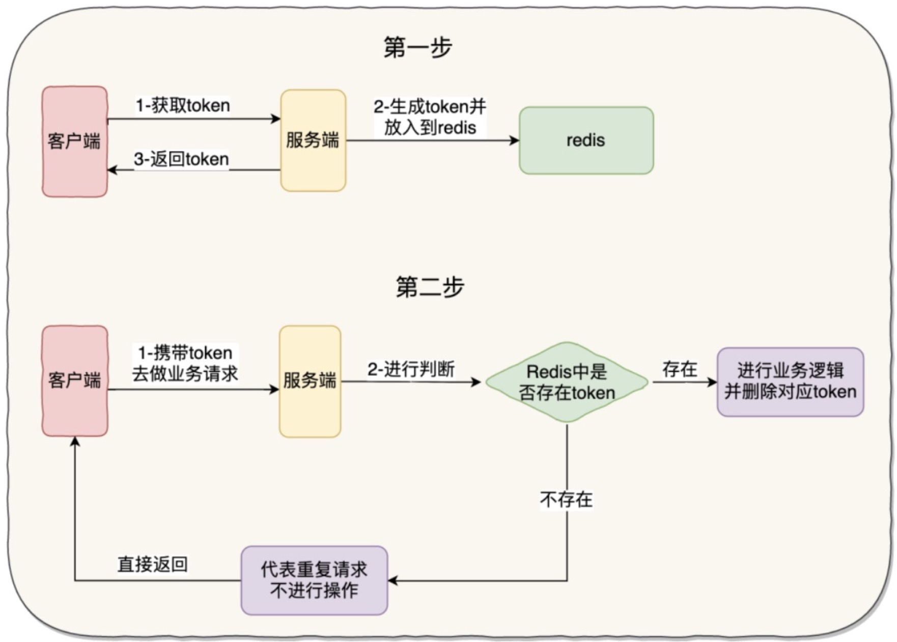

token去重

流程：
1.服务端提供生成token接口，将token返给前端，并将token存入redis以便校验
2.前端获取到token，请求接口携带token
3.服务端获取前端携带的token，并与redis中保存的进行比较，一致则重复请求，校验通过则删除reids



代码示例：
[工具类](../工具类/UnDuplicationUtil.java)

获取防重复令牌:
```java
public class xx {
    @GetMapping("/getToken")
    public ResultResponse<String> getUnDuplicationToken(){
        String token = UnDuplicationUtil.getToken(用户ID);
        return ResultResponse.success(token);
    }
}
```

校验令牌：
```java
public class xx {
    private void checkToken(String token, Long userId) {
        if (UnDuplicationUtil.checkToken(token, userId)) {
            throw new HelloZjException(ExceptionEnum.REPEAT_CREATE_ORDER);
        }
    }
}
```