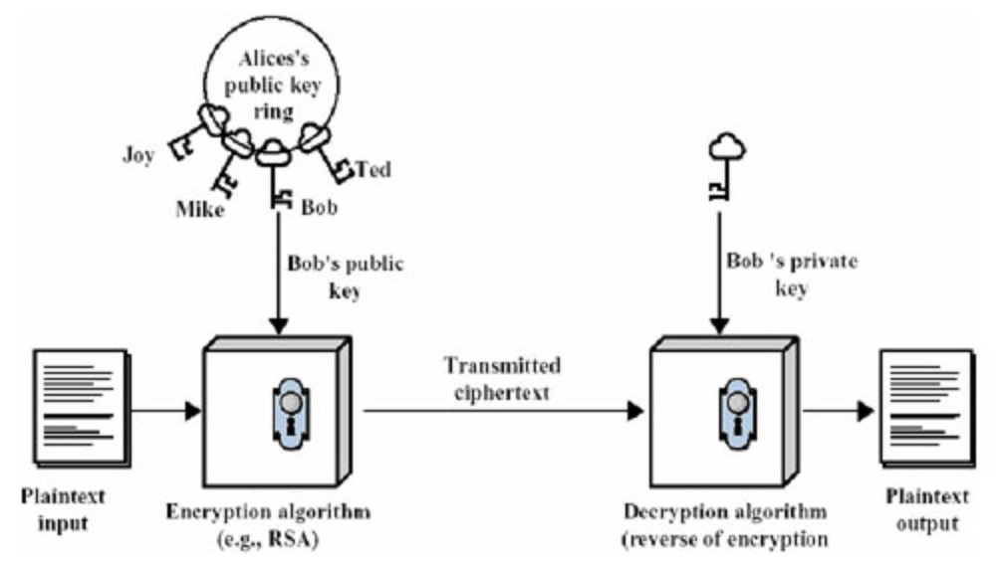
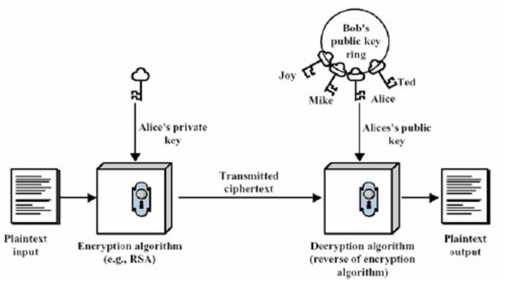

公钥与私钥

如何在一个不安全的环境中实现安全的数据通信？
数据加密

加密和认证
[加密是将数据资料加密]，使得非法用户即使取得加密过的资料，也无法获取正确的资料内容，所以数据加密可以保护数据，防止监听攻击。其重点在于[数据的安全性]。
[身份认证是用来判断某个身份的真实性]，确认身份后，系统才可以依不同的身份给予不同的权限。其重点在于[用户的真实性]。两者的侧重点是不同的。

对称加密和非对称加密
[私钥加密算法，又称 对称加密算法]，因为这种算法[解密密钥和加密密钥是相同的]。
也正因为同一密钥既用于加密又用于解密，所以这个密钥是不能公开的。常见的有《DES加密算法》、《AES加密算法》。

[公钥加密算法，也就是 非对称加密算法]，这种算法[加密和解密的密码不一样]，一个是公钥，另一个是私钥。常见的有《RSA加密算法》。

[算法](https://blog.csdn.net/weixin_38342534/article/details/94582656)

比较：
如果使用对称加密算法，加解密使用同一个密钥，除了自己保存外，对方也要知道这个密钥，才能对数据进行解密。
如果你把密钥也一起传过去，就存在密码泄漏的可能。

公钥和私钥
[公钥和私钥](https://blog.csdn.net/tabactivity/article/details/49685319)

在现代密码体制中加密和解密是采用不同的密钥（公开密钥），也就是[非对称密钥密码系统]，每个通信方均需要两个密钥，即公钥和私钥，这两把密钥可以互为加解密。
公钥是公开的，不需要保密，而私钥是由个人自己持有，并且必须妥善保管和注意保密。

公钥私钥的原则:
1.公钥和私钥成对出现
2.公开的密钥叫公钥，只有自己知道的叫私钥
3.用公钥加密的数据只有对应的私钥可以解密
4.用私钥加密的数据只有对应的公钥可以解密
5.如果可以用公钥解密，则必然是对应的私钥加的密
6.如果可以用私钥解密，则必然是对应的公钥加的密
[公钥和私钥是相对的，两者本身并没有规定哪一个必须是公钥或私钥]

一、公钥加密
假设一下，我找了两个数字，一个是1，一个是2。我喜欢2这个数字，就保留起来，不告诉你们(私钥），然后我告诉大家，1是我的公钥。
我有一个文件，不能让别人看，我就用1加密了。别人找到了这个文件，但是他不知道2就是解密的私钥啊，所以他解不开，只有我可以用
数字2，就是我的私钥，来解密。这样我就可以保护数据了。
我的好朋友x用我的公钥1加密了字符a，加密后成了b，放在网上。别人偷到了这个文件，但是别人解不开，因为别人不知道2就是我的私钥，
只有我才能解密，解密后就得到a。这样，我们就可以传送加密的数据了。

示例：
比如有两个用户Alice和Bob，Alice想把一段明文通过双钥加密的技术发送给Bob，Bob有一对公钥和私钥，那么加密解密的过程如下：
1.Bob将他的公开密钥传送给Alice。
2.Alice用Bob的公开密钥加密她的消息，然后传送给Bob。
3.Bob用他的私人密钥解密Alice的消息。
上面的过程可以用下图表示，Alice使用Bob的公钥进行加密，Bob用自己的私钥进行解密。

二、私钥签名
如果我用私钥加密一段数据（当然只有我可以用私钥加密，因为只有我知道2是我的私钥），结果所有的人都看到我的内容了，因为他们都知道我的公钥是1，

那么这种加密有什么用处呢？但是我的好朋友x说有人冒充我给他发信。怎么办呢？
我把我要发的信，内容是c，用我的私钥2，加密，加密后的内容是d，发给x，再告诉他解密看是不是c。他用我的公钥1解密，发现果然是c。
这个时候，他会想到，[能够用我的公钥解密的数据，必然是用我的私钥加的密]。只有我知道我得私钥，因此他就可以确认确实是我发的东西。
这样我们就能确认发送方身份了。
这个过程叫做数字签名。当然具体的过程要稍微复杂一些。用私钥来加密数据，用途就是数字签名。

示例：
还是Alice和Bob这两个用户，Alice想让Bob知道自己是真实的Alice，而不是假冒的，因此Alice只要使用私钥密码学对文件签名发送给Bob，
Bob使用Alice的公钥对文件进行解密，如果可以解密成功，则证明Alice的私钥是正确的，因而就完成了对Alice的身份鉴别。
整个身份认证的过程如下：
1.Alice用她的私人密钥对文件加密，从而对文件签名。
2.Alice将签名的文件传送给Bob。
3.Bob用Alice的公钥解密文件，从而验证签名。
上面的过程可以用下图表示，Alice使用自己的私钥加密，Bob用Alice的公钥进行解密。

总结：
公钥和私钥是成对的，它们互相解密。
公钥加密，私钥解密。
私钥数字签名，公钥验证。