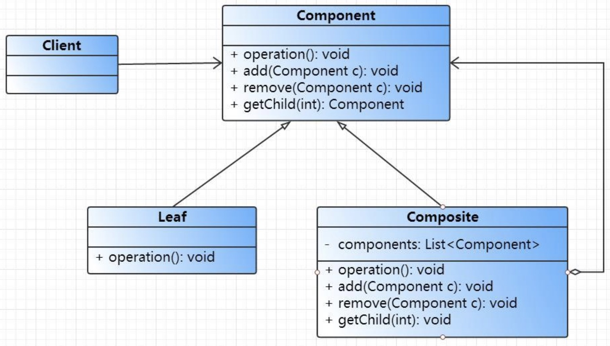
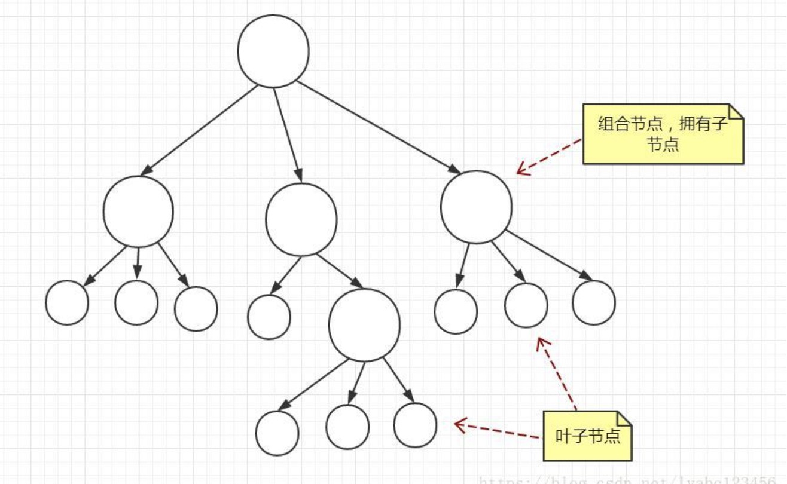

组合模式


###定义
将对象组合成树形结构来表示“部分-整体”的层次结构。
组合模式使得客户能以一致的方式处理个别对象和组合对象。

白话：公共操作抽象，将所有的执行类，进行组合，组装成一个树结构，使操作顺序执行。[遍历执行]

设计类图：

[参考](https://blog.csdn.net/lyabc123456/article/details/80415830)


组合模式中的角色：
Component抽象组件：为组合中所有对象提供一个接口，不管是叶子对象还是组合对象。
Composite组合节点对象：实现了Component的所有操作，并且持有子节点对象。
Leaf叶节点对象：叶节点对象没有任何子节点，实现了Component中的某些操作。

组合模式让我们能用树形方式创建对象的结构，树里面包含了组合以及个别的对象。
使用组合结构，我们能把相同的操作应用在组合和个别对象上。换句活说，在大多数情况下，我们可以忽略对象组合和个别对象之问的差别。

###示例代码
```java
public abstract class Component {
    //名称
    protected String name;

    public Component(String name) {
        this.name = name;
    }
   //操作
   public abstract void operation();
   //添加
   public void add(Component c) {
        throw new UnsupportedOperationException();
    }
    //删除
    public void remove(Component c) {
        throw new UnsupportedOperationException();
    }
    //获取一个子节点
    public Component getChild(int i) {
        throw new UnsupportedOperationException();
    }
    //获取所有子节点
    public List<Component> getChildren() {
        return null;
    }
}
```

```shell script
public class Composite extends Component {
    //子节点
    private List<Component> components = new ArrayList<>();

    public Composite(String name) {
        super(name);
    }

    @Override
    public void operation() {
        System.out.println("组合节点"+name+"的操作");
        //调用所有子节点的操作
        for (Component component : components) {
             component.operation();
        }
    }

    @Override
    public void add(Component c) {
        components.add(c);
    }

    @Override
    public void remove(Component c) {
        components.remove(c);
    }

    @Override
    public Component getChild(int i) {
        return components.get(i);
    }

    @Override
    public List<Component> getChildren() {
        return components;
    }
}
```

```shell script
public class Leaf extends Component {

    public Leaf(String name) {
        super(name);
    }

    @Override
    public void operation() {
        System.out.println("叶节点"+name+"的操作");
    }
}
```

####组装
```shell script
public class Client {
    public static void main(String[] args) {
        //创建根节点对象
        Component component = new Composite("component");

        //创建两个组合节点对象
        Component composite1 = new Composite("composite1");
        Component composite2 = new Composite("composite2");

        //将两个组合节点对象添加到根节点
        component.add(composite1);
        component.add(composite2);

        //给第一个组合节点对象添加两个叶子节点
        Component leaf1 = new Leaf("leaf1");
        Component leaf2 = new Leaf("leaf2");
        composite1.add(leaf1);
        composite1.add(leaf2);

        //给第二个组合节点对象添加一个叶子节点和一个组合节点
        Component leaf3 = new Leaf("leaf3");
        Component composite3 = new Composite("composite3");
        composite2.add(leaf3);
        composite2.add(composite3);

        //给第二个组合节点下面的组合节点添加两个叶子节点
        Component leaf4 = new Leaf("leaf4");
        Component leaf5 = new Leaf("leaf5");
        composite3.add(leaf4);
        composite3.add(leaf5);

        //执行所有节点的操作
        component.operation();
    }
}
```

输出结果：
组合节点component的操作
组合节点component1的操作
叶节点leaf1的操作
叶节点leaf2的操作
组合节点component2的操作
叶节点leaf3的操作
组合节点component3的操作
叶节点leaf4的操作
叶节点leaf5的操作


上述代码中，在组合节点对象Composite的operation()方法中除了执行自身的操作外，还调用了子节点的operation()方法，
这样使得客户端可以透明的遍历所有的节点对象的操作，而不用关心操作的是叶子节点还是组合节点，将它们一视同仁
这看上去有点像二叉树的遍历，不过这里并不是二叉树，每个组合节点可以有若干个子节点，而这些子节点，如果是组合节点，则可以继续拥有子节点，如果是叶子节点，那么就终止了。

叶子节点和组合节点可以有相同的操作，如上面代码中的operation()方法，但是叶子节点不具备add、remove以及getChild操作，
如果你试图在叶子节点上调用这些方法就会抛出不支持的异常。组合节点可以添加子节点，因此组合节点实现了add、remove以及getChild等操作。
组合节点持有一个节点的集合，在组合节点的operation()方法中通过遍历调用持有节点的operation()方法，就像是在递归遍历一样。
通过这种方式Client客户端可以透明的访问节点对象，你可以在客户端中调用一个组合节点的operation()方法，也可以调用一个叶子节点的operation()方法，
也就是说你根本不需要关心调用的是组合节点还是叶子节点，它们都可以进行相同的操作。



组合模式的扩展
1.子节点可以指向父节点
组件可以有一个指向父节点的引用，以便在游走时更容易。而且，如果引用某个孩子，你想从树形结构中删除这个孩子，你会需要从父节点中去蒯除它。一旦孩子有了指向父亲的引用，这做起来就很容易。这样做也使得遍历操作可上可下，更加自由灵活。

2.使用缓存
有时候，如果这个组合结构很复杂，或者遍历的代价太高，那么实现组合节点的缓存就很有帮助。比方说，如果你要不断地遍历一个组合，而且它的每一个子节点都需要进行某些计算，那你就应该使用缓存来临时保存结果，从而省去遍历的开支。

3.组合模式应用场景
这个应用的地方也比较多，比如大多数系统的UI界面的导航菜单一般都是组合模式，再如Android里面的xml布局都是用的组合模式。在选择是否应用组合模式时，要考虑设计上的抉择，到底是要透明性更多一点，还是安全性更多一点，需要做一个平衡。